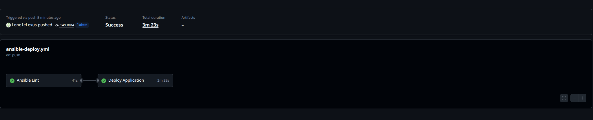

# Lab 6: Advanced Ansible & CI/CD - Submission

**Name:** Aleksey Antipov
**Date:** 2026.03.05
**Lab Points:** 10

---

## Task 1: Blocks & Tags (2 pts)

### Role Structure

The `common` and `docker` roles have been reorganized using blocks for task grouping and error handling.

### `common` Role

**Blocks:**
- `Update apt cache with handling` — cache update with `rescue` on failure
- `Install common packages with handling` — package installation with retry
- `Set timezone to UTC` — separate timezone configuration task

**Tags:** `packages`, `common`, `config`, `users`

### `docker` Role

**Blocks:**
- `Clean up prev` — cleanup of old Docker repositories
- `Docker installation` — Docker installation with error handling
- `Docker conf` — Docker configuration and user group management

**Tags:** `docker`, `docker_install`, `docker_config`

### Results:

```bash
$ ansible-playbook playbooks/provision.yml

PLAY [Provision web servers] **************************************************************************************************************************************

TASK [Gathering Facts] ********************************************************************************************************************************************
ok: [devops-lab-vm]

TASK [common : Update apt cache] **********************************************************************************************************************************
ok: [devops-lab-vm]

TASK [common : Log completion] ************************************************************************************************************************************
ok: [devops-lab-vm] => {
    "msg": "Apt cache update attempted"
}

TASK [common : Install common packages] ***************************************************************************************************************************
ok: [devops-lab-vm]

TASK [common : Log completion] ************************************************************************************************************************************
ok: [devops-lab-vm] => {
    "msg": "Install common packages attempted"
}

TASK [common : Set timezone to UTC] *******************************************************************************************************************************
ok: [devops-lab-vm]

TASK [docker : Install prerequisites] *****************************************************************************************************************************
ok: [devops-lab-vm]

TASK [docker : Add Docker GPG key] ********************************************************************************************************************************
ok: [devops-lab-vm]

TASK [docker : Add Docker repository] *****************************************************************************************************************************
ok: [devops-lab-vm]

TASK [docker : Update apt cache after adding Docker repo] *********************************************************************************************************
changed: [devops-lab-vm]

TASK [docker : Install Docker packages] ***************************************************************************************************************************
ok: [devops-lab-vm]

TASK [docker : Install Docker] ************************************************************************************************************************************
ok: [devops-lab-vm]

TASK [docker : Ensure Docker service is running and enabled] ******************************************************************************************************
ok: [devops-lab-vm]

TASK [docker : Log completion] ************************************************************************************************************************************
ok: [devops-lab-vm] => {
    "msg": "Docker Installation attempted"
}

TASK [docker : Add user to docker group] **************************************************************************************************************************
ok: [devops-lab-vm]

TASK [docker : Install python3-docker for Ansible docker modules] *************************************************************************************************
ok: [devops-lab-vm]

TASK [docker : Ensure Docker service is running and enabled] ******************************************************************************************************
ok: [devops-lab-vm]

TASK [docker : Log completion] ************************************************************************************************************************************
ok: [devops-lab-vm] => {
    "msg": "Docker Configuration attempted"
}

PLAY RECAP ********************************************************************************************************************************************************
devops-lab-vm              : ok=18   changed=1    unreachable=0    failed=0    skipped=0    rescued=0    ignored=0
```

```bash
$ ansible-playbook playbooks/provision.yml --tags "docker"

PLAY [Provision web servers] **************************************************************************************************************************************

TASK [Gathering Facts] ********************************************************************************************************************************************
ok: [devops-lab-vm]

TASK [docker : Install prerequisites] *****************************************************************************************************************************
ok: [devops-lab-vm]

TASK [docker : Add Docker GPG key] ********************************************************************************************************************************
ok: [devops-lab-vm]

TASK [docker : Add Docker repository] *****************************************************************************************************************************
ok: [devops-lab-vm]

TASK [docker : Update apt cache after adding Docker repo] *********************************************************************************************************
changed: [devops-lab-vm]

TASK [docker : Install Docker packages] ***************************************************************************************************************************
ok: [devops-lab-vm]

TASK [docker : Install Docker] ************************************************************************************************************************************
ok: [devops-lab-vm]

TASK [docker : Ensure Docker service is running and enabled] ******************************************************************************************************
ok: [devops-lab-vm]

TASK [docker : Log completion] ************************************************************************************************************************************
ok: [devops-lab-vm] => {
    "msg": "Docker Installation attempted"
}

TASK [docker : Add user to docker group] **************************************************************************************************************************
ok: [devops-lab-vm]

TASK [docker : Install python3-docker for Ansible docker modules] *************************************************************************************************
ok: [devops-lab-vm]

TASK [docker : Ensure Docker service is running and enabled] ******************************************************************************************************
ok: [devops-lab-vm]

TASK [docker : Log completion] ************************************************************************************************************************************
ok: [devops-lab-vm] => {
    "msg": "Docker Configuration attempted"
}

PLAY RECAP ********************************************************************************************************************************************************
devops-lab-vm              : ok=13   changed=1    unreachable=0    failed=0    skipped=0    rescued=0    ignored=0  
```

```bash
$ ansible-playbook playbooks/provision.yml --skip-tags "common"

PLAY [Provision web servers] **************************************************************************************************************************************

TASK [Gathering Facts] ********************************************************************************************************************************************
ok: [devops-lab-vm]

TASK [docker : Install prerequisites] *****************************************************************************************************************************
ok: [devops-lab-vm]

TASK [docker : Add Docker GPG key] ********************************************************************************************************************************
ok: [devops-lab-vm]

TASK [docker : Add Docker repository] *****************************************************************************************************************************
ok: [devops-lab-vm]

TASK [docker : Update apt cache after adding Docker repo] *********************************************************************************************************
changed: [devops-lab-vm]

TASK [docker : Install Docker packages] ***************************************************************************************************************************
ok: [devops-lab-vm]

TASK [docker : Install Docker] ************************************************************************************************************************************
ok: [devops-lab-vm]

TASK [docker : Ensure Docker service is running and enabled] ******************************************************************************************************
ok: [devops-lab-vm]

TASK [docker : Log completion] ************************************************************************************************************************************
ok: [devops-lab-vm] => {
    "msg": "Docker Installation attempted"
}

TASK [docker : Add user to docker group] **************************************************************************************************************************
ok: [devops-lab-vm]

TASK [docker : Install python3-docker for Ansible docker modules] *************************************************************************************************
ok: [devops-lab-vm]

TASK [docker : Ensure Docker service is running and enabled] ******************************************************************************************************
ok: [devops-lab-vm]

TASK [docker : Log completion] ************************************************************************************************************************************
ok: [devops-lab-vm] => {
    "msg": "Docker Configuration attempted"
}

PLAY RECAP ********************************************************************************************************************************************************
devops-lab-vm              : ok=13   changed=1    unreachable=0    failed=0    skipped=0    rescued=0    ignored=0  
```

```bash
$ ansible-playbook playbooks/provision.yml --tags "packages"

PLAY [Provision web servers] **************************************************************************************************************************************

TASK [Gathering Facts] ********************************************************************************************************************************************
ok: [devops-lab-vm]

TASK [common : Update apt cache] **********************************************************************************************************************************
ok: [devops-lab-vm]

TASK [common : Log completion] ************************************************************************************************************************************
ok: [devops-lab-vm] => {
    "msg": "Apt cache update attempted"
}

TASK [common : Install common packages] ***************************************************************************************************************************
ok: [devops-lab-vm]

TASK [common : Log completion] ************************************************************************************************************************************
ok: [devops-lab-vm] => {
    "msg": "Install common packages attempted"
}

PLAY RECAP ********************************************************************************************************************************************************
devops-lab-vm              : ok=5    changed=0    unreachable=0    failed=0    skipped=0    rescued=0    ignored=0   
```

```bash
$ ansible-playbook playbooks/provision.yml --tags "docker" --check

PLAY [Provision web servers] **************************************************************************************************************************************

TASK [Gathering Facts] ********************************************************************************************************************************************
ok: [devops-lab-vm]

TASK [docker : Install prerequisites] *****************************************************************************************************************************
ok: [devops-lab-vm]

TASK [docker : Add Docker GPG key] ********************************************************************************************************************************
ok: [devops-lab-vm]

TASK [docker : Add Docker repository] *****************************************************************************************************************************
ok: [devops-lab-vm]

TASK [docker : Update apt cache after adding Docker repo] *********************************************************************************************************
changed: [devops-lab-vm]

TASK [docker : Install Docker packages] ***************************************************************************************************************************
ok: [devops-lab-vm]

TASK [docker : Install Docker] ************************************************************************************************************************************
ok: [devops-lab-vm]

TASK [docker : Ensure Docker service is running and enabled] ******************************************************************************************************
ok: [devops-lab-vm]

TASK [docker : Log completion] ************************************************************************************************************************************
ok: [devops-lab-vm] => {
    "msg": "Docker Installation attempted"
}

TASK [docker : Add user to docker group] **************************************************************************************************************************
ok: [devops-lab-vm]

TASK [docker : Install python3-docker for Ansible docker modules] *************************************************************************************************
ok: [devops-lab-vm]

TASK [docker : Ensure Docker service is running and enabled] ******************************************************************************************************
ok: [devops-lab-vm]

TASK [docker : Log completion] ************************************************************************************************************************************
ok: [devops-lab-vm] => {
    "msg": "Docker Configuration attempted"
}

PLAY RECAP ********************************************************************************************************************************************************
devops-lab-vm              : ok=13   changed=1    unreachable=0    failed=0    skipped=0    rescued=0    ignored=0   
```

```bash
$ ansible-playbook playbooks/provision.yml --tags "docker_install"

PLAY [Provision web servers] **************************************************************************************************************************************

TASK [Gathering Facts] ********************************************************************************************************************************************
ok: [devops-lab-vm]

TASK [docker : Install prerequisites] *****************************************************************************************************************************
ok: [devops-lab-vm]

TASK [docker : Add Docker GPG key] ********************************************************************************************************************************
ok: [devops-lab-vm]

TASK [docker : Add Docker repository] *****************************************************************************************************************************
ok: [devops-lab-vm]

TASK [docker : Update apt cache after adding Docker repo] *********************************************************************************************************
changed: [devops-lab-vm]

TASK [docker : Install Docker packages] ***************************************************************************************************************************
ok: [devops-lab-vm]

TASK [docker : Install Docker] ************************************************************************************************************************************
ok: [devops-lab-vm]

TASK [docker : Ensure Docker service is running and enabled] ******************************************************************************************************
ok: [devops-lab-vm]

TASK [docker : Log completion] ************************************************************************************************************************************
ok: [devops-lab-vm] => {
    "msg": "Docker Installation attempted"
}

PLAY RECAP ********************************************************************************************************************************************************
devops-lab-vm              : ok=9    changed=1    unreachable=0    failed=0    skipped=0    rescued=0    ignored=0 
```

```bash
$ ansible-playbook playbooks/provision.yml --list-tags

playbook: playbooks/provision.yml

  play #1 (webservers): Provision web servers   TAGS: []
      TASK TAGS: [common, docker, docker_config, docker_install, packages, users]
```

[Research answers]

## Task 2: Docker Compose (3 pts)

Renamed `app_deploy` to `web_app`. Added `docker` role as dependency. Created Jinja2 template for `docker-compose.yml` with variable substitution. Deployment is still idempotent.

```bash
$ ansible-playbook playbooks/deploy.yml --ask-vault-pass
Vault password: 

PLAY [Deploy application] *****************************************************************************************************************************************

TASK [Gathering Facts] ********************************************************************************************************************************************
ok: [devops-lab-vm]

TASK [docker : Install prerequisites] *****************************************************************************************************************************
ok: [devops-lab-vm]

TASK [docker : Add Docker GPG key] ********************************************************************************************************************************
ok: [devops-lab-vm]

TASK [docker : Add Docker repository] *****************************************************************************************************************************
ok: [devops-lab-vm]

TASK [docker : Update apt cache after adding Docker repo] *********************************************************************************************************
changed: [devops-lab-vm]

TASK [docker : Install Docker packages] ***************************************************************************************************************************
ok: [devops-lab-vm]

TASK [docker : Install Docker] ************************************************************************************************************************************
ok: [devops-lab-vm]

TASK [docker : Ensure Docker service is running and enabled] ******************************************************************************************************
ok: [devops-lab-vm]

TASK [docker : Log completion] ************************************************************************************************************************************
ok: [devops-lab-vm] => {
    "msg": "Docker Installation attempted"
}

TASK [docker : Add user to docker group] **************************************************************************************************************************
ok: [devops-lab-vm]

TASK [docker : Install python3-docker for Ansible docker modules] *************************************************************************************************
ok: [devops-lab-vm]

TASK [docker : Ensure Docker service is running and enabled] ******************************************************************************************************
ok: [devops-lab-vm]

TASK [docker : Log completion] ************************************************************************************************************************************
ok: [devops-lab-vm] => {
    "msg": "Docker Configuration attempted"
}

TASK [web_app : Create app directory] *****************************************************************************************************************************
ok: [devops-lab-vm]

TASK [web_app : Template docker-compose file] *********************************************************************************************************************
changed: [devops-lab-vm]

TASK [web_app : Install docker-compose] ***************************************************************************************************************************
ok: [devops-lab-vm]

TASK [web_app : Log in to Docker Hub] *****************************************************************************************************************************
ok: [devops-lab-vm]

TASK [web_app : Pull Docker image] ********************************************************************************************************************************
ok: [devops-lab-vm]

TASK [web_app : Deploy with docker-compose] ***********************************************************************************************************************
[WARNING]: Cannot parse event from line: 'time="2026-03-05T17:45:16Z" level=warning msg="/opt/devops-info-service/docker-compose.yml: the attribute `version` is
obsolete, it will be ignored, please remove it to avoid potential confusion"'. Please report this at https://github.com/ansible-
collections/community.docker/issues/new?assignees=&labels=&projects=&template=bug_report.md
changed: [devops-lab-vm]

TASK [web_app : Wait for application to be ready] *****************************************************************************************************************
ok: [devops-lab-vm]

TASK [web_app : Verify health endpoint] ***************************************************************************************************************************
ok: [devops-lab-vm]

TASK [web_app : Log completion] ***********************************************************************************************************************************
ok: [devops-lab-vm] => {
    "msg": "Deploy completed"
}

TASK [web_app : Log completion] ***********************************************************************************************************************************
ok: [devops-lab-vm] => {
    "msg": "Deploy attempted"
}

PLAY RECAP ********************************************************************************************************************************************************
devops-lab-vm              : ok=23   changed=3    unreachable=0    failed=0    skipped=0    rescued=0    ignored=0   
```

```bash
$ ansible-playbook playbooks/deploy.yml --ask-vault-pass
Vault password: 

PLAY [Deploy application] *****************************************************************************************************************************************

TASK [Gathering Facts] ********************************************************************************************************************************************
ok: [devops-lab-vm]

TASK [docker : Install prerequisites] *****************************************************************************************************************************
ok: [devops-lab-vm]

TASK [docker : Add Docker GPG key] ********************************************************************************************************************************
ok: [devops-lab-vm]

TASK [docker : Add Docker repository] *****************************************************************************************************************************
ok: [devops-lab-vm]

TASK [docker : Update apt cache after adding Docker repo] *********************************************************************************************************
changed: [devops-lab-vm]

TASK [docker : Install Docker packages] ***************************************************************************************************************************
ok: [devops-lab-vm]

TASK [docker : Install Docker] ************************************************************************************************************************************
ok: [devops-lab-vm]

TASK [docker : Ensure Docker service is running and enabled] ******************************************************************************************************
ok: [devops-lab-vm]

TASK [docker : Log completion] ************************************************************************************************************************************
ok: [devops-lab-vm] => {
    "msg": "Docker Installation attempted"
}

TASK [docker : Add user to docker group] **************************************************************************************************************************
ok: [devops-lab-vm]

TASK [docker : Install python3-docker for Ansible docker modules] *************************************************************************************************
ok: [devops-lab-vm]

TASK [docker : Ensure Docker service is running and enabled] ******************************************************************************************************
ok: [devops-lab-vm]

TASK [docker : Log completion] ************************************************************************************************************************************
ok: [devops-lab-vm] => {
    "msg": "Docker Configuration attempted"
}

TASK [web_app : Create app directory] *****************************************************************************************************************************
ok: [devops-lab-vm]

TASK [web_app : Template docker-compose file] *********************************************************************************************************************
ok: [devops-lab-vm]

TASK [web_app : Install docker-compose] ***************************************************************************************************************************
ok: [devops-lab-vm]

TASK [web_app : Log in to Docker Hub] *****************************************************************************************************************************
ok: [devops-lab-vm]

TASK [web_app : Pull Docker image] ********************************************************************************************************************************
ok: [devops-lab-vm]

TASK [web_app : Deploy with docker-compose] ***********************************************************************************************************************
[WARNING]: Cannot parse event from line: 'time="2026-03-05T17:46:53Z" level=warning msg="/opt/devops-info-service/docker-compose.yml: the attribute `version` is
obsolete, it will be ignored, please remove it to avoid potential confusion"'. Please report this at https://github.com/ansible-
collections/community.docker/issues/new?assignees=&labels=&projects=&template=bug_report.md
changed: [devops-lab-vm]

TASK [web_app : Wait for application to be ready] *****************************************************************************************************************
ok: [devops-lab-vm]

TASK [web_app : Verify health endpoint] ***************************************************************************************************************************
ok: [devops-lab-vm]

TASK [web_app : Log completion] ***********************************************************************************************************************************
ok: [devops-lab-vm] => {
    "msg": "Deploy completed"
}

TASK [web_app : Log completion] ***********************************************************************************************************************************
ok: [devops-lab-vm] => {
    "msg": "Deploy attempted"
}

PLAY RECAP ********************************************************************************************************************************************************
devops-lab-vm              : ok=23   changed=2    unreachable=0    failed=0    skipped=0    rescued=0    ignored=0
```

```bash
 ansible webservers -a "curl -s http://localhost:8080/health" --ask-vault-pass
Vault password: 
devops-lab-vm | CHANGED | rc=0 >>
{"status":"healthy","timestamp":"2026-03-05T17:46:05.548130+00:00","uptime_seconds":47}
```

```bash
$ ansible webservers -a "curl -s http://localhost:8080" --ask-vault-pass
Vault password: 
devops-lab-vm | CHANGED | rc=0 >>
{"service":{"name":"devops-info-service","version":"1.0.0","description":"DevOps course info service","framework":"FastAPI"},"system":{"hostname":"792f2d6a6c68","platform":"Linux","platform_version":"#180-Ubuntu SMP Fri Jan 9 16:10:31 UTC 2026","architecture":"x86_64","cpu_count":2,"python_version":"3.13.12"},"runtime":{"uptime_seconds":343,"uptime_human":"0 hours, 5 minutes","current_time":"2026-03-05T17:56:54.086927+00:00","timezone":"UTC"},"request":{"client_ip":"172.18.0.1","user_agent":"curl/7.81.0","method":"GET","path":"/"},"endpoints":[{"path":"/","method":"GET","description":"Service information"},{"path":"/health","method":"GET","description":"Health check"},{"path":"/docs","method":"GET","description":"Auto-generated API documentation"}]}
```

```bash
$ ansible webservers -a "docker ps" --ask-vault-pass
Vault password: 
devops-lab-vm | CHANGED | rc=0 >>
CONTAINER ID   IMAGE                               COMMAND           CREATED         STATUS         PORTS                                         NAMES
792f2d6a6c68   lehus1/devops-info-service:latest   "python app.py"   5 minutes ago   Up 5 minutes   0.0.0.0:8080->8000/tcp, [::]:8080->8000/tcp   devops-info-service
```

```bash
$ ansible webservers -a "docker compose -f /opt/devops-info-service/docker-compose.yml ps" --ask-vault-pass
Vault password: 
devops-lab-vm | CHANGED | rc=0 >>
NAME                  IMAGE                               COMMAND           SERVICE               CREATED         STATUS         PORTS
devops-info-service   lehus1/devops-info-service:latest   "python app.py"   devops-info-service   4 minutes ago   Up 4 minutes   0.0.0.0:8080->8000/tcp, [::]:8080->8000/tcptime="2026-03-05T17:55:54Z" level=warning msg="/opt/devops-info-service/docker-compose.yml: the attribute `version` is obsolete, it will be ignored, please remove it to avoid potential confusion"
```

## Task 3: Wipe Logic (1 pt)

Implemented double-gated deletion: requires both `web_app_wipe=true` variable and `--tags web_app_wipe` tag. Prevents accidental deletion. Supports clean reinstall scenario.

```bash
$ ansible-playbook playbooks/deploy.yml --ask-vault-pass
Vault password: 

PLAY [Deploy application] *****************************************************************************************************************************************

TASK [Gathering Facts] ********************************************************************************************************************************************
ok: [devops-lab-vm]

TASK [docker : Install prerequisites] *****************************************************************************************************************************
ok: [devops-lab-vm]

TASK [docker : Add Docker GPG key] ********************************************************************************************************************************
ok: [devops-lab-vm]

TASK [docker : Add Docker repository] *****************************************************************************************************************************
ok: [devops-lab-vm]

TASK [docker : Update apt cache after adding Docker repo] *********************************************************************************************************
changed: [devops-lab-vm]

TASK [docker : Install Docker packages] ***************************************************************************************************************************
ok: [devops-lab-vm]

TASK [docker : Install Docker] ************************************************************************************************************************************
ok: [devops-lab-vm]

TASK [docker : Ensure Docker service is running and enabled] ******************************************************************************************************
ok: [devops-lab-vm]

TASK [docker : Log completion] ************************************************************************************************************************************
ok: [devops-lab-vm] => {
    "msg": "Docker Installation attempted"
}

TASK [docker : Add user to docker group] **************************************************************************************************************************
ok: [devops-lab-vm]

TASK [docker : Install python3-docker for Ansible docker modules] *************************************************************************************************
ok: [devops-lab-vm]

TASK [docker : Ensure Docker service is running and enabled] ******************************************************************************************************
ok: [devops-lab-vm]

TASK [docker : Log completion] ************************************************************************************************************************************
ok: [devops-lab-vm] => {
    "msg": "Docker Configuration attempted"
}

TASK [web_app : Include wipe tasks] *******************************************************************************************************************************
included: /home/lord/DevOps/DevOps-Core-Course/ansible/roles/web_app/tasks/wipe.yml for devops-lab-vm

TASK [web_app : Stop and remove containers] ***********************************************************************************************************************
skipping: [devops-lab-vm]

TASK [web_app : Remove docker-compose file] ***********************************************************************************************************************
skipping: [devops-lab-vm]

TASK [web_app : Remove application directory] *********************************************************************************************************************
skipping: [devops-lab-vm]

TASK [web_app : Log wipe completion] ******************************************************************************************************************************
skipping: [devops-lab-vm]

TASK [web_app : Create app directory] *****************************************************************************************************************************
ok: [devops-lab-vm]

TASK [web_app : Template docker-compose file] *********************************************************************************************************************
ok: [devops-lab-vm]

TASK [web_app : Install docker-compose] ***************************************************************************************************************************
ok: [devops-lab-vm]

TASK [web_app : Log in to Docker Hub] *****************************************************************************************************************************
ok: [devops-lab-vm]

TASK [web_app : Pull Docker image] ********************************************************************************************************************************
ok: [devops-lab-vm]

TASK [web_app : Deploy with docker-compose] ***********************************************************************************************************************
[WARNING]: Cannot parse event from line: 'time="2026-03-05T18:16:33Z" level=warning msg="/opt/devops-info-service/docker-compose.yml: the attribute `version` is
obsolete, it will be ignored, please remove it to avoid potential confusion"'. Please report this at https://github.com/ansible-
collections/community.docker/issues/new?assignees=&labels=&projects=&template=bug_report.md
changed: [devops-lab-vm]

TASK [web_app : Wait for application to be ready] *****************************************************************************************************************
ok: [devops-lab-vm]

TASK [web_app : Verify health endpoint] ***************************************************************************************************************************
ok: [devops-lab-vm]

TASK [web_app : Log completion] ***********************************************************************************************************************************
ok: [devops-lab-vm] => {
    "msg": "Deploy completed"
}

TASK [web_app : Log completion] ***********************************************************************************************************************************
ok: [devops-lab-vm] => {
    "msg": "Deploy attempted"
}

PLAY RECAP ********************************************************************************************************************************************************
devops-lab-vm              : ok=24   changed=2    unreachable=0    failed=0    skipped=4    rescued=0    ignored=0
```

```bash
$ ansible webservers -a "docker ps" --ask-vault-pass
Vault password: 
devops-lab-vm | CHANGED | rc=0 >>
CONTAINER ID   IMAGE                               COMMAND           CREATED         STATUS         PORTS                                         NAMES
c775805ed838   lehus1/devops-info-service:latest   "python app.py"   2 minutes ago   Up 2 minutes   0.0.0.0:8080->8000/tcp, [::]:8080->8000/tcp   devops-info-service
```

```bash
$ ansible webservers -a "docker compose -f /opt/devops-info-service/docker-compose.yml ps" --ask-vault-pass
Vault password: 
devops-lab-vm | CHANGED | rc=0 >>
NAME                  IMAGE                               COMMAND           SERVICE               CREATED         STATUS         PORTS
devops-info-service   lehus1/devops-info-service:latest   "python app.py"   devops-info-service   2 minutes ago   Up 2 minutes   0.0.0.0:8080->8000/tcp, [::]:8080->8000/tcptime="2026-03-05T18:23:34Z" level=warning msg="/opt/devops-info-service/docker-compose.yml: the attribute `version` is obsolete, it will be ignored, please remove it to avoid potential confusion"
```

```bash
$ ansible-playbook playbooks/deploy.yml --ask-vault-pass \
  -e "web_app_wipe=true" \
  --tags web_app_wipe
Vault password: 

PLAY [Deploy application] *****************************************************************************************************************************************

TASK [Gathering Facts] ********************************************************************************************************************************************
ok: [devops-lab-vm]

TASK [web_app : Include wipe tasks] *******************************************************************************************************************************
included: /home/lord/DevOps/DevOps-Core-Course/ansible/roles/web_app/tasks/wipe.yml for devops-lab-vm

TASK [web_app : Stop and remove containers] ***********************************************************************************************************************
[WARNING]: Cannot parse event from line: 'time="2026-03-05T18:19:00Z" level=warning msg="/opt/devops-info-service/docker-compose.yml: the attribute `version` is
obsolete, it will be ignored, please remove it to avoid potential confusion"'. Please report this at https://github.com/ansible-
collections/community.docker/issues/new?assignees=&labels=&projects=&template=bug_report.md
changed: [devops-lab-vm]

TASK [web_app : Remove docker-compose file] ***********************************************************************************************************************
changed: [devops-lab-vm]

TASK [web_app : Remove application directory] *********************************************************************************************************************
changed: [devops-lab-vm]

TASK [web_app : Log wipe completion] ******************************************************************************************************************************
ok: [devops-lab-vm] => {
    "msg": "Application devops-info-service wiped successfully"
}

PLAY RECAP ********************************************************************************************************************************************************
devops-lab-vm              : ok=6    changed=3    unreachable=0    failed=0    skipped=0    rescued=0    ignored=0   
```

```bash
ansible webservers -a "docker compose -f /opt/devops-info-service/docker-compose.yml ps" --ask-vault-pass
Vault password: 
devops-lab-vm | FAILED | rc=1 >>
open /opt/devops-info-service/docker-compose.yml: no such file or directorynon-zero return code
```

```bash
$ ansible webservers -a "docker ps" --ask-vault-pass
Vault password: 
devops-lab-vm | CHANGED | rc=0 >>
CONTAINER ID   IMAGE     COMMAND   CREATED   STATUS    PORTS     NAMES
```


## Task 4: CI/CD (3 pts)

Created workflow with two jobs: `lint` (ansible-lint with Vault) and `deploy` (SSH setup, Ansible run, health check). Used path filters to trigger only on Ansible changes. Configured GitHub Secrets for credentials.

```bash
Run cd ansible
  cd ansible
  echo "***" > .vault_pass
  chmod 600 .vault_pass
  export ANSIBLE_VAULT_PASSWORD_FILE=./.vault_pass
  ansible-lint playbooks/*.yml
  shell: /usr/bin/bash -e {0}
  env:
    pythonLocation: /opt/hostedtoolcache/Python/3.12.12/x64
    PKG_CONFIG_PATH: /opt/hostedtoolcache/Python/3.12.12/x64/lib/pkgconfig
    Python_ROOT_DIR: /opt/hostedtoolcache/Python/3.12.12/x64
    Python2_ROOT_DIR: /opt/hostedtoolcache/Python/3.12.12/x64
    Python3_ROOT_DIR: /opt/hostedtoolcache/Python/3.12.12/x64
    LD_LIBRARY_PATH: /opt/hostedtoolcache/Python/3.12.12/x64/lib

Passed: 0 failure(s), 0 warning(s) in 12 files processed of 12 encountered. Last profile that met the validation criteria was 'production'.
```

```bash
Run cd ansible
  cd ansible
  echo "***" > .vault_pass
  ansible-playbook playbooks/deploy.yml \
    -i inventory/ci.ini \
    --vault-password-file .vault_pass
  rm .vault_pass
  shell: /usr/bin/bash -e {0}
  env:
    pythonLocation: /opt/hostedtoolcache/Python/3.12.12/x64
    PKG_CONFIG_PATH: /opt/hostedtoolcache/Python/3.12.12/x64/lib/pkgconfig
    Python_ROOT_DIR: /opt/hostedtoolcache/Python/3.12.12/x64
    Python2_ROOT_DIR: /opt/hostedtoolcache/Python/3.12.12/x64
    Python3_ROOT_DIR: /opt/hostedtoolcache/Python/3.12.12/x64
    LD_LIBRARY_PATH: /opt/hostedtoolcache/Python/3.12.12/x64/lib
PLAY [Deploy application] ******************************************************
TASK [Gathering Facts] *********************************************************
Warning: : Host 'devops-lab-vm' is using the discovered Python interpreter at '/usr/bin/python3.10', but future installation of another Python interpreter could cause a different interpreter to be discovered. See https://docs.ansible.com/ansible-core/2.20/reference_appendices/interpreter_discovery.html for more information.
ok: [devops-lab-vm]
TASK [docker : Install prerequisites] ******************************************
ok: [devops-lab-vm]
TASK [docker : Add Docker GPG key] *********************************************
ok: [devops-lab-vm]
TASK [docker : Add Docker repository] ******************************************
Warning: : Deprecation warnings can be disabled by setting `deprecation_warnings=False` in ansible.cfg.
[DEPRECATION WARNING]: INJECT_FACTS_AS_VARS default to `True` is deprecated, top-level facts will not be auto injected after the change. This feature will be removed from ansible-core version 2.24.
Origin: /home/runner/work/DevOps-Core-Course/DevOps-Core-Course/ansible/roles/docker/tasks/main.yml:24:15
22     - name: Add Docker repository
23       ansible.builtin.apt_repository:
24         repo: "deb https://download.docker.com/linux/*** {{ ansible_distribution_release }} stable"
                 ^ column 15
Use `ansible_facts["fact_name"]` (no `ansible_` prefix) instead.
ok: [devops-lab-vm]
TASK [docker : Update apt cache after adding Docker repo] **********************
changed: [devops-lab-vm]
TASK [docker : Install Docker packages] ****************************************
ok: [devops-lab-vm]
TASK [docker : Install Docker] *************************************************
ok: [devops-lab-vm]
TASK [docker : Ensure Docker service is running and enabled] *******************
ok: [devops-lab-vm]
TASK [docker : Log completion] *************************************************
ok: [devops-lab-vm] => {
    "msg": "Docker Installation attempted"
}
TASK [docker : Add user to docker group] ***************************************
ok: [devops-lab-vm]
TASK [docker : Install python3-docker for Ansible docker modules] **************
ok: [devops-lab-vm]
TASK [docker : Ensure Docker service is running and enabled] *******************
ok: [devops-lab-vm]
TASK [docker : Log completion] *************************************************
ok: [devops-lab-vm] => {
    "msg": "Docker Configuration attempted"
}
TASK [web_app : Include wipe tasks] ********************************************
included: /home/runner/work/DevOps-Core-Course/DevOps-Core-Course/ansible/roles/web_app/tasks/wipe.yml for devops-lab-vm
TASK [web_app : Stop and remove containers] ************************************
skipping: [devops-lab-vm]
TASK [web_app : Remove docker-compose file] ************************************
skipping: [devops-lab-vm]
TASK [web_app : Remove application directory] **********************************
skipping: [devops-lab-vm]
TASK [web_app : Log wipe completion] *******************************************
skipping: [devops-lab-vm]
TASK [web_app : Create app directory] ******************************************
ok: [devops-lab-vm]
TASK [web_app : Template docker-compose file] **********************************
ok: [devops-lab-vm]
TASK [web_app : Install docker-compose] ****************************************
ok: [devops-lab-vm]
TASK [web_app : Log in to Docker Hub] ******************************************
ok: [devops-lab-vm]
TASK [web_app : Pull Docker image] *********************************************
ok: [devops-lab-vm]
TASK [web_app : Deploy with docker-compose] ************************************
Warning: : Docker compose: unknown None: /opt/devops-info-service/docker-compose.yml: the attribute `version` is obsolete, it will be ignored, please remove it to avoid potential confusion
changed: [devops-lab-vm]
TASK [web_app : Wait for application to be ready] ******************************
ok: [devops-lab-vm]
TASK [web_app : Verify health endpoint] ****************************************
ok: [devops-lab-vm]
TASK [web_app : Log completion] ************************************************
ok: [devops-lab-vm] => {
    "msg": "Deploy completed"
}
TASK [web_app : Log completion] ************************************************
ok: [devops-lab-vm] => {
    "msg": "Deploy attempted"
}
PLAY RECAP *********************************************************************
devops-lab-vm              : ok=24   changed=2    unreachable=0    failed=0    skipped=4    rescued=0    ignored=0   
```



[](https://github.com/Lone1eLexus/DevOps-Core-Course/actions/workflows/ansible-deploy.yml)

```bash
$ ansible webservers -a "curl -s http://localhost:8080"
devops-lab-vm | CHANGED | rc=0 >>
{"service":{"name":"devops-info-service","version":"1.0.0","description":"DevOps course info service","framework":"FastAPI"},"system":{"hostname":"d397692176af","platform":"Linux","platform_version":"#180-Ubuntu SMP Fri Jan 9 16:10:31 UTC 2026","architecture":"x86_64","cpu_count":2,"python_version":"3.13.12"},"runtime":{"uptime_seconds":47,"uptime_human":"0 hours, 0 minutes","current_time":"2026-03-05T20:40:32.298820+00:00","timezone":"UTC"},"request":{"client_ip":"172.18.0.1","user_agent":"curl/7.81.0","method":"GET","path":"/"},"endpoints":[{"path":"/","method":"GET","description":"Service information"},{"path":"/health","method":"GET","description":"Health check"},{"path":"/docs","method":"GET","description":"Auto-generated API documentation"}]}
```


## Summary
- Overall reflection: interesting 
- Total time spent: 8 hours
- Key learnings: ansible