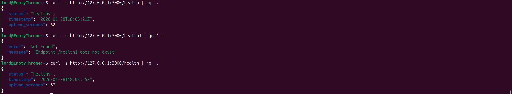

# Lab 1 Bonus Task

## Best Practices Applied

### 1. Clean Code Structure
- Separated functions: `get_system_info()`, `get_uptime()`
- Clear function names and docstrings

### 2. Error Handling
- Custom 404 and 500 error handlers

```go
func notFoundHandler(w http.ResponseWriter, r *http.Request) {
    response := map[string]string{
        "error":   "Not Found",
        "message": fmt.Sprintf("Endpoint %s does not exist", r.URL.Path),
    }
    jsonResponse(w, http.StatusNotFound, response)
}
```

### 3. Logging
- Configured structured logging
- Logs request methods and paths

```go
func loggingMiddleware(next http.HandlerFunc) http.HandlerFunc {
	return func(w http.ResponseWriter, r *http.Request) {
		start := time.Now()
		next(w, r)
		log.Printf("%s %s %s", r.Method, r.URL.Path, time.Since(start))
	}
}
```

## API Documentation

### Endpoints Overview

| Method | Path | Description |
|--------|------|-------------|
| GET | `/` | Service and system information |
| GET | `/health` | Health check for monitoring |

### Main Endpoint: `GET /`

**Request Example:**
```bash
$ curl -s http://127.0.0.1:3000/ | jq '.'
```

**Response Example:**
```json
{
  "service": {
    "name": "devops-info-service",
    "version": "1.0.0",
    "description": "DevOps course info service",
    "framework": "FastAPI"
  },
  "system": {
    "hostname": "EmptyThrone",
    "platform": "Linux",
    "platform_version": "#36~24.04.1-Ubuntu SMP PREEMPT_DYNAMIC Wed Oct 15 15:45:17 UTC 2",
    "architecture": "x86_64",
    "cpu_count": 16,
    "python_version": "3.12.3"
  },
  "runtime": {
    "uptime_seconds": 22,
    "uptime_human": "0 hours, 0 minutes",
    "current_time": "2026-01-28T15:27:01.489584+00:00",
    "timezone": "UTC"
  },
  "request": {
    "client_ip": "127.0.0.1",
    "user_agent": "curl/8.5.0",
    "method": "GET",
    "path": "/"
  },
  "endpoints": [
    {
      "path": "/",
      "method": "GET",
      "description": "Service information"
    },
    {
      "path": "/health",
      "method": "GET",
      "description": "Health check"
    },
    {
      "path": "/docs",
      "method": "GET",
      "description": "Auto-generated API documentation"
    }
  ]
}
```

### Health Endpoint: `GET /health`

**Request Example:**
```bash
curl -s http://localhost:3000/health | jq '.'
```

**Response Example:**
```json
{
  "status": "healthy",
  "timestamp": "2026-01-28T15:21:29.978114+00:00",
  "uptime_seconds": 604
}
```

### Wrong Endpoint: `GET /health1`

**Request Example:**
```bash
curl -s http://localhost:3000/health1 | jq '.'
```

**Response Example:**
```json
{
  "error": "Not Found",
  "message": "Endpoint /health1 does not exist"
}
```

### Testing Commands:

```bash
# Main endpoint test
curl http://localhost:8000/

# Health check
curl http://localhost:8000/health

# Pretty main endpoint output
curl -s http://localhost:8000/ | jq '.'
```

## Testing Evidence




