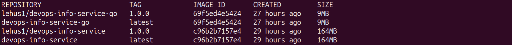

# Lab 2 Bonus Task

## Terminal output showing build process and image sizes
```bash

$ docker build . -t devops-info-service-go
[+] Building 5.8s (14/14) FINISHED                                                                                                                   docker:default
 => [internal] load build definition from dockerfile                                                                                                           0.0s
 => => transferring dockerfile: 322B                                                                                                                           0.0s
 => [internal] load metadata for gcr.io/distroless/static-debian12:latest                                                                                      0.6s
 => [internal] load metadata for docker.io/library/golang:1.21                                                                                                 0.7s
 => [internal] load .dockerignore                                                                                                                              0.0s
 => => transferring context: 360B                                                                                                                              0.0s
 => [builder 1/5] FROM docker.io/library/golang:1.21@sha256:4746d26432a9117a5f58e95cb9f954ddf0de128e9d5816886514199316e4a2fb                                   0.0s
 => [stage-1 1/3] FROM gcr.io/distroless/static-debian12:latest@sha256:cd64bec9cec257044ce3a8dd3620cf83b387920100332f2b041f19c4d2febf93                        0.0s
 => [internal] load build context                                                                                                                              0.0s
 => => transferring context: 54B                                                                                                                               0.0s
 => CACHED [stage-1 2/3] WORKDIR /app                                                                                                                          0.0s
 => CACHED [builder 2/5] WORKDIR /app                                                                                                                          0.0s
 => [builder 3/5] COPY go.mod main.go .                                                                                                                        0.1s
 => [builder 4/5] RUN go mod download                                                                                                                          0.3s
 => [builder 5/5] RUN CGO_ENABLED=0 go build -o my_app                                                                                                         4.1s
 => [stage-1 3/3] COPY --from=builder /app/my_app .                                                                                                            0.2s
 => exporting to image                                                                                                                                         0.1s
 => => exporting layers                                                                                                                                        0.1s
 => => writing image sha256:69f5ed4e54243a04e4b175f209d94c93aa56de05e76a02df3010ccf641f48020                                                                   0.0s
 => => naming to docker.io/library/devops-info-service-go  

$ docker run -p 8000:8000 devops-info-service-go

$ docker tag devops-info-service-go lehus1/devops-info-service-go:1.0.0

$ docker push lehus1/devops-info-service-go:1.0.0
The push refers to repository [docker.io/lehus1/devops-info-service-go]
1e5e7c8bdf62: Pushed 
47b55641188e: Pushed 
33b37ab0b090: Pushed 
6e7fbcf090d0: Pushed 
1a73b54f556b: Mounted from bkimminich/juice-shop 
4cde6b0bb6f5: Pushed 
bd3cdfae1d3f: Pushed 
6f1cdceb6a31: Mounted from bkimminich/juice-shop 
af5aa97ebe6c: Mounted from bkimminich/juice-shop 
4d049f83d9cf: Mounted from bkimminich/juice-shop 
114dde0fefeb: Mounted from bkimminich/juice-shop 
4840c7c54023: Pushed 
8fa10c0194df: Mounted from bkimminich/juice-shop 
a33ba213ad26: Pushed 
1.0.0: digest: sha256:118b4515e975b04024fd2a9e201ac01165ea9fe7b89b75518f77479faa50d22d size: 3228
```



## Multi-Stage Build Strategy
### Stage 1: Builder

**Purpose:** Compile the Go application with all necessary build tools.

**Key Features:**

- Complete Go toolchain (compiler, linker, standard library)

- Dependency management via go mod download

- Static compilation with CGO_ENABLED=0

- Named stage (AS builder) for reference in next stage

### Stage 2: Runtime

**Purpose:** Run the compiled binary in a minimal, secure environment.

**Key Features:**

- Ultra-minimal base image (~2MB)

- No shell, no package manager, no unnecessary tools

- Copy only the binary from builder stage

## Size comp.

Python usual build: 164 MB

GO multi-stage build: 9 MB

## Why Multi-Stage Builds Matter for Compiled Languages

- Minimal attack surface: No shell, no package manager, no compilers

- No secrets leakage: Build tools can't accidentally include credentials

- Immutable deployment: Binary can't be modified or recompiled

- Small size

- Fast deployment
