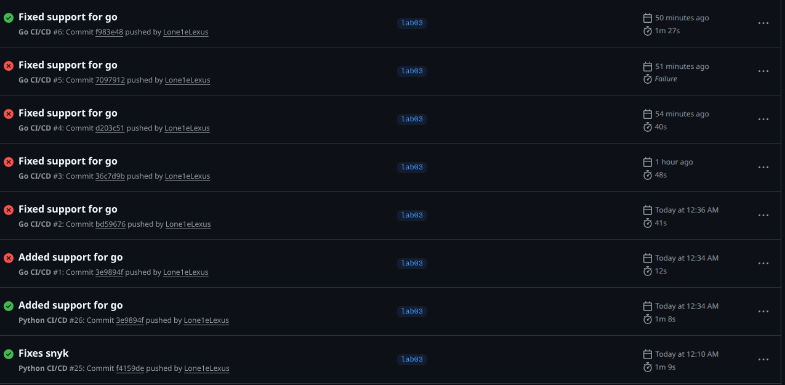

# Lab 3 — Continuous Integration (CI/CD)

## Bonus task (Go)

The Go CI/CD workflow (.github/workflows/go-ci.yml) provides automated testing, security scanning, Docker image building, and test coverage tracking for the Go implementation of the DevOps Info Service.

## Best Practices:

- Go modules - Fast, reproducible dependency resolution.
- Linting - Enforces idiomatic Go code.
- Native coverage - Built‑in coverage tool, no extra dependencies.
- Dependency caching - fast.
- Snyk security - Scans for vulnerabilities in dependencies.
- CalVer tagging - Immutable version tags, easy rollbacks.
- Path filtering - Trigger pipeline for go only when go files changes

## Coverege:

```bash
$ go test -v -coverprofile=coverage.out -covermode=atomic ./...
=== RUN   TestHealthEndpoint
--- PASS: TestHealthEndpoint (0.00s)
=== RUN   TestMainEndpoint
--- PASS: TestMainEndpoint (0.00s)
=== RUN   Test404Endpoint
--- PASS: Test404Endpoint (0.00s)
PASS
coverage: 51.8% of statements
ok      devops-info-service-go  0.002s  coverage: 51.8% of statements
```

## Results:

