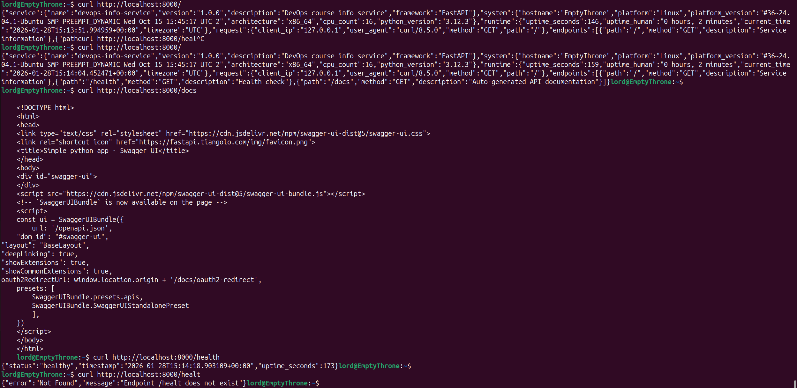

# Lab 1 Submission Documentation

## Framework Selection

### Choice: FastAPI

I chose FastAPI for several reasons:
1. **Modern features** (async/await support, type hints)
2. **Auto-documentation**
3. **Good performance**
4. **Easy validation**

| Framework | Pros | Cons |
|-----------|------|------|
| **FastAPI** | Fast, modern, async, auto-documentation | Newer, less mature than Flask | 
| **Flask** | Simple, lightweight, lots of tutorials | No async, manual documentation | 
| **Django** | Full-featured, batteries included | Too heavy for simple service | 

## Best Practices Applied

### 1. Clean Code Structure
- Separated functions: `get_system_info()`, `get_uptime()`
- Clear function names and docstrings
- PEP 8 compliance (checked with pycodestyle)

### 2. Error Handling
- Custom 404 and 500 error handlers

```python
# Error Handling


@app.exception_handler(404)
def not_found(request: Request, exc):
    """Handle 404 Not Found errors."""
    return JSONResponse(
        status_code=404,
        content={
            "error": "Not Found",
            "message": f"Endpoint {request.url.path} does not exist"
        }
    )


@app.exception_handler(500)
def internal_error(request: Request, exc):
    """Handle 500 Internal Server errors."""
    logger.error(f"Internal server error: {exc}")
    return JSONResponse(
        status_code=500,
        content={
            "error": "Internal Server Error",
            "message": "An unexpected error occurred"
        }
    )
```

### 3. Logging
- Configured structured logging
- Logs request methods and paths

```python
# Logging
logging.basicConfig(
    level=logging.INFO,
    format='%(asctime)s - %(name)s - %(levelname)s - %(message)s'
)
logger = logging.getLogger(__name__)

logger.info('Application starting...')
```

## API Documentation

### Endpoints Overview

| Method | Path | Description |
|--------|------|-------------|
| GET | `/` | Service and system information |
| GET | `/health` | Health check for monitoring |
| GET | `/docs` | Auto-generated API documentation |

### Main Endpoint: `GET /`

**Request Example:**
```bash
$ curl -s http://127.0.0.1:3000/ | jq '.'
```

**Response Example:**
```json
{
  "service": {
    "name": "devops-info-service",
    "version": "1.0.0",
    "description": "DevOps course info service",
    "framework": "FastAPI"
  },
  "system": {
    "hostname": "EmptyThrone",
    "platform": "Linux",
    "platform_version": "#36~24.04.1-Ubuntu SMP PREEMPT_DYNAMIC Wed Oct 15 15:45:17 UTC 2",
    "architecture": "x86_64",
    "cpu_count": 16,
    "python_version": "3.12.3"
  },
  "runtime": {
    "uptime_seconds": 22,
    "uptime_human": "0 hours, 0 minutes",
    "current_time": "2026-01-28T15:27:01.489584+00:00",
    "timezone": "UTC"
  },
  "request": {
    "client_ip": "127.0.0.1",
    "user_agent": "curl/8.5.0",
    "method": "GET",
    "path": "/"
  },
  "endpoints": [
    {
      "path": "/",
      "method": "GET",
      "description": "Service information"
    },
    {
      "path": "/health",
      "method": "GET",
      "description": "Health check"
    },
    {
      "path": "/docs",
      "method": "GET",
      "description": "Auto-generated API documentation"
    }
  ]
}
```

### Health Endpoint: `GET /health`

**Request Example:**
```bash
curl -s http://localhost:3000/health | jq '.'
```

**Response Example:**
```json
{
  "status": "healthy",
  "timestamp": "2026-01-28T15:21:29.978114+00:00",
  "uptime_seconds": 604
}
```

### Wrong Endpoint: `GET /health1`

**Request Example:**
```bash
curl -s http://localhost:3000/health1 | jq '.'
```

**Response Example:**
```json
{
  "error": "Not Found",
  "message": "Endpoint /health1 does not exist"
}
```

### Testing Commands:

```bash
# Main endpoint test
curl http://localhost:8000/

# Health check
curl http://localhost:8000/health

# Pretty main endpoint output
curl -s http://localhost:8000/ | jq '.'

# Auto-generated documentation
curl http://localhost:8000/docs
```

## Testing Evidence
### All endpoints:

```bash
$ curl http://localhost:8000/
{"service":{"name":"devops-info-service","version":"1.0.0","description":"DevOps course info service","framework":"FastAPI"},"system":{"hostname":"EmptyThrone","platform":"Linux","platform_version":"#36~24.04.1-Ubuntu SMP PREEMPT_DYNAMIC Wed Oct 15 15:45:17 UTC 2","architecture":"x86_64","cpu_count":16,"python_version":"3.12.3"},"runtime":{"uptime_seconds":159,"uptime_human":"0 hours, 2 minutes","current_time":"2026-01-28T15:14:04.452471+00:00","timezone":"UTC"},"request":{"client_ip":"127.0.0.1","user_agent":"curl/8.5.0","method":"GET","path":"/"},"endpoints":[{"path":"/","method":"GET","description":"Service information"},{"path":"/health","method":"GET","description":"Health check"},{"path":"/docs","method":"GET","description":"Auto-generated API documentation"}]}$ 
$ curl http://localhost:8000/docs

    <!DOCTYPE html>
    <html>
    <head>
    <link type="text/css" rel="stylesheet" href="https://cdn.jsdelivr.net/npm/swagger-ui-dist@5/swagger-ui.css">
    <link rel="shortcut icon" href="https://fastapi.tiangolo.com/img/favicon.png">
    <title>Simple python app - Swagger UI</title>
    </head>
    <body>
    <div id="swagger-ui">
    </div>
    <script src="https://cdn.jsdelivr.net/npm/swagger-ui-dist@5/swagger-ui-bundle.js"></script>
    <!-- `SwaggerUIBundle` is now available on the page -->
    <script>
    const ui = SwaggerUIBundle({
        url: '/openapi.json',
    "dom_id": "#swagger-ui",
"layout": "BaseLayout",
"deepLinking": true,
"showExtensions": true,
"showCommonExtensions": true,
oauth2RedirectUrl: window.location.origin + '/docs/oauth2-redirect',
    presets: [
        SwaggerUIBundle.presets.apis,
        SwaggerUIBundle.SwaggerUIStandalonePreset
        ],
    })
    </script>
    </body>
    </html>
curl http://localhost:8000/health
{"status":"healthy","timestamp":"2026-01-28T15:14:18.903109+00:00","uptime_seconds":173}$ 
$ curl http://localhost:8000/healt
{"error":"Not Found","message":"Endpoint /healt does not exist"}
```
### Auto-generated endpoind with documentation:

### Main endpoint:

### Health endpoint:

### Wrong endpoint:


## Challenges & Solutions

### Challenge 1: FastAPI Error Handlers
Problem: Different syntax from Flask error handlers
Solution: Used JSONResponse and proper function signatures


## GitHub Community

### Why starring repositories matters in open source:
- Shows appreciation
- Helps with discovery
- Bookmarks useful projects
- Shows you follow best practices and quality projects

### How following developers helps in team projects and professional growth:
- Builds network
- Helps learn from others
- Supports collaboration

