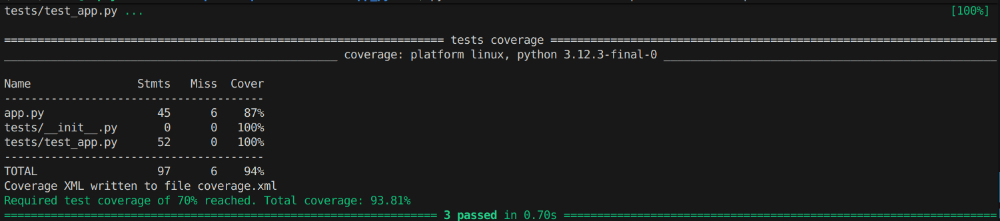
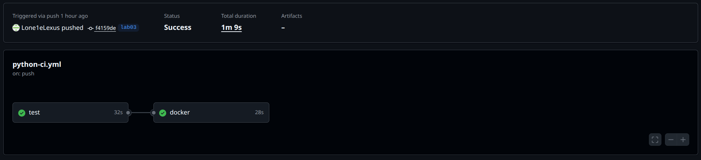
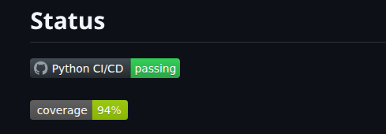
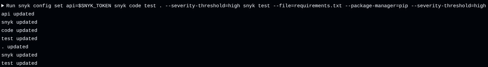
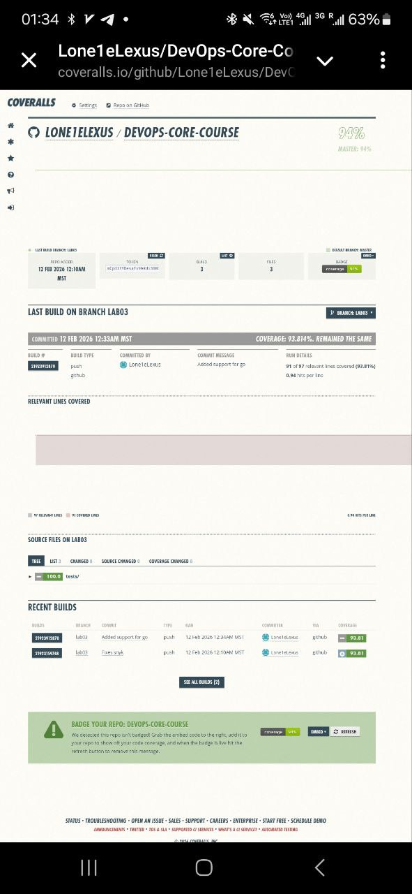

# Lab 3 — Continuous Integration (CI/CD)

## Task 1 — Unit Testing

1. Testing Framework: pytest
    - Simple, minimal boilerplate syntax

    - Powerful fixtures and plugins

    - Native integration with FastAPI's TestClient

    - Industry standard for modern Python projects

2. Test structure:

    - test_health_endpoint(): It verifies GET /health (Status 200, required fields (status, timestamp, uptime_seconds), correct data types)

    - test_main_endpoint(): It verifies GET / (Status 200, all 5 top-level sections present, key fields exist and have correct types/values)

    - test_404_endpoint(): It verifies that other endpoints are unaccessible. 


3. Tests:

```bash
cd app_python
pip install pytest flake8 pytest-cov coveralls
pytest tests/
```


## Task 2 — GitHub Actions CI Workflow

### Workflow trigger strategy

On push to master and labs branches, I run tests and publish Docker images on every code change, if I change something in python dir or pipeline.

On pull to master branches, I run tests, if I change something in python dir.

### Actions from the marketplace
- actions/checkout - Official, fast, minimal configuration.
- actions/setup-python	- Built‑in cache
- docker/setup-buildx-action - Required for Docker layer caching.
- docker/login-action -	Authenticate to Docker Hub	Secure
- docker/build-push-action	- Supports caching, tagging, and pushing in one step.

### Tagging

I use CalVer because I want.

### Proof

https://github.com/Lone1eLexus/DevOps-Core-Course/actions/runs/21923159748 



## Task 3 — CI Best Practices & Security

### Status badge



### Caching implementation and speed improvement metrics

Cache Size: ~16 MB (17123409 B)

### Best practicing 

- Fail fast
- Job dependency
- Conditional push
- Docker layer caching
- Coverage threshold

I use vest practicing with begining this lab, I can't compare :)

### Vulnerabilities scan

```bash
- name: Install Snyk CLI
        run: npm install -g snyk

      - name: Scan  with Snyk Code
        working-directory: app_python
        continue-on-error: false
        env:
          SNYK_TOKEN: ${{ secrets.SNYK_TOKEN }}
        run: 
          snyk config set api=$SNYK_TOKEN
          snyk code test . --severity-threshold=high
          snyk test --file=requirements.txt --package-manager=pip --severity-threshold=high
```



It doesn't find problems

## Bonus Task — Multi-App CI with Path Filters + Test Coverage

```bash
- name: Run tests with coverage
        working-directory: app_python
        run: |
          pytest tests/ --cov=. --cov-report=xml --cov-report=term --cov-fail-under=70

      - name: Upload coverage to Coveralls
        working-directory: app_python
        env:
          GITHUB_TOKEN: ${{ secrets.GITHUB_TOKEN }}
        run: coveralls --service=github
```



