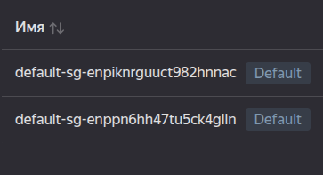

# Lab 4 — Infrastructure as Code (Terraform & Pulumi)

## Cloud Provider & Infrastructure

**Cloud provider:** Yandex Cloud (chosen for its free tier, no credit card required, and good accessibility in Russia).

**Instance type:** `standard-v2` with 2 vCPU (20% core fraction), 1 GB RAM – fits the free tier limits.

**Region/zone:** `ru-central1-a` (Moscow region).

**Total cost:** $0 (all resources within free tier).

## Task 1 — Terraform VM Creation (4 pts)

## Resources Created

| Resource | Description |
|----------|-------------|
| VPC Network | Automatically created via subnet reference |
| Subnet | Existing, ID provided in variables |
| Security Group | Ingress rules for SSH (22), HTTP (80), and port 5000 |
| Compute Instance | Ubuntu 22.04 LTS with public IP, 10 GB HDD boot disk |

## Key Configuration Decisions
- Used data source to fetch existing subnet by ID – avoids hardcoding network details.
- Security group allows SSH from anywhere (0.0.0.0/0) for lab convenience (in production, restrict to specific IP).
- VM metadata includes cloud‑init to install Docker and other tools for future labs.
- Labels applied for resource tracking.


```bash
$ terraform init
Initializing the backend...
Initializing provider plugins...
- Reusing previous version of yandex-cloud/yandex from the dependency lock file
- Installing yandex-cloud/yandex v0.187.0...
- Installed yandex-cloud/yandex v0.187.0 (unauthenticated)

Terraform has been successfully initialized!

You may now begin working with Terraform. Try running "terraform plan" to see
any changes that are required for your infrastructure. All Terraform commands
should now work.

If you ever set or change modules or backend configuration for Terraform,
rerun this command to reinitialize your working directory. If you forget, other
commands will detect it and remind you to do so if necessary.
$ terraform fmt
$ terraform validate
Success! The configuration is valid.

$ terraform plan
data.yandex_compute_image.ubuntu: Reading...
data.yandex_vpc_subnet.existing: Reading...
data.yandex_vpc_subnet.existing: Read complete after 0s [id=...]
data.yandex_compute_image.ubuntu: Read complete after 0s [id=...]

Terraform used the selected providers to generate the following execution plan. Resource actions are indicated with the following symbols:
  + create

Terraform will perform the following actions:

  # yandex_compute_instance.devops_vm will be created
  + resource "yandex_compute_instance" "devops_vm" {
      + created_at                = (known after apply)
      + folder_id                 = (known after apply)
      + fqdn                      = (known after apply)
      + gpu_cluster_id            = (known after apply)
      + hardware_generation       = (known after apply)
      + hostname                  = (known after apply)
      + id                        = (known after apply)
      + labels                    = {
          + "environment" = "lab"
          + "lab"         = "lab04"
          + "managed-by"  = "terraform"
        }
      + maintenance_grace_period  = (known after apply)
      + maintenance_policy        = (known after apply)
      + metadata                  = {
          + "ssh-keys"  = "..."
          + "user-data" = <<-EOT
                #cloud-config
                package_update: true
                package_upgrade: true
                packages:
                  - curl
                  - vim
                  - git
                  - docker.io
                runcmd:
                  - [ systemctl, enable, --now, ssh ]
                  - [ systemctl, enable, --now, docker ]
            EOT
        }
      + name                      = "devops-lab-vm"
      + network_acceleration_type = "standard"
      + platform_id               = "standard-v2"
      + status                    = (known after apply)
      + zone                      = "ru-central1-a"

      + boot_disk {
          + auto_delete = true
          + device_name = (known after apply)
          + disk_id     = (known after apply)
          + mode        = (known after apply)

          + initialize_params {
              + block_size  = (known after apply)
              + description = (known after apply)
              + image_id    = "fd8t9g30r3pc23et5krl"
              + name        = (known after apply)
              + size        = 10
              + snapshot_id = (known after apply)
              + type        = "network-hdd"
            }
        }

      + metadata_options (known after apply)

      + network_interface {
          + index              = (known after apply)
          + ip_address         = (known after apply)
          + ipv4               = true
          + ipv6               = (known after apply)
          + ipv6_address       = (known after apply)
          + mac_address        = (known after apply)
          + nat                = true
          + nat_ip_address     = (known after apply)
          + nat_ip_version     = (known after apply)
          + security_group_ids = (known after apply)
          + subnet_id          = "e9blcmbc2rjsuthi92f9"
        }

      + placement_policy (known after apply)

      + resources {
          + core_fraction = 20
          + cores         = 2
          + memory        = 1
        }

      + scheduling_policy (known after apply)
    }

  # yandex_vpc_security_group.devops_sg will be created
  + resource "yandex_vpc_security_group" "devops_sg" {
      + created_at = (known after apply)
      + folder_id  = (known after apply)
      + id         = (known after apply)
      + labels     = {
          + "environment" = "lab"
          + "lab"         = "lab04"
          + "managed-by"  = "terraform"
        }
      + name       = "devops-lab-sg"
      + network_id = "enpiknrguuct982hnnac"
      + status     = (known after apply)

      + egress {
          + description       = "All outbound"
          + from_port         = 0
          + id                = (known after apply)
          + labels            = (known after apply)
          + port              = -1
          + protocol          = "ANY"
          + to_port           = 65535
          + v4_cidr_blocks    = [
              + "0.0.0.0/0",
            ]
          + v6_cidr_blocks    = []
            # (2 unchanged attributes hidden)
        }

      + ingress {
          + description       = "Custom app port"
          + from_port         = -1
          + id                = (known after apply)
          + labels            = (known after apply)
          + port              = 5000
          + protocol          = "TCP"
          + to_port           = -1
          + v4_cidr_blocks    = [
              + "0.0.0.0/0",
            ]
          + v6_cidr_blocks    = []
            # (2 unchanged attributes hidden)
        }
      + ingress {
          + description       = "HTTP access"
          + from_port         = -1
          + id                = (known after apply)
          + labels            = (known after apply)
          + port              = 80
          + protocol          = "TCP"
          + to_port           = -1
          + v4_cidr_blocks    = [
              + "0.0.0.0/0",
            ]
          + v6_cidr_blocks    = []
            # (2 unchanged attributes hidden)
        }
      + ingress {
          + description       = "SSH access"
          + from_port         = -1
          + id                = (known after apply)
          + labels            = (known after apply)
          + port              = 22
          + protocol          = "TCP"
          + to_port           = -1
          + v4_cidr_blocks    = [
              + "0.0.0.0/0",
            ]
          + v6_cidr_blocks    = []
            # (2 unchanged attributes hidden)
        }
    }

Plan: 2 to add, 0 to change, 0 to destroy.

Changes to Outputs:
  + ssh_command  = (known after apply)
  + vm_public_ip = (known after apply)
╷
│ Warning: Cannot connect to YC tool initialization service. Network connectivity to the service is required for provider version control.
│ 
│ 
│   with provider["registry.terraform.io/yandex-cloud/yandex"],
│   on main.tf line 10, in provider "yandex":
│   10: provider "yandex" {
│ 
╵

───────────────────────────────────────────────────────────────────────────────────────────────────────────────────────────────────────────────────────────────────

Note: You didn't use the -out option to save this plan, so Terraform can't guarantee to take exactly these actions if you run "terraform apply" now.
$ terraform apply
data.yandex_compute_image.ubuntu: Reading...
data.yandex_vpc_subnet.existing: Reading...
data.yandex_vpc_subnet.existing: Read complete after 0s [id=...]
data.yandex_compute_image.ubuntu: Read complete after 0s [id=...]

Terraform used the selected providers to generate the following execution plan. Resource actions are indicated with the following symbols:
  + create

Terraform will perform the following actions:

  # yandex_compute_instance.devops_vm will be created
  + resource "yandex_compute_instance" "devops_vm" {
      + created_at                = (known after apply)
      + folder_id                 = (known after apply)
      + fqdn                      = (known after apply)
      + gpu_cluster_id            = (known after apply)
      + hardware_generation       = (known after apply)
      + hostname                  = (known after apply)
      + id                        = (known after apply)
      + labels                    = {
          + "environment" = "lab"
          + "lab"         = "lab04"
          + "managed-by"  = "terraform"
        }
      + maintenance_grace_period  = (known after apply)
      + maintenance_policy        = (known after apply)
      + metadata                  = {
          + "ssh-keys"  = "..."
          + "user-data" = <<-EOT
                #cloud-config
                package_update: true
                package_upgrade: true
                packages:
                  - curl
                  - vim
                  - git
                  - docker.io
                runcmd:
                  - [ systemctl, enable, --now, ssh ]
                  - [ systemctl, enable, --now, docker ]
            EOT
        }
      + name                      = "devops-lab-vm"
      + network_acceleration_type = "standard"
      + platform_id               = "standard-v2"
      + status                    = (known after apply)
      + zone                      = "ru-central1-a"

      + boot_disk {
          + auto_delete = true
          + device_name = (known after apply)
          + disk_id     = (known after apply)
          + mode        = (known after apply)

          + initialize_params {
              + block_size  = (known after apply)
              + description = (known after apply)
              + image_id    = "fd8t9g30r3pc23et5krl"
              + name        = (known after apply)
              + size        = 10
              + snapshot_id = (known after apply)
              + type        = "network-hdd"
            }
        }

      + metadata_options (known after apply)

      + network_interface {
          + index              = (known after apply)
          + ip_address         = (known after apply)
          + ipv4               = true
          + ipv6               = (known after apply)
          + ipv6_address       = (known after apply)
          + mac_address        = (known after apply)
          + nat                = true
          + nat_ip_address     = (known after apply)
          + nat_ip_version     = (known after apply)
          + security_group_ids = (known after apply)
          + subnet_id          = "e9blcmbc2rjsuthi92f9"
        }

      + placement_policy (known after apply)

      + resources {
          + core_fraction = 20
          + cores         = 2
          + memory        = 1
        }

      + scheduling_policy (known after apply)
    }

  # yandex_vpc_security_group.devops_sg will be created
  + resource "yandex_vpc_security_group" "devops_sg" {
      + created_at = (known after apply)
      + folder_id  = (known after apply)
      + id         = (known after apply)
      + labels     = {
          + "environment" = "lab"
          + "lab"         = "lab04"
          + "managed-by"  = "terraform"
        }
      + name       = "devops-lab-sg"
      + network_id = "enpiknrguuct982hnnac"
      + status     = (known after apply)

      + egress {
          + description       = "All outbound"
          + from_port         = 0
          + id                = (known after apply)
          + labels            = (known after apply)
          + port              = -1
          + protocol          = "ANY"
          + to_port           = 65535
          + v4_cidr_blocks    = [
              + "0.0.0.0/0",
            ]
          + v6_cidr_blocks    = []
            # (2 unchanged attributes hidden)
        }

      + ingress {
          + description       = "Custom app port"
          + from_port         = -1
          + id                = (known after apply)
          + labels            = (known after apply)
          + port              = 5000
          + protocol          = "TCP"
          + to_port           = -1
          + v4_cidr_blocks    = [
              + "0.0.0.0/0",
            ]
          + v6_cidr_blocks    = []
            # (2 unchanged attributes hidden)
        }
      + ingress {
          + description       = "HTTP access"
          + from_port         = -1
          + id                = (known after apply)
          + labels            = (known after apply)
          + port              = 80
          + protocol          = "TCP"
          + to_port           = -1
          + v4_cidr_blocks    = [
              + "0.0.0.0/0",
            ]
          + v6_cidr_blocks    = []
            # (2 unchanged attributes hidden)
        }
      + ingress {
          + description       = "SSH access"
          + from_port         = -1
          + id                = (known after apply)
          + labels            = (known after apply)
          + port              = 22
          + protocol          = "TCP"
          + to_port           = -1
          + v4_cidr_blocks    = [
              + "0.0.0.0/0",
            ]
          + v6_cidr_blocks    = []
            # (2 unchanged attributes hidden)
        }
    }

Plan: 2 to add, 0 to change, 0 to destroy.

Changes to Outputs:
  + ssh_command  = (known after apply)
  + vm_public_ip = (known after apply)
╷
│ Warning: Cannot connect to YC tool initialization service. Network connectivity to the service is required for provider version control.
│ 
│ 
│   with provider["registry.terraform.io/yandex-cloud/yandex"],
│   on main.tf line 10, in provider "yandex":
│   10: provider "yandex" {
│ 
╵

Do you want to perform these actions?
  Terraform will perform the actions described above.
  Only 'yes' will be accepted to approve.

  Enter a value: yes

yandex_vpc_security_group.devops_sg: Creating...
yandex_vpc_security_group.devops_sg: Creation complete after 2s [id=...]
yandex_compute_instance.devops_vm: Creating...
yandex_compute_instance.devops_vm: Still creating... [00m10s elapsed]
yandex_compute_instance.devops_vm: Still creating... [00m20s elapsed]
yandex_compute_instance.devops_vm: Still creating... [00m30s elapsed]
yandex_compute_instance.devops_vm: Still creating... [00m40s elapsed]
yandex_compute_instance.devops_vm: Creation complete after 42s [id=...]
╷
│ Warning: Cannot connect to YC tool initialization service. Network connectivity to the service is required for provider version control.
│ 
│ 
│   with provider["registry.terraform.io/yandex-cloud/yandex"],
│   on main.tf line 10, in provider "yandex":
│   10: provider "yandex" {
│ 
╵

Apply complete! Resources: 2 added, 0 changed, 0 destroyed.

Outputs:

ssh_command = "ssh ubuntu@89.169.132.54"
vm_public_ip = "89.169.132.54"

$ terraform output vm_public_ip
"89.169.132.54"
$ ssh ubuntu@$(terraform output -raw vm_public_ip)
The authenticity of host '89.169.132.54 (89.169.132.54)' can't be established.
ED25519 key fingerprint is SHA256:BVcTcptsPl6Suewhhu8K9vbL6ljkMZXlc+TK71yjg9w.
This key is not known by any other names.
Are you sure you want to continue connecting (yes/no/[fingerprint])? yes
Warning: Permanently added '89.169.132.54' (ED25519) to the list of known hosts.
Welcome to Ubuntu 22.04.5 LTS (GNU/Linux 5.15.0-170-generic x86_64)

 * Documentation:  https://help.ubuntu.com
 * Management:     https://landscape.canonical.com
 * Support:        https://ubuntu.com/pro

 System information as of Thu Feb 19 20:28:40 UTC 2026

  System load:  0.48              Processes:             106
  Usage of /:   23.4% of 9.04GB   Users logged in:       0
  Memory usage: 22%               IPv4 address for eth0: 10.128.0.8
  Swap usage:   0%

 * Strictly confined Kubernetes makes edge and IoT secure. Learn how MicroK8s
   just raised the bar for easy, resilient and secure K8s cluster deployment.

   https://ubuntu.com/engage/secure-kubernetes-at-the-edge

Expanded Security Maintenance for Applications is not enabled.

0 updates can be applied immediately.

2 additional security updates can be applied with ESM Apps.
Learn more about enabling ESM Apps service at https://ubuntu.com/esm


The programs included with the Ubuntu system are free software;
the exact distribution terms for each program are described in the
individual files in /usr/share/doc/*/copyright.

Ubuntu comes with ABSOLUTELY NO WARRANTY, to the extent permitted by
applicable law.

To run a command as administrator (user "root"), use "sudo <command>".
See "man sudo_root" for details.

ubuntu@fhm4ir78s8oehluk41tp:~$ docker --version
Docker version 28.2.2, build 28.2.2-0ubuntu1~22.04.1
ubuntu@fhm4ir78s8oehluk41tp:~$ exit
logout
Connection to 89.169.132.54 closed.
```


```bash
$ terraform destroy
data.yandex_vpc_subnet.existing: Reading...
data.yandex_compute_image.ubuntu: Reading...
data.yandex_vpc_subnet.existing: Read complete after 1s [id=e9blcmbc2rjsuthi92f9]
yandex_vpc_security_group.devops_sg: Refreshing state... [id=enpe9kl68g4sj2fjakv1]
data.yandex_compute_image.ubuntu: Read complete after 1s [id=fd8t9g30r3pc23et5krl]
yandex_compute_instance.devops_vm: Refreshing state... [id=fhm4ir78s8oehluk41tp]

Terraform used the selected providers to generate the following execution plan. Resource actions are indicated with the following symbols:
  - destroy

Terraform will perform the following actions:

  # yandex_compute_instance.devops_vm will be destroyed
  - resource "yandex_compute_instance" "devops_vm" {
      - created_at                = "2026-02-19T20:26:13Z" -> null
      - folder_id                 = "b1gk6gicrmma8tsr4pkb" -> null
      - fqdn                      = "fhm4ir78s8oehluk41tp.auto.internal" -> null
      - hardware_generation       = [
          - {
              - generation2_features = []
              - legacy_features      = [
                  - {
                      - pci_topology = "PCI_TOPOLOGY_V2"
                    },
                ]
            },
        ] -> null
      - id                        = "fhm4ir78s8oehluk41tp" -> null
      - labels                    = {
          - "environment" = "lab"
          - "lab"         = "lab04"
          - "managed-by"  = "terraform"
        } -> null
      - metadata                  = {
          - "ssh-keys"  = "..."
          - "user-data" = <<-EOT
                #cloud-config
                package_update: true
                package_upgrade: true
                packages:
                  - curl
                  - vim
                  - git
                  - docker.io
                runcmd:
                  - [ systemctl, enable, --now, ssh ]
                  - [ systemctl, enable, --now, docker ]
            EOT
        } -> null
      - name                      = "devops-lab-vm" -> null
      - network_acceleration_type = "standard" -> null
      - platform_id               = "standard-v2" -> null
      - status                    = "running" -> null
      - zone                      = "ru-central1-a" -> null
        # (5 unchanged attributes hidden)

      - boot_disk {
          - auto_delete = true -> null
          - device_name = "fhmntl0ih9vp6j3r7qcd" -> null
          - disk_id     = "fhmntl0ih9vp6j3r7qcd" -> null
          - mode        = "READ_WRITE" -> null

          - initialize_params {
              - block_size  = 4096 -> null
              - image_id    = "fd8t9g30r3pc23et5krl" -> null
                name        = null
              - size        = 10 -> null
              - type        = "network-hdd" -> null
                # (3 unchanged attributes hidden)
            }
        }

      - metadata_options {
          - aws_v1_http_endpoint = 1 -> null
          - aws_v1_http_token    = 2 -> null
          - gce_http_endpoint    = 1 -> null
          - gce_http_token       = 1 -> null
        }

      - network_interface {
          - index              = 0 -> null
          - ip_address         = "10.128.0.8" -> null
          - ipv4               = true -> null
          - ipv6               = false -> null
          - mac_address        = "d0:0d:49:6c:e8:e2" -> null
          - nat                = true -> null
          - nat_ip_address     = "89.169.132.54" -> null
          - nat_ip_version     = "IPV4" -> null
          - security_group_ids = [
              - "enpe9kl68g4sj2fjakv1",
            ] -> null
          - subnet_id          = "e9blcmbc2rjsuthi92f9" -> null
            # (1 unchanged attribute hidden)
        }

      - placement_policy {
          - host_affinity_rules       = [] -> null
          - placement_group_partition = 0 -> null
            # (1 unchanged attribute hidden)
        }

      - resources {
          - core_fraction = 20 -> null
          - cores         = 2 -> null
          - gpus          = 0 -> null
          - memory        = 1 -> null
        }

      - scheduling_policy {
          - preemptible = false -> null
        }
    }

  # yandex_vpc_security_group.devops_sg will be destroyed
  - resource "yandex_vpc_security_group" "devops_sg" {
      - created_at  = "2026-02-19T20:26:12Z" -> null
      - folder_id   = "b1gk6gicrmma8tsr4pkb" -> null
      - id          = "enpe9kl68g4sj2fjakv1" -> null
      - labels      = {
          - "environment" = "lab"
          - "lab"         = "lab04"
          - "managed-by"  = "terraform"
        } -> null
      - name        = "devops-lab-sg" -> null
      - network_id  = "enpiknrguuct982hnnac" -> null
      - status      = "ACTIVE" -> null
        # (1 unchanged attribute hidden)

      - egress {
          - description       = "All outbound" -> null
          - from_port         = 0 -> null
          - id                = "enp3lcr6gllrak66umku" -> null
          - labels            = {} -> null
          - port              = -1 -> null
          - protocol          = "ANY" -> null
          - to_port           = 65535 -> null
          - v4_cidr_blocks    = [
              - "0.0.0.0/0",
            ] -> null
          - v6_cidr_blocks    = [] -> null
            # (2 unchanged attributes hidden)
        }

      - ingress {
          - description       = "Custom app port" -> null
          - from_port         = -1 -> null
          - id                = "enp5mpv2i1qf3h75nsu6" -> null
          - labels            = {} -> null
          - port              = 5000 -> null
          - protocol          = "TCP" -> null
          - to_port           = -1 -> null
          - v4_cidr_blocks    = [
              - "0.0.0.0/0",
            ] -> null
          - v6_cidr_blocks    = [] -> null
            # (2 unchanged attributes hidden)
        }
      - ingress {
          - description       = "HTTP access" -> null
          - from_port         = -1 -> null
          - id                = "enpolpqpafgvsqudfcdo" -> null
          - labels            = {} -> null
          - port              = 80 -> null
          - protocol          = "TCP" -> null
          - to_port           = -1 -> null
          - v4_cidr_blocks    = [
              - "0.0.0.0/0",
            ] -> null
          - v6_cidr_blocks    = [] -> null
            # (2 unchanged attributes hidden)
        }
      - ingress {
          - description       = "SSH access" -> null
          - from_port         = -1 -> null
          - id                = "enprfk8gpfkt5tb4gss3" -> null
          - labels            = {} -> null
          - port              = 22 -> null
          - protocol          = "TCP" -> null
          - to_port           = -1 -> null
          - v4_cidr_blocks    = [
              - "0.0.0.0/0",
            ] -> null
          - v6_cidr_blocks    = [] -> null
            # (2 unchanged attributes hidden)
        }
    }

Plan: 0 to add, 0 to change, 2 to destroy.

Changes to Outputs:
  - ssh_command  = "ssh ubuntu@89.169.132.54" -> null
  - vm_public_ip = "89.169.132.54" -> null
╷
│ Warning: Cannot connect to YC tool initialization service. Network connectivity to the service is required for provider version control.
│ 
│ 
│   with provider["registry.terraform.io/yandex-cloud/yandex"],
│   on main.tf line 10, in provider "yandex":
│   10: provider "yandex" {
│ 
╵

Do you really want to destroy all resources?
  Terraform will destroy all your managed infrastructure, as shown above.
  There is no undo. Only 'yes' will be accepted to confirm.

  Enter a value: yes

yandex_compute_instance.devops_vm: Destroying... [id=fhm4ir78s8oehluk41tp]
yandex_compute_instance.devops_vm: Still destroying... [id=...]
yandex_compute_instance.devops_vm: Still destroying... [id=...]
yandex_compute_instance.devops_vm: Still destroying... [id=...]
yandex_compute_instance.devops_vm: Destruction complete after 30s
yandex_vpc_security_group.devops_sg: Destroying... [id=enpe9kl68g4sj2fjakv1]
yandex_vpc_security_group.devops_sg: Destruction complete after 1s
╷
│ Warning: Cannot connect to YC tool initialization service. Network connectivity to the service is required for provider version control.
│ 
│ 
│   with provider["registry.terraform.io/yandex-cloud/yandex"],
│   on main.tf line 10, in provider "yandex":
│   10: provider "yandex" {
│ 
╵

Destroy complete! Resources: 2 destroyed.
```



## Task 2 — Pulumi VM Creation (4 pts)

### Code differences from Terraform
- Imperative style – resources are instantiated with Python function calls.

- Uses pulumi.Config and environment variables for configuration.

- No separate files for variables/outputs; everything in __main__.py.

- More compact and leverages Python’s string formatting and control structures.

### I met some problems with pulumi-yandex, tried python 3.11 and 3.12, but problem still presents. 

```bash
$ pulumi preview
Previewing update (dev)

View in Browser (Ctrl+O): https://app.pulumi.com/Lone-org/devops-info/dev/previews/4998916f-bc4b-4635-92db-a1acbd5428c8

     Type                 Name             Plan       Info
 +   pulumi:pulumi:Stack  devops-info-dev  create     1 error

Diagnostics:
  pulumi:pulumi:Stack (devops-info-dev):
    error: Program failed with an unhandled exception:
    Traceback (most recent call last):
      File "/home/lord/DevOps/DevOps-Core-Course/pulumi/__main__.py", line 2, in <module>
        import pulumi_yandex as yandex
      File "/home/lord/DevOps/DevOps-Core-Course/pulumi/venv/lib/python3.12/site-packages/pulumi_yandex/__init__.py", line 5, in <module>
        from . import _utilities
      File "/home/lord/DevOps/DevOps-Core-Course/pulumi/venv/lib/python3.12/site-packages/pulumi_yandex/_utilities.py", line 10, in <module>
        import pkg_resources
    ModuleNotFoundError: No module named 'pkg_resources'

Resources:
    + 1 to create
    1 errored
```

