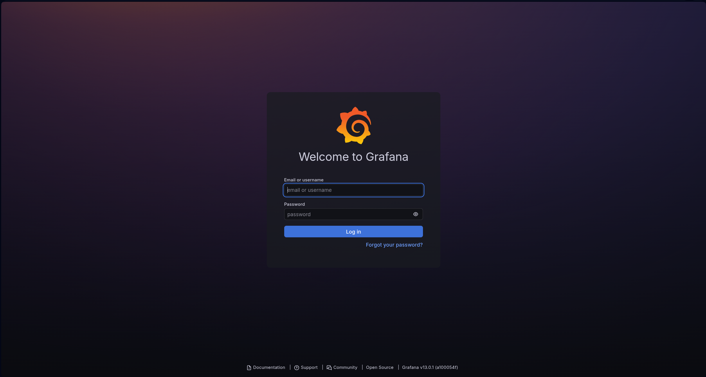
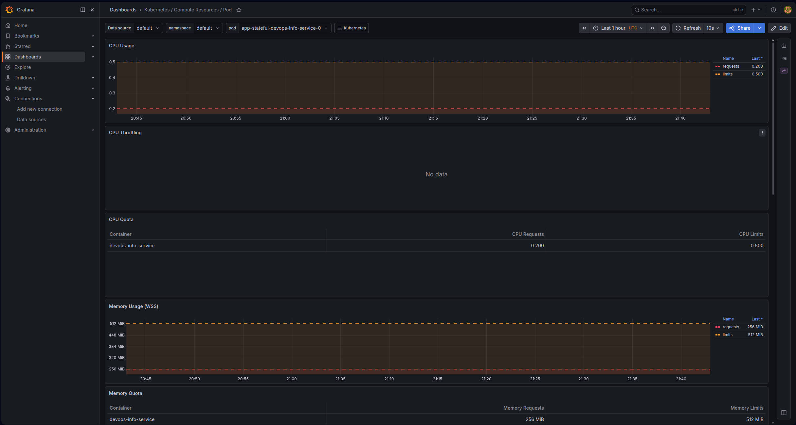
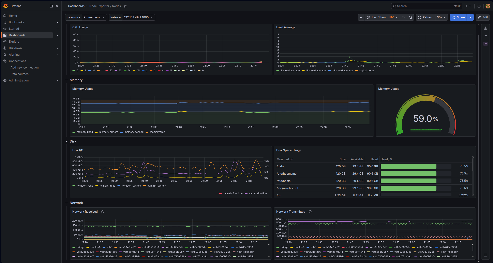
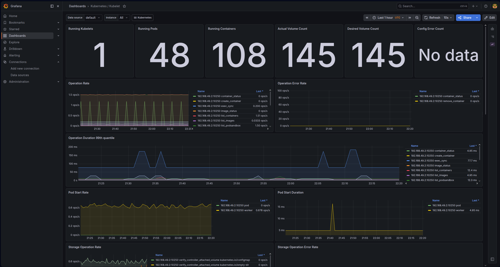

# Lab 16 — Kubernetes Monitoring & Init Containers

## Task 1 — Kube-Prometheus Stack

```bash
$ helm repo add prometheus-community https://prometheus-community.github.io/helm-charts
"prometheus-community" already exists with the same configuration, skipping
 helm repo update
Hang tight while we grab the latest from your chart repositories...
...Successfully got an update from the "argo" chart repository
...Successfully got an update from the "prometheus-community" chart repository
Update Complete. ⎈Happy Helming!⎈
```

```bash
$ helm install monitoring prometheus-community/kube-prometheus-stack   --namespace monitoring   --create-namespace
NAME: monitoring
LAST DEPLOYED: Mon May 11 22:50:26 2026
NAMESPACE: monitoring
STATUS: deployed
REVISION: 1
DESCRIPTION: Install complete
TEST SUITE: None
NOTES:
kube-prometheus-stack has been installed. Check its status by running:
  kubectl --namespace monitoring get pods -l "release=monitoring"

Get Grafana 'admin' user password by running:

  kubectl --namespace monitoring get secrets monitoring-grafana -o jsonpath="{.data.admin-password}" | base64 -d ; echo

Access Grafana local instance:

  export POD_NAME=$(kubectl --namespace monitoring get pod -l "app.kubernetes.io/name=grafana,app.kubernetes.io/instance=monitoring" -oname)
  kubectl --namespace monitoring port-forward $POD_NAME 3000

Get your grafana admin user password by running:

  kubectl get secret --namespace monitoring -l app.kubernetes.io/component=admin-secret -o jsonpath="{.items[0].data.admin-password}" | base64 --decode ; echo


Visit https://github.com/prometheus-operator/kube-prometheus for instructions on how to create & configure Alertmanager and Prometheus instances using the Operator.
 kubectl get pods -n monitoring
NAME                                                     READY   STATUS    RESTARTS   AGE
alertmanager-monitoring-kube-prometheus-alertmanager-0   2/2     Running   0          8m11s
monitoring-grafana-6ff98ddbd7-hmj27                      3/3     Running   0          8m30s
monitoring-kube-prometheus-operator-84c6779586-wj6xp     1/1     Running   0          8m30s
monitoring-kube-state-metrics-5957bd45bc-xm5xb           1/1     Running   0          8m30s
monitoring-prometheus-node-exporter-kv4c9                1/1     Running   0          8m30s
prometheus-monitoring-kube-prometheus-prometheus-0       2/2     Running   0          8m11s
```

### Kube-Prometheus Stack Components

| Component | Role |
|-----------|------|
| **Prometheus Operator** | Manages Prometheus, Alertmanager, and related resources (ServiceMonitor, PrometheusRule) |
| **Prometheus** | Scrapes metrics from targets, stores time‑series data, evaluates rules |
| **Alertmanager** | Handles alerts: deduplication, grouping, routing to receivers (email, Slack, etc.) |
| **Grafana** | Provides dashboards to visualise metrics from Prometheus |
| **kube-state-metrics** | Exposes Kubernetes object state metrics (deployments, pods, etc.) |
| **node-exporter** | Collects host‑level metrics (CPU, memory, disk, network) from each node |



## Task 2 — Grafana Dashboard Exploration



### Pod Resources:

#### Memory: 
Requests: 256 MiB
Limits: 512 Mib

#### CPU:
Requests: 0.2
Limits: 0.5

Equal for every app-statefull-devops-info-service-(0, 1, 2)

### Namespace Analysis

devops-info-service-go uses least CPU.
app-statefull-devops-info-service uses most CPU.

### Node Metrics



### Kubelet

48 pods and 108 cons



### Network

No traffic 

### Alerts

0 Alerts

## Task 3 — Init Containers

```bash
$ kubectl apply -f init-download.yaml
pod/init-download-pod created
$ kubectl get pods -w
NAME                                                READY   STATUS     RESTARTS        AGE
app-stateful-devops-info-service-0                  1/1     Running    1 (4d12h ago)   4d13h
app-stateful-devops-info-service-1                  1/1     Running    1 (4d12h ago)   4d13h
app-stateful-devops-info-service-2                  1/1     Running    1 (4d12h ago)   4d13h
app-stateful-devops-info-service-5cc78d9d6-b79ds    1/1     Running    1 (4d12h ago)   4d13h
app-stateful-devops-info-service-5cc78d9d6-gqkcq    1/1     Running    1 (4d12h ago)   4d13h
app-stateful-devops-info-service-5cc78d9d6-lpcvz    1/1     Running    1 (4d12h ago)   4d13h
dev-app-bg-devops-info-service-post-install-2smjd   0/1     Error      0               11d
dev-app-bg-devops-info-service-post-install-8hnp7   0/1     Error      0               11d
dev-app-bg-devops-info-service-post-install-dcxvd   0/1     Error      0               11d
dev-app-bg-devops-info-service-post-install-fdv9q   0/1     Error      0               11d
dev-app-bg-devops-info-service-post-install-jhfl8   0/1     Error      0               11d
dev-app-bg-devops-info-service-post-install-s9zbl   0/1     Error      0               11d
dev-app-bg-devops-info-service-post-install-td5cc   0/1     Error      0               11d
devops-app-devops-info-service-8996948df-4khxm      1/1     Running    3 (4d12h ago)   18d
devops-app-devops-info-service-8996948df-g9fll      1/1     Running    3 (4d12h ago)   18d
devops-app-devops-info-service-8996948df-knrkn      1/1     Running    3 (4d12h ago)   18d
devops-info-service-78f44cdc7d-9lbts                1/1     Running    7 (4d12h ago)   46d
devops-info-service-78f44cdc7d-gwbd9                1/1     Running    7 (4d12h ago)   46d
devops-info-service-78f44cdc7d-kbfjx                1/1     Running    7 (4d12h ago)   46d
devops-info-service-78f44cdc7d-ksxq4                1/1     Running    7 (4d12h ago)   46d
devops-info-service-78f44cdc7d-rdx7w                1/1     Running    7 (4d12h ago)   46d
devops-info-service-go-686d4f5dcd-9h44m             1/1     Running    7 (4d12h ago)   46d
devops-info-service-go-686d4f5dcd-n2t2f             1/1     Running    7 (4d12h ago)   46d
devops-info-service-go-686d4f5dcd-nxgbh             1/1     Running    7 (4d12h ago)   46d
devops-info-service-go-686d4f5dcd-qd4nx             1/1     Running    7 (4d12h ago)   46d
devops-info-service-go-686d4f5dcd-zf92x             1/1     Running    7 (4d12h ago)   46d
init-download-pod                                   0/1     Init:0/1   0               1s
vault-0                                             1/1     Running    5 (4d12h ago)   32d
vault-agent-injector-848dd747d7-znxsq               1/1     Running    5 (4d12h ago)   32d
init-download-pod                                   0/1     PodInitializing   0               7s
init-download-pod                                   1/1     Running           0               8s
```

```bash
$ kubectl logs init-download-pod -c downloader
Downloading index.html...
Connecting to example.com (8.6.112.0:443)
wget: note: TLS certificate validation not implemented
saving to '/work-dir/index.html'
index.html           100% |********************************|   528  0:00:00 ETA
'/work-dir/index.html' saved
Download complete.
$ kubectl exec init-download-pod -- cat /data/index.html
Defaulted container "main-app" out of: main-app, downloader (init)
<!doctype html><html lang="en"><head><title>Example Domain</title><meta name="viewport" content="width=device-width, initial-scale=1"><style>body{background:#eee;width:60vw;margin:15vh auto;font-family:system-ui,sans-serif}h1{font-size:1.5em}div{opacity:0.8}a:link,a:visited{color:#348}</style></head><body><div><h1>Example Domain</h1><p>This domain is for use in documentation examples without needing permission. Avoid use in operations.</p><p><a href="https://iana.org/domains/example">Learn more</a></p></div></body></html>
```

```bash
$ kubectl apply -f init-wait.yaml
pod/init-wait-pod created
$ kubectl get pods -w 
NAME                                                READY   STATUS     RESTARTS        AGE
app-stateful-devops-info-service-0                  1/1     Running    1 (4d12h ago)   4d13h
app-stateful-devops-info-service-1                  1/1     Running    1 (4d12h ago)   4d13h
app-stateful-devops-info-service-2                  1/1     Running    1 (4d12h ago)   4d13h
app-stateful-devops-info-service-5cc78d9d6-b79ds    1/1     Running    1 (4d12h ago)   4d13h
app-stateful-devops-info-service-5cc78d9d6-gqkcq    1/1     Running    1 (4d12h ago)   4d13h
app-stateful-devops-info-service-5cc78d9d6-lpcvz    1/1     Running    1 (4d12h ago)   4d13h
dev-app-bg-devops-info-service-post-install-2smjd   0/1     Error      0               11d
dev-app-bg-devops-info-service-post-install-8hnp7   0/1     Error      0               11d
dev-app-bg-devops-info-service-post-install-dcxvd   0/1     Error      0               11d
dev-app-bg-devops-info-service-post-install-fdv9q   0/1     Error      0               11d
dev-app-bg-devops-info-service-post-install-jhfl8   0/1     Error      0               11d
dev-app-bg-devops-info-service-post-install-s9zbl   0/1     Error      0               11d
dev-app-bg-devops-info-service-post-install-td5cc   0/1     Error      0               11d
devops-app-devops-info-service-8996948df-4khxm      1/1     Running    3 (4d12h ago)   18d
devops-app-devops-info-service-8996948df-g9fll      1/1     Running    3 (4d12h ago)   18d
devops-app-devops-info-service-8996948df-knrkn      1/1     Running    3 (4d12h ago)   18d
devops-info-service-78f44cdc7d-9lbts                1/1     Running    7 (4d12h ago)   46d
devops-info-service-78f44cdc7d-gwbd9                1/1     Running    7 (4d12h ago)   46d
devops-info-service-78f44cdc7d-kbfjx                1/1     Running    7 (4d12h ago)   46d
devops-info-service-78f44cdc7d-ksxq4                1/1     Running    7 (4d12h ago)   46d
devops-info-service-78f44cdc7d-rdx7w                1/1     Running    7 (4d12h ago)   46d
devops-info-service-go-686d4f5dcd-9h44m             1/1     Running    7 (4d12h ago)   46d
devops-info-service-go-686d4f5dcd-n2t2f             1/1     Running    7 (4d12h ago)   46d
devops-info-service-go-686d4f5dcd-nxgbh             1/1     Running    7 (4d12h ago)   46d
devops-info-service-go-686d4f5dcd-qd4nx             1/1     Running    7 (4d12h ago)   46d
devops-info-service-go-686d4f5dcd-zf92x             1/1     Running    7 (4d12h ago)   46d
init-download-pod                                   1/1     Running    0               2m49s
init-wait-pod                                       0/1     Init:0/1   0               0s
vault-0                                             1/1     Running    5 (4d12h ago)   32d
vault-agent-injector-848dd747d7-znxsq               1/1     Running    5 (4d12h ago)   32d
init-wait-pod                                       0/1     PodInitializing   0               2s
init-wait-pod                                       1/1     Running           0               3s
$ kubectl logs init-wait-pod -c waiter
Waiting for kubernetes.default.svc.cluster.local...
Server:         10.96.0.10
Address:        10.96.0.10:53


Name:   kubernetes.default.svc.cluster.local
Address: 10.96.0.1

Service found. Continuing.
$ kubectl get pods init-wait-pod
NAME            READY   STATUS    RESTARTS   AGE
init-wait-pod   1/1     Running   0          37s
```

