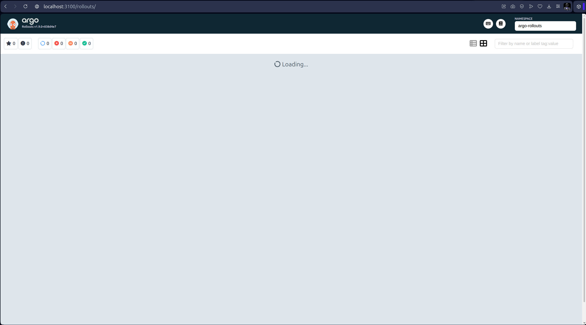

# Lab 14 — Progressive Delivery with Argo Rollouts

## Task 1 — Argo Rollouts Fundamentals

```bash
$ kubectl create namespace argo-rollouts
namespace/argo-rollouts created
$ kubectl apply -n argo-rollouts -f https://github.com/argoproj/argo-rollouts/releases/latest/download/install.yaml
customresourcedefinition.apiextensions.k8s.io/analysisruns.argoproj.io created
customresourcedefinition.apiextensions.k8s.io/analysistemplates.argoproj.io created
customresourcedefinition.apiextensions.k8s.io/clusteranalysistemplates.argoproj.io created
customresourcedefinition.apiextensions.k8s.io/experiments.argoproj.io created
customresourcedefinition.apiextensions.k8s.io/rollouts.argoproj.io created
serviceaccount/argo-rollouts created
clusterrole.rbac.authorization.k8s.io/argo-rollouts created
clusterrole.rbac.authorization.k8s.io/argo-rollouts-aggregate-to-admin created
clusterrole.rbac.authorization.k8s.io/argo-rollouts-aggregate-to-edit created
clusterrole.rbac.authorization.k8s.io/argo-rollouts-aggregate-to-view created
clusterrolebinding.rbac.authorization.k8s.io/argo-rollouts created
configmap/argo-rollouts-config created
secret/argo-rollouts-notification-secret created
service/argo-rollouts-metrics created
deployment.apps/argo-rollouts created
$ curl -LO https://github.com/argoproj/argo-rollouts/releases/latest/download/kubectl-argo-rollouts-linux-amd64
  % Total    % Received % Xferd  Average Speed   Time    Time     Time  Current
                                 Dload  Upload   Total   Spent    Left  Speed
  0     0    0     0    0     0      0      0 --:--:--  0:00:01 --:--:--     0
  0     0    0     0    0     0      0      0 --:--:--  0:00:01 --:--:--     0
100  127M  100  127M    0     0  1451k      0  0:01:30  0:01:30 --:--:-- 1893k
$ chmod +x kubectl-argo-rollouts-linux-amd64
sudo mv kubectl-argo-rollouts-linux-amd64 /usr/local/bin/kubectl-argo-rollouts
[sudo] password for lord: 
$ kubectl argo rollouts version
kubectl-argo-rollouts: v1.9.0+838d4e7
  BuildDate: 2026-03-20T21:08:11Z
  GitCommit: 838d4e792be666ec11bd0c80331e0c5511b5010e
  GitTreeState: clean
  GoVersion: go1.24.13
  Compiler: gc
  Platform: linux/amd64
```

```bash
$ kubectl port-forward svc/argo-rollouts-dashboard -n argo-rollouts 3100:3100
...
```

### Argo Rollouts Fundamentals: Rollout vs Deployment

Both `Deployment` and `Rollout` are Kubernetes resources that manage the lifecycle of stateless applications. However, Argo Rollouts extends the standard Deployment with advanced deployment strategies (canary, blue‑green), traffic shaping, and automated analysis‑based rollback.

#### Key Differences

| Feature                   | Standard Kubernetes Deployment       | Argo Rollouts `Rollout`                     |
|---------------------------|----------------------------------------|----------------------------------------------|
| **Update strategies**     | `RollingUpdate`, `Recreate`            | `Canary`, `BlueGreen`, plus `RollingUpdate` |
| **Traffic weighting**     | Not supported (pods replaced linearly) | Yes, with manual or automatic percentages   |
| **Pause / manual gates**  | `kubectl rollout pause/resume`         | Native `pause` steps in canary strategy     |
| **Preview environment**   | No                                     | Built‑in `previewService` for blue‑green    |
| **Metrics‑based analysis**| No                                     | `AnalysisTemplate` + automatic promotion/rollback |
| **UI Dashboard**          | `kubectl rollout status` only          | Full dashboard with real‑time rollouts      |
| **Traffic management integration** | None                                  | Supports Istio, SMI, and manual traffic splitting |
| **Instant rollback**      | `kubectl rollout undo`                 | `kubectl argo rollouts abort`, instant switch |



## Task 2 — Canary Deployment

```bash
$ helm upgrade --install dev-app .
Release "dev-app" does not exist. Installing it now.
NAME: dev-app
LAST DEPLOYED: Thu Apr 30 22:12:35 2026
NAMESPACE: default
STATUS: deployed
REVISION: 1
DESCRIPTION: Install complete
TEST SUITE: None
$ helm upgrade --install dev-app .   --set canary.enabled=true   --set image.tag=2026.04.55
Release "dev-app" has been upgraded. Happy Helming!
NAME: dev-app
LAST DEPLOYED: Thu Apr 30 22:23:26 2026
NAMESPACE: default
STATUS: deployed
REVISION: 5
DESCRIPTION: Upgrade complete
TEST SUITE: None
```

```bash
$ kubectl argo rollouts promote dev-app-devops-info-service
rollout 'dev-app-devops-info-service' promoted
$ kubectl argo rollouts abort dev-app-devops-info-service
rollout 'dev-app-devops-info-service' aborted
$ kubectl argo rollouts retry rollout dev-app-devops-info-service
rollout 'dev-app-devops-info-service' retried
```

```bash

NAME                                                     KIND        STATUS               AGE  INFO
⟳ dev-app-devops-info-service                            Rollout     ◌ Progressing        3s   
└──# revision:1                                                                                
   └──⧉ dev-app-devops-info-service-5d6f6fd46c           ReplicaSet  ◌ Progressing        3s   stable
      ├──□ dev-app-devops-info-service-5d6f6fd46c-ccklk  Pod         ◌ ContainerCreating  3s   ready:0/1
      ├──□ dev-app-devops-info-service-5d6f6fd46c-mhcp9  Pod         ◌ ContainerCreating  3s   ready:0/1
      └──□ dev-app-devops-info-service-5d6f6fd46c-trzpz  Pod         ◌ ContainerCreating  3s   ready:0/1
Name:            dev-app-devops-info-service
Namespace:       default
Status:          ◌ Progressing
Message:         updated replicas are still becoming available
Strategy:        Canary
  Step:          9/9
  SetWeight:     100
  ActualWeight:  100
Images:          lehus1/devops-info-service:2026.04.52 (stable)
Replicas:
  Desired:       3
  Current:       3
  Updated:       3
  Ready:         0
  Available:     0

NAME                                                     KIND        STATUS               AGE  INFO
⟳ dev-app-devops-info-service                            Rollout     ◌ Progressing        4s   
└──# revision:1                                                                                
   └──⧉ dev-app-devops-info-service-5d6f6fd46c           ReplicaSet  ◌ Progressing        4s   stable
      ├──□ dev-app-devops-info-service-5d6f6fd46c-ccklk  Pod         ◌ ContainerCreating  4s   ready:0/1
      ├──□ dev-app-devops-info-service-5d6f6fd46c-mhcp9  Pod         ◌ ContainerCreating  4s   ready:0/1
      └──□ dev-app-devops-info-service-5d6f6fd46c-trzpz  Pod         ◌ ContainerCreating  4s   ready:0/1
Name:            dev-app-devops-info-service
Namespace:       default
Status:          ◌ Progressing
Message:         updated replicas are still becoming available
Strategy:        Canary
  Step:          9/9
  SetWeight:     100
  ActualWeight:  100
Images:          lehus1/devops-info-service:2026.04.52 (stable)
Replicas:
  Desired:       3
  Current:       3
  Updated:       3
  Ready:         0
  Available:     0

NAME                                                     KIND        STATUS               AGE  INFO
⟳ dev-app-devops-info-service                            Rollout     ◌ Progressing        5s   
└──# revision:1                                                                                
   └──⧉ dev-app-devops-info-service-5d6f6fd46c           ReplicaSet  ◌ Progressing        5s   stable
      ├──□ dev-app-devops-info-service-5d6f6fd46c-ccklk  Pod         ◌ ContainerCreating  5s   ready:0/1
      ├──□ dev-app-devops-info-service-5d6f6fd46c-mhcp9  Pod         ◌ ContainerCreating  5s   ready:0/1
      └──□ dev-app-devops-info-service-5d6f6fd46c-trzpz  Pod         ◌ ContainerCreating  5s   ready:0/1
Name:            dev-app-devops-info-service
Namespace:       default
Status:          ◌ Progressing
Message:         updated replicas are still becoming available
Strategy:        Canary
  Step:          9/9
  SetWeight:     100
  ActualWeight:  100
Images:          lehus1/devops-info-service:2026.04.52 (stable)
Replicas:
  Desired:       3
  Current:       3
  Updated:       3
  Ready:         0
  Available:     0

NAME                                                     KIND        STATUS               AGE  INFO
⟳ dev-app-devops-info-service                            Rollout     ◌ Progressing        6s   
└──# revision:1                                                                                
   └──⧉ dev-app-devops-info-service-5d6f6fd46c           ReplicaSet  ◌ Progressing        6s   stable
      ├──□ dev-app-devops-info-service-5d6f6fd46c-ccklk  Pod         ◌ ContainerCreating  6s   ready:0/1
      ├──□ dev-app-devops-info-service-5d6f6fd46c-mhcp9  Pod         ◌ ContainerCreating  6s   ready:0/1
      └──□ dev-app-devops-info-service-5d6f6fd46c-trzpz  Pod         ◌ ContainerCreating  6s   ready:0/1
Name:            dev-app-devops-info-service
Namespace:       default
Status:          ◌ Progressing
Message:         updated replicas are still becoming available
Strategy:        Canary
  Step:          9/9
  SetWeight:     100
  ActualWeight:  100
Images:          lehus1/devops-info-service:2026.04.52 (stable)
Replicas:
  Desired:       3
  Current:       3
  Updated:       3
  Ready:         0
  Available:     0

NAME                                                     KIND        STATUS               AGE  INFO
⟳ dev-app-devops-info-service                            Rollout     ◌ Progressing        7s   
└──# revision:1                                                                                
   └──⧉ dev-app-devops-info-service-5d6f6fd46c           ReplicaSet  ◌ Progressing        7s   stable
      ├──□ dev-app-devops-info-service-5d6f6fd46c-ccklk  Pod         ◌ ContainerCreating  7s   ready:0/1
      ├──□ dev-app-devops-info-service-5d6f6fd46c-mhcp9  Pod         ◌ ContainerCreating  7s   ready:0/1
      └──□ dev-app-devops-info-service-5d6f6fd46c-trzpz  Pod         ◌ ContainerCreating  7s   ready:0/1
Name:            dev-app-devops-info-service
Namespace:       default
Status:          ◌ Progressing
Message:         updated replicas are still becoming available
Strategy:        Canary
  Step:          9/9
  SetWeight:     100
  ActualWeight:  100
Images:          lehus1/devops-info-service:2026.04.52 (stable)
Replicas:
  Desired:       3
  Current:       3
  Updated:       3
  Ready:         0
  Available:     0

NAME                                                     KIND        STATUS               AGE  INFO
⟳ dev-app-devops-info-service                            Rollout     ◌ Progressing        7s   
└──# revision:1                                                                                
   └──⧉ dev-app-devops-info-service-5d6f6fd46c           ReplicaSet  ◌ Progressing        7s   stable
      ├──□ dev-app-devops-info-service-5d6f6fd46c-ccklk  Pod         ◌ ContainerCreating  7s   ready:0/1
      ├──□ dev-app-devops-info-service-5d6f6fd46c-mhcp9  Pod         ◌ ContainerCreating  7s   ready:0/1
      └──□ dev-app-devops-info-service-5d6f6fd46c-trzpz  Pod         ✔ Running            7s   ready:0/1
Name:            dev-app-devops-info-service
Namespace:       default
Status:          ◌ Progressing
Message:         updated replicas are still becoming available
Strategy:        Canary
  Step:          9/9
  SetWeight:     100
  ActualWeight:  100
Images:          lehus1/devops-info-service:2026.04.52 (stable)
Replicas:
  Desired:       3
  Current:       3
  Updated:       3
  Ready:         0
  Available:     0

NAME                                                     KIND        STATUS               AGE  INFO
⟳ dev-app-devops-info-service                            Rollout     ◌ Progressing        8s   
└──# revision:1                                                                                
   └──⧉ dev-app-devops-info-service-5d6f6fd46c           ReplicaSet  ◌ Progressing        8s   stable
      ├──□ dev-app-devops-info-service-5d6f6fd46c-ccklk  Pod         ◌ ContainerCreating  8s   ready:0/1
      ├──□ dev-app-devops-info-service-5d6f6fd46c-mhcp9  Pod         ◌ ContainerCreating  8s   ready:0/1
      └──□ dev-app-devops-info-service-5d6f6fd46c-trzpz  Pod         ✔ Running            8s   ready:0/1
Name:            dev-app-devops-info-service
Namespace:       default
Status:          ◌ Progressing
Message:         updated replicas are still becoming available
Strategy:        Canary
  Step:          9/9
  SetWeight:     100
  ActualWeight:  100
Images:          lehus1/devops-info-service:2026.04.52 (stable)
Replicas:
  Desired:       3
  Current:       3
  Updated:       3
  Ready:         0
  Available:     0

NAME                                                     KIND        STATUS               AGE  INFO
⟳ dev-app-devops-info-service                            Rollout     ◌ Progressing        9s   
└──# revision:1                                                                                
   └──⧉ dev-app-devops-info-service-5d6f6fd46c           ReplicaSet  ◌ Progressing        9s   stable
      ├──□ dev-app-devops-info-service-5d6f6fd46c-ccklk  Pod         ◌ ContainerCreating  9s   ready:0/1
      ├──□ dev-app-devops-info-service-5d6f6fd46c-mhcp9  Pod         ◌ ContainerCreating  9s   ready:0/1
      └──□ dev-app-devops-info-service-5d6f6fd46c-trzpz  Pod         ✔ Running            9s   ready:0/1
Name:            dev-app-devops-info-service
Namespace:       default
Status:          ◌ Progressing
Message:         updated replicas are still becoming available
Strategy:        Canary
  Step:          9/9
  SetWeight:     100
  ActualWeight:  100
Images:          lehus1/devops-info-service:2026.04.52 (stable)
Replicas:
  Desired:       3
  Current:       3
  Updated:       3
  Ready:         0
  Available:     0

NAME                                                     KIND        STATUS               AGE  INFO
⟳ dev-app-devops-info-service                            Rollout     ◌ Progressing        10s  
└──# revision:1                                                                                
   └──⧉ dev-app-devops-info-service-5d6f6fd46c           ReplicaSet  ◌ Progressing        10s  stable
      ├──□ dev-app-devops-info-service-5d6f6fd46c-ccklk  Pod         ◌ ContainerCreating  10s  ready:0/1
      ├──□ dev-app-devops-info-service-5d6f6fd46c-mhcp9  Pod         ◌ ContainerCreating  10s  ready:0/1
      └──□ dev-app-devops-info-service-5d6f6fd46c-trzpz  Pod         ✔ Running            10s  ready:0/1
Name:            dev-app-devops-info-service
Namespace:       default
Status:          ◌ Progressing
Message:         updated replicas are still becoming available
Strategy:        Canary
  Step:          9/9
  SetWeight:     100
  ActualWeight:  100
Images:          lehus1/devops-info-service:2026.04.52 (stable)
Replicas:
  Desired:       3
  Current:       3
  Updated:       3
  Ready:         0
  Available:     0

NAME                                                     KIND        STATUS               AGE  INFO
⟳ dev-app-devops-info-service                            Rollout     ◌ Progressing        10s  
└──# revision:1                                                                                
   └──⧉ dev-app-devops-info-service-5d6f6fd46c           ReplicaSet  ◌ Progressing        10s  stable
      ├──□ dev-app-devops-info-service-5d6f6fd46c-ccklk  Pod         ◌ ContainerCreating  10s  ready:0/1
      ├──□ dev-app-devops-info-service-5d6f6fd46c-mhcp9  Pod         ✔ Running            10s  ready:0/1
      └──□ dev-app-devops-info-service-5d6f6fd46c-trzpz  Pod         ✔ Running            10s  ready:0/1
Name:            dev-app-devops-info-service
Namespace:       default
Status:          ◌ Progressing
Message:         updated replicas are still becoming available
Strategy:        Canary
  Step:          9/9
  SetWeight:     100
  ActualWeight:  100
Images:          lehus1/devops-info-service:2026.04.52 (stable)
Replicas:
  Desired:       3
  Current:       3
  Updated:       3
  Ready:         0
  Available:     0

NAME                                                     KIND        STATUS               AGE  INFO
⟳ dev-app-devops-info-service                            Rollout     ◌ Progressing        11s  
└──# revision:1                                                                                
   └──⧉ dev-app-devops-info-service-5d6f6fd46c           ReplicaSet  ◌ Progressing        11s  stable
      ├──□ dev-app-devops-info-service-5d6f6fd46c-ccklk  Pod         ◌ ContainerCreating  11s  ready:0/1
      ├──□ dev-app-devops-info-service-5d6f6fd46c-mhcp9  Pod         ✔ Running            11s  ready:0/1
      └──□ dev-app-devops-info-service-5d6f6fd46c-trzpz  Pod         ✔ Running            11s  ready:0/1
Name:            dev-app-devops-info-service
Namespace:       default
Status:          ◌ Progressing
Message:         updated replicas are still becoming available
Strategy:        Canary
  Step:          9/9
  SetWeight:     100
  ActualWeight:  100
Images:          lehus1/devops-info-service:2026.04.52 (stable)
Replicas:
  Desired:       3
  Current:       3
  Updated:       3
  Ready:         0
  Available:     0

NAME                                                     KIND        STATUS               AGE  INFO
⟳ dev-app-devops-info-service                            Rollout     ◌ Progressing        12s  
└──# revision:1                                                                                
   └──⧉ dev-app-devops-info-service-5d6f6fd46c           ReplicaSet  ◌ Progressing        12s  stable
      ├──□ dev-app-devops-info-service-5d6f6fd46c-ccklk  Pod         ◌ ContainerCreating  12s  ready:0/1
      ├──□ dev-app-devops-info-service-5d6f6fd46c-mhcp9  Pod         ✔ Running            12s  ready:0/1
      └──□ dev-app-devops-info-service-5d6f6fd46c-trzpz  Pod         ✔ Running            12s  ready:0/1
Name:            dev-app-devops-info-service
Namespace:       default
Status:          ◌ Progressing
Message:         updated replicas are still becoming available
Strategy:        Canary
  Step:          9/9
  SetWeight:     100
  ActualWeight:  100
Images:          lehus1/devops-info-service:2026.04.52 (stable)
Replicas:
  Desired:       3
  Current:       3
  Updated:       3
  Ready:         0
  Available:     0

NAME                                                     KIND        STATUS         AGE  INFO
⟳ dev-app-devops-info-service                            Rollout     ◌ Progressing  12s  
└──# revision:1                                                                          
   └──⧉ dev-app-devops-info-service-5d6f6fd46c           ReplicaSet  ◌ Progressing  12s  stable
      ├──□ dev-app-devops-info-service-5d6f6fd46c-ccklk  Pod         ✔ Running      12s  ready:0/1
      ├──□ dev-app-devops-info-service-5d6f6fd46c-mhcp9  Pod         ✔ Running      12s  ready:0/1
      └──□ dev-app-devops-info-service-5d6f6fd46c-trzpz  Pod         ✔ Running      12s  ready:0/1
Name:            dev-app-devops-info-service
Namespace:       default
Status:          ◌ Progressing
Message:         updated replicas are still becoming available
Strategy:        Canary
  Step:          9/9
  SetWeight:     100
  ActualWeight:  100
Images:          lehus1/devops-info-service:2026.04.52 (stable)
Replicas:
  Desired:       3
  Current:       3
  Updated:       3
  Ready:         0
  Available:     0

NAME                                                     KIND        STATUS         AGE  INFO
⟳ dev-app-devops-info-service                            Rollout     ◌ Progressing  13s  
└──# revision:1                                                                          
   └──⧉ dev-app-devops-info-service-5d6f6fd46c           ReplicaSet  ◌ Progressing  13s  stable
      ├──□ dev-app-devops-info-service-5d6f6fd46c-ccklk  Pod         ✔ Running      13s  ready:0/1
      ├──□ dev-app-devops-info-service-5d6f6fd46c-mhcp9  Pod         ✔ Running      13s  ready:0/1
      └──□ dev-app-devops-info-service-5d6f6fd46c-trzpz  Pod         ✔ Running      13s  ready:0/1
Name:            dev-app-devops-info-service
Namespace:       default
Status:          ◌ Progressing
Message:         updated replicas are still becoming available
Strategy:        Canary
  Step:          9/9
  SetWeight:     100
  ActualWeight:  100
Images:          lehus1/devops-info-service:2026.04.52 (stable)
Replicas:
  Desired:       3
  Current:       3
  Updated:       3
  Ready:         0
  Available:     0

NAME                                                     KIND        STATUS         AGE  INFO
⟳ dev-app-devops-info-service                            Rollout     ◌ Progressing  14s  
└──# revision:1                                                                          
   └──⧉ dev-app-devops-info-service-5d6f6fd46c           ReplicaSet  ◌ Progressing  14s  stable
      ├──□ dev-app-devops-info-service-5d6f6fd46c-ccklk  Pod         ✔ Running      14s  ready:0/1
      ├──□ dev-app-devops-info-service-5d6f6fd46c-mhcp9  Pod         ✔ Running      14s  ready:0/1
      └──□ dev-app-devops-info-service-5d6f6fd46c-trzpz  Pod         ✔ Running      14s  ready:0/1
Name:            dev-app-devops-info-service
Namespace:       default
Status:          ◌ Progressing
Message:         updated replicas are still becoming available
Strategy:        Canary
  Step:          9/9
  SetWeight:     100
  ActualWeight:  100
Images:          lehus1/devops-info-service:2026.04.52 (stable)
Replicas:
  Desired:       3
  Current:       3
  Updated:       3
  Ready:         0
  Available:     0

NAME                                                     KIND        STATUS         AGE  INFO
⟳ dev-app-devops-info-service                            Rollout     ◌ Progressing  14s  
└──# revision:1                                                                          
   └──⧉ dev-app-devops-info-service-5d6f6fd46c           ReplicaSet  ◌ Progressing  14s  stable
      ├──□ dev-app-devops-info-service-5d6f6fd46c-ccklk  Pod         ✔ Running      14s  ready:0/1
      ├──□ dev-app-devops-info-service-5d6f6fd46c-mhcp9  Pod         ✔ Running      14s  ready:0/1
      └──□ dev-app-devops-info-service-5d6f6fd46c-trzpz  Pod         ✔ Running      14s  ready:1/1
Name:            dev-app-devops-info-service
Namespace:       default
Status:          ◌ Progressing
Message:         updated replicas are still becoming available
Strategy:        Canary
  Step:          9/9
  SetWeight:     100
  ActualWeight:  100
Images:          lehus1/devops-info-service:2026.04.52 (stable)
Replicas:
  Desired:       3
  Current:       3
  Updated:       3
  Ready:         2
  Available:     2

NAME                                                     KIND        STATUS         AGE  INFO
⟳ dev-app-devops-info-service                            Rollout     ◌ Progressing  15s  
└──# revision:1                                                                          
   └──⧉ dev-app-devops-info-service-5d6f6fd46c           ReplicaSet  ◌ Progressing  15s  stable
      ├──□ dev-app-devops-info-service-5d6f6fd46c-ccklk  Pod         ✔ Running      15s  ready:0/1
      ├──□ dev-app-devops-info-service-5d6f6fd46c-mhcp9  Pod         ✔ Running      15s  ready:1/1
      └──□ dev-app-devops-info-service-5d6f6fd46c-trzpz  Pod         ✔ Running      15s  ready:1/1
Name:            dev-app-devops-info-service
Namespace:       default
Status:          ◌ Progressing
Message:         updated replicas are still becoming available
Strategy:        Canary
  Step:          9/9
  SetWeight:     100
  ActualWeight:  100
Images:          lehus1/devops-info-service:2026.04.52 (stable)
Replicas:
  Desired:       3
  Current:       3
  Updated:       3
  Ready:         2
  Available:     2

NAME                                                     KIND        STATUS         AGE  INFO
⟳ dev-app-devops-info-service                            Rollout     ◌ Progressing  16s  
└──# revision:1                                                                          
   └──⧉ dev-app-devops-info-service-5d6f6fd46c           ReplicaSet  ◌ Progressing  16s  stable
      ├──□ dev-app-devops-info-service-5d6f6fd46c-ccklk  Pod         ✔ Running      16s  ready:0/1
      ├──□ dev-app-devops-info-service-5d6f6fd46c-mhcp9  Pod         ✔ Running      16s  ready:1/1
      └──□ dev-app-devops-info-service-5d6f6fd46c-trzpz  Pod         ✔ Running      16s  ready:1/1
Name:            dev-app-devops-info-service
Namespace:       default
Status:          ◌ Progressing
Message:         updated replicas are still becoming available
Strategy:        Canary
  Step:          9/9
  SetWeight:     100
  ActualWeight:  100
Images:          lehus1/devops-info-service:2026.04.52 (stable)
Replicas:
  Desired:       3
  Current:       3
  Updated:       3
  Ready:         2
  Available:     2

NAME                                                     KIND        STATUS         AGE  INFO
⟳ dev-app-devops-info-service                            Rollout     ◌ Progressing  16s  
└──# revision:1                                                                          
   └──⧉ dev-app-devops-info-service-5d6f6fd46c           ReplicaSet  ◌ Progressing  16s  stable
      ├──□ dev-app-devops-info-service-5d6f6fd46c-ccklk  Pod         ✔ Running      16s  ready:1/1
      ├──□ dev-app-devops-info-service-5d6f6fd46c-mhcp9  Pod         ✔ Running      16s  ready:1/1
      └──□ dev-app-devops-info-service-5d6f6fd46c-trzpz  Pod         ✔ Running      16s  ready:1/1
Name:            dev-app-devops-info-service
Namespace:       default
Status:          ✔ Healthy
Strategy:        Canary
  Step:          9/9
  SetWeight:     100
  ActualWeight:  100
Images:          lehus1/devops-info-service:2026.04.52 (stable)
Replicas:
  Desired:       3
  Current:       3
  Updated:       3
  Ready:         3
  Available:     3
...
```

### Task 3 — Blue-Green Deployment

```bash
$ kubectl argo rollouts get rollout devops-app-helm-devops-info-service -w
Name:            devops-app-helm-devops-info-service
Namespace:       default
Status:          ✖ Degraded
Message:         InvalidSpec: The Rollout "devops-app-helm-devops-info-service" is invalid: spec.strategy.blueGreen.activeService: Invalid value: "devops-app-helm-devops-info-service": service "devops-app-helm-devops-info-service" not found
Strategy:        BlueGreen
Replicas:
  Desired:       3
  Current:       0
  Updated:       0
  Ready:         0
  Available:     0

NAME                                   KIND     STATUS      AGE  INFO
⟳ devops-app-helm-devops-info-service  Rollout  ✖ Degraded  85s  
Name:            devops-app-helm-devops-info-service
Namespace:       default
Status:          ✖ Degraded
Message:         InvalidSpec: The Rollout "devops-app-helm-devops-info-service" is invalid: spec.strategy.blueGreen.activeService: Invalid value: "devops-app-helm-devops-info-service": service "devops-app-helm-devops-info-service" not found
Strategy:        BlueGreen
Replicas:
  Desired:       3
  Current:       0
  Updated:       0
  Ready:         0
  Available:     0

NAME                                   KIND     STATUS      AGE  INFO
⟳ devops-app-helm-devops-info-service  Rollout  ✖ Degraded  86s  
Name:            devops-app-helm-devops-info-service
Namespace:       default
Status:          ✖ Degraded
Message:         InvalidSpec: The Rollout "devops-app-helm-devops-info-service" is invalid: spec.strategy.blueGreen.activeService: Invalid value: "devops-app-helm-devops-info-service": service "devops-app-helm-devops-info-service" not found
Strategy:        BlueGreen
Replicas:
  Desired:       3
  Current:       0
  Updated:       0
  Ready:         0
  Available:     0

NAME                                                    KIND        STATUS         AGE  INFO
⟳ devops-app-helm-devops-info-service                   Rollout     ✖ Degraded     87s  
└──# revision:1                                                                         
   └──⧉ devops-app-helm-devops-info-service-756746745b  ReplicaSet  ◌ Progressing  0s   
Name:            devops-app-helm-devops-info-service
Namespace:       default
Status:          ✖ Degraded
Message:         InvalidSpec: The Rollout "devops-app-helm-devops-info-service" is invalid: spec.strategy.blueGreen.activeService: Invalid value: "devops-app-helm-devops-info-service": service "devops-app-helm-devops-info-service" not found
Strategy:        BlueGreen
Replicas:
  Desired:       3
  Current:       0
  Updated:       0
  Ready:         0
  Available:     0

NAME                                                    KIND        STATUS        AGE  INFO
⟳ devops-app-helm-devops-info-service                   Rollout     ✖ Degraded    88s  
└──# revision:1                                                                        
   └──⧉ devops-app-helm-devops-info-service-756746745b  ReplicaSet  • ScaledDown  1s   
Name:            devops-app-helm-devops-info-service
Namespace:       default
Status:          ✖ Degraded
Message:         InvalidSpec: The Rollout "devops-app-helm-devops-info-service" is invalid: spec.strategy.blueGreen.activeService: Invalid value: "devops-app-helm-devops-info-service": service "devops-app-helm-devops-info-service" not found
Strategy:        BlueGreen
Replicas:
  Desired:       3
  Current:       0
  Updated:       0
  Ready:         0
  Available:     0

NAME                                                    KIND        STATUS        AGE  INFO
⟳ devops-app-helm-devops-info-service                   Rollout     ✖ Degraded    89s  
└──# revision:1                                                                        
   └──⧉ devops-app-helm-devops-info-service-756746745b  ReplicaSet  • ScaledDown  2s   
Name:            devops-app-helm-devops-info-service
Namespace:       default
Status:          ✖ Degraded
Message:         InvalidSpec: The Rollout "devops-app-helm-devops-info-service" is invalid: spec.strategy.blueGreen.activeService: Invalid value: "devops-app-helm-devops-info-service": service "devops-app-helm-devops-info-service" not found
Strategy:        BlueGreen
Replicas:
  Desired:       3
  Current:       0
  Updated:       0
  Ready:         0
  Available:     0

NAME                                                    KIND        STATUS        AGE  INFO
⟳ devops-app-helm-devops-info-service                   Rollout     ✖ Degraded    90s  
└──# revision:1                                                                        
   └──⧉ devops-app-helm-devops-info-service-756746745b  ReplicaSet  • ScaledDown  3s   
Name:            devops-app-helm-devops-info-service
Namespace:       default
Status:          ✖ Degraded
Message:         InvalidSpec: The Rollout "devops-app-helm-devops-info-service" is invalid: spec.strategy.blueGreen.activeService: Invalid value: "devops-app-helm-devops-info-service": service "devops-app-helm-devops-info-service" not found
Strategy:        BlueGreen
Replicas:
  Desired:       3
  Current:       0
  Updated:       0
  Ready:         0
  Available:     0

NAME                                                    KIND        STATUS        AGE  INFO
⟳ devops-app-helm-devops-info-service                   Rollout     ✖ Degraded    91s  
└──# revision:1                                                                        
   └──⧉ devops-app-helm-devops-info-service-756746745b  ReplicaSet  • ScaledDown  4s   
Name:            devops-app-helm-devops-info-service
Namespace:       default
Status:          ✖ Degraded
Message:         InvalidSpec: The Rollout "devops-app-helm-devops-info-service" is invalid: spec.strategy.blueGreen.activeService: Invalid value: "devops-app-helm-devops-info-service": service "devops-app-helm-devops-info-service" not found
Strategy:        BlueGreen
Replicas:
  Desired:       3
  Current:       0
  Updated:       0
  Ready:         0
  Available:     0

NAME                                                    KIND        STATUS        AGE  INFO
⟳ devops-app-helm-devops-info-service                   Rollout     ✖ Degraded    92s  
└──# revision:1                                                                        
   └──⧉ devops-app-helm-devops-info-service-756746745b  ReplicaSet  • ScaledDown  5s   
Name:            devops-app-helm-devops-info-service
Namespace:       default
Status:          ✖ Degraded
Message:         InvalidSpec: The Rollout "devops-app-helm-devops-info-service" is invalid: spec.strategy.blueGreen.activeService: Invalid value: "devops-app-helm-devops-info-service": service "devops-app-helm-devops-info-service" not found
Strategy:        BlueGreen
Replicas:
  Desired:       3
  Current:       0
  Updated:       0
  Ready:         0
  Available:     0

NAME                                                    KIND        STATUS        AGE  INFO
⟳ devops-app-helm-devops-info-service                   Rollout     ✖ Degraded    93s  
└──# revision:1                                                                        
   └──⧉ devops-app-helm-devops-info-service-756746745b  ReplicaSet  • ScaledDown  6s   
Name:            devops-app-helm-devops-info-service
Namespace:       default
Status:          ✖ Degraded
Message:         InvalidSpec: The Rollout "devops-app-helm-devops-info-service" is invalid: spec.strategy.blueGreen.activeService: Invalid value: "devops-app-helm-devops-info-service": service "devops-app-helm-devops-info-service" not found
Strategy:        BlueGreen
Replicas:
  Desired:       3
  Current:       0
  Updated:       0
  Ready:         0
  Available:     0

NAME                                                    KIND        STATUS        AGE  INFO
⟳ devops-app-helm-devops-info-service                   Rollout     ✖ Degraded    94s  
└──# revision:1                                                                        
   └──⧉ devops-app-helm-devops-info-service-756746745b  ReplicaSet  • ScaledDown  7s   
Name:            devops-app-helm-devops-info-service
Namespace:       default
Status:          ✖ Degraded
Message:         InvalidSpec: The Rollout "devops-app-helm-devops-info-service" is invalid: spec.strategy.blueGreen.activeService: Invalid value: "devops-app-helm-devops-info-service": service "devops-app-helm-devops-info-service" not found
Strategy:        BlueGreen
Replicas:
  Desired:       3
  Current:       0
  Updated:       0
  Ready:         0
  Available:     0

NAME                                                    KIND        STATUS        AGE  INFO
⟳ devops-app-helm-devops-info-service                   Rollout     ✖ Degraded    95s  
└──# revision:1                                                                        
   └──⧉ devops-app-helm-devops-info-service-756746745b  ReplicaSet  • ScaledDown  8s   
Name:            devops-app-helm-devops-info-service
Namespace:       default
Status:          ✖ Degraded
Message:         InvalidSpec: The Rollout "devops-app-helm-devops-info-service" is invalid: spec.strategy.blueGreen.activeService: Invalid value: "devops-app-helm-devops-info-service": service "devops-app-helm-devops-info-service" not found
Strategy:        BlueGreen
Replicas:
  Desired:       3
  Current:       0
  Updated:       0
  Ready:         0
  Available:     0

NAME                                                    KIND        STATUS        AGE  INFO
⟳ devops-app-helm-devops-info-service                   Rollout     ✖ Degraded    96s  
└──# revision:1                                                                        
   └──⧉ devops-app-helm-devops-info-service-756746745b  ReplicaSet  • ScaledDown  9s   
Name:            devops-app-helm-devops-info-service
Namespace:       default
Status:          ✖ Degraded
Message:         InvalidSpec: The Rollout "devops-app-helm-devops-info-service" is invalid: spec.strategy.blueGreen.activeService: Invalid value: "devops-app-helm-devops-info-service": service "devops-app-helm-devops-info-service" not found
Strategy:        BlueGreen
Replicas:
  Desired:       3
  Current:       0
  Updated:       0
  Ready:         0
  Available:     0

NAME                                                    KIND        STATUS         AGE  INFO
⟳ devops-app-helm-devops-info-service                   Rollout     ✖ Degraded     97s  
└──# revision:1                                                                         
   └──⧉ devops-app-helm-devops-info-service-756746745b  ReplicaSet  ◌ Progressing  10s  
Name:            devops-app-helm-devops-info-service
Namespace:       default
Status:          ◌ Progressing
Message:         updated replicas are still becoming available
Strategy:        BlueGreen
Images:          lehus1/devops-info-service:latest (stable, preview)
Replicas:
  Desired:       3
  Current:       3
  Updated:       3
  Ready:         0
  Available:     0

NAME                                                             KIND        STATUS               AGE  INFO
⟳ devops-app-helm-devops-info-service                            Rollout     ◌ Progressing        98s  
└──# revision:1                                                                                        
   └──⧉ devops-app-helm-devops-info-service-756746745b           ReplicaSet  ◌ Progressing        11s  stable,preview
      ├──□ devops-app-helm-devops-info-service-756746745b-4k7sf  Pod         ◌ ContainerCreating  1s   ready:0/1
      ├──□ devops-app-helm-devops-info-service-756746745b-dwshg  Pod         ◌ ContainerCreating  1s   ready:0/1
      └──□ devops-app-helm-devops-info-service-756746745b-xk66q  Pod         ◌ ContainerCreating  1s   ready:0/1
Name:            devops-app-helm-devops-info-service
Namespace:       default
Status:          ◌ Progressing
Message:         updated replicas are still becoming available
Strategy:        BlueGreen
Images:          lehus1/devops-info-service:latest (stable, preview)
Replicas:
  Desired:       3
  Current:       3
  Updated:       3
  Ready:         0
  Available:     0

NAME                                                             KIND        STATUS               AGE  INFO
⟳ devops-app-helm-devops-info-service                            Rollout     ◌ Progressing        99s  
└──# revision:1                                                                                        
   └──⧉ devops-app-helm-devops-info-service-756746745b           ReplicaSet  ◌ Progressing        12s  stable,preview
      ├──□ devops-app-helm-devops-info-service-756746745b-4k7sf  Pod         ◌ ContainerCreating  2s   ready:0/1
      ├──□ devops-app-helm-devops-info-service-756746745b-dwshg  Pod         ◌ ContainerCreating  2s   ready:0/1
      └──□ devops-app-helm-devops-info-service-756746745b-xk66q  Pod         ◌ ContainerCreating  2s   ready:0/1
Name:            devops-app-helm-devops-info-service
Namespace:       default
Status:          ◌ Progressing
Message:         updated replicas are still becoming available
Strategy:        BlueGreen
Images:          lehus1/devops-info-service:latest (stable, preview)
Replicas:
  Desired:       3
  Current:       3
  Updated:       3
  Ready:         0
  Available:     0

NAME                                                             KIND        STATUS               AGE   INFO
⟳ devops-app-helm-devops-info-service                            Rollout     ◌ Progressing        100s  
└──# revision:1                                                                                         
   └──⧉ devops-app-helm-devops-info-service-756746745b           ReplicaSet  ◌ Progressing        13s   stable,preview
      ├──□ devops-app-helm-devops-info-service-756746745b-4k7sf  Pod         ◌ ContainerCreating  3s    ready:0/1
      ├──□ devops-app-helm-devops-info-service-756746745b-dwshg  Pod         ◌ ContainerCreating  3s    ready:0/1
      └──□ devops-app-helm-devops-info-service-756746745b-xk66q  Pod         ◌ ContainerCreating  3s    ready:0/1
Name:            devops-app-helm-devops-info-service
Namespace:       default
Status:          ◌ Progressing
Message:         updated replicas are still becoming available
Strategy:        BlueGreen
Images:          lehus1/devops-info-service:latest (stable, preview)
Replicas:
  Desired:       3
  Current:       3
  Updated:       3
  Ready:         0
  Available:     0

NAME                                                             KIND        STATUS               AGE   INFO
⟳ devops-app-helm-devops-info-service                            Rollout     ◌ Progressing        101s  
└──# revision:1                                                                                         
   └──⧉ devops-app-helm-devops-info-service-756746745b           ReplicaSet  ◌ Progressing        14s   stable,preview
      ├──□ devops-app-helm-devops-info-service-756746745b-4k7sf  Pod         ◌ ContainerCreating  4s    ready:0/1
      ├──□ devops-app-helm-devops-info-service-756746745b-dwshg  Pod         ◌ ContainerCreating  4s    ready:0/1
      └──□ devops-app-helm-devops-info-service-756746745b-xk66q  Pod         ◌ ContainerCreating  4s    ready:0/1
Name:            devops-app-helm-devops-info-service
Namespace:       default
Status:          ◌ Progressing
Message:         updated replicas are still becoming available
Strategy:        BlueGreen
Images:          lehus1/devops-info-service:latest (stable, preview)
Replicas:
  Desired:       3
  Current:       3
  Updated:       3
  Ready:         0
  Available:     0

NAME                                                             KIND        STATUS               AGE   INFO
⟳ devops-app-helm-devops-info-service                            Rollout     ◌ Progressing        101s  
└──# revision:1                                                                                         
   └──⧉ devops-app-helm-devops-info-service-756746745b           ReplicaSet  ◌ Progressing        14s   stable,preview
      ├──□ devops-app-helm-devops-info-service-756746745b-4k7sf  Pod         ◌ ContainerCreating  4s    ready:0/1
      ├──□ devops-app-helm-devops-info-service-756746745b-dwshg  Pod         ✔ Running            4s    ready:0/1
      └──□ devops-app-helm-devops-info-service-756746745b-xk66q  Pod         ◌ ContainerCreating  4s    ready:0/1
Name:            devops-app-helm-devops-info-service
Namespace:       default
Status:          ◌ Progressing
Message:         updated replicas are still becoming available
Strategy:        BlueGreen
Images:          lehus1/devops-info-service:latest (stable, preview)
Replicas:
  Desired:       3
  Current:       3
  Updated:       3
  Ready:         0
  Available:     0

NAME                                                             KIND        STATUS               AGE   INFO
⟳ devops-app-helm-devops-info-service                            Rollout     ◌ Progressing        102s  
└──# revision:1                                                                                         
   └──⧉ devops-app-helm-devops-info-service-756746745b           ReplicaSet  ◌ Progressing        15s   stable,preview
      ├──□ devops-app-helm-devops-info-service-756746745b-4k7sf  Pod         ◌ ContainerCreating  5s    ready:0/1
      ├──□ devops-app-helm-devops-info-service-756746745b-dwshg  Pod         ✔ Running            5s    ready:0/1
      └──□ devops-app-helm-devops-info-service-756746745b-xk66q  Pod         ◌ ContainerCreating  5s    ready:0/1
Name:            devops-app-helm-devops-info-service
Namespace:       default
Status:          ◌ Progressing
Message:         updated replicas are still becoming available
Strategy:        BlueGreen
Images:          lehus1/devops-info-service:latest (stable, preview)
Replicas:
  Desired:       3
  Current:       3
  Updated:       3
  Ready:         0
  Available:     0

NAME                                                             KIND        STATUS               AGE   INFO
⟳ devops-app-helm-devops-info-service                            Rollout     ◌ Progressing        103s  
└──# revision:1                                                                                         
   └──⧉ devops-app-helm-devops-info-service-756746745b           ReplicaSet  ◌ Progressing        16s   stable,preview
      ├──□ devops-app-helm-devops-info-service-756746745b-4k7sf  Pod         ◌ ContainerCreating  6s    ready:0/1
      ├──□ devops-app-helm-devops-info-service-756746745b-dwshg  Pod         ✔ Running            6s    ready:0/1
      └──□ devops-app-helm-devops-info-service-756746745b-xk66q  Pod         ◌ ContainerCreating  6s    ready:0/1
Name:            devops-app-helm-devops-info-service
Namespace:       default
Status:          ◌ Progressing
Message:         updated replicas are still becoming available
Strategy:        BlueGreen
Images:          lehus1/devops-info-service:latest (stable, preview)
Replicas:
  Desired:       3
  Current:       3
  Updated:       3
  Ready:         0
  Available:     0

NAME                                                             KIND        STATUS               AGE   INFO
⟳ devops-app-helm-devops-info-service                            Rollout     ◌ Progressing        103s  
└──# revision:1                                                                                         
   └──⧉ devops-app-helm-devops-info-service-756746745b           ReplicaSet  ◌ Progressing        16s   stable,preview
      ├──□ devops-app-helm-devops-info-service-756746745b-4k7sf  Pod         ◌ ContainerCreating  6s    ready:0/1
      ├──□ devops-app-helm-devops-info-service-756746745b-dwshg  Pod         ✔ Running            6s    ready:0/1
      └──□ devops-app-helm-devops-info-service-756746745b-xk66q  Pod         ✔ Running            6s    ready:0/1
Name:            devops-app-helm-devops-info-service
Namespace:       default
Status:          ◌ Progressing
Message:         updated replicas are still becoming available
Strategy:        BlueGreen
Images:          lehus1/devops-info-service:latest (stable, preview)
Replicas:
  Desired:       3
  Current:       3
  Updated:       3
  Ready:         0
  Available:     0

NAME                                                             KIND        STATUS               AGE   INFO
⟳ devops-app-helm-devops-info-service                            Rollout     ◌ Progressing        104s  
└──# revision:1                                                                                         
   └──⧉ devops-app-helm-devops-info-service-756746745b           ReplicaSet  ◌ Progressing        17s   stable,preview
      ├──□ devops-app-helm-devops-info-service-756746745b-4k7sf  Pod         ◌ ContainerCreating  7s    ready:0/1
      ├──□ devops-app-helm-devops-info-service-756746745b-dwshg  Pod         ✔ Running            7s    ready:0/1
      └──□ devops-app-helm-devops-info-service-756746745b-xk66q  Pod         ✔ Running            7s    ready:0/1
Name:            devops-app-helm-devops-info-service
Namespace:       default
Status:          ◌ Progressing
Message:         updated replicas are still becoming available
Strategy:        BlueGreen
Images:          lehus1/devops-info-service:latest (stable, preview)
Replicas:
  Desired:       3
  Current:       3
  Updated:       3
  Ready:         0
  Available:     0

NAME                                                             KIND        STATUS         AGE   INFO
⟳ devops-app-helm-devops-info-service                            Rollout     ◌ Progressing  104s  
└──# revision:1                                                                                   
   └──⧉ devops-app-helm-devops-info-service-756746745b           ReplicaSet  ◌ Progressing  17s   stable,preview
      ├──□ devops-app-helm-devops-info-service-756746745b-4k7sf  Pod         ✔ Running      7s    ready:0/1
      ├──□ devops-app-helm-devops-info-service-756746745b-dwshg  Pod         ✔ Running      7s    ready:0/1
      └──□ devops-app-helm-devops-info-service-756746745b-xk66q  Pod         ✔ Running      7s    ready:0/1
Name:            devops-app-helm-devops-info-service
Namespace:       default
Status:          ◌ Progressing
Message:         updated replicas are still becoming available
Strategy:        BlueGreen
Images:          lehus1/devops-info-service:latest (stable, preview)
Replicas:
  Desired:       3
  Current:       3
  Updated:       3
  Ready:         0
  Available:     0

NAME                                                             KIND        STATUS         AGE   INFO
⟳ devops-app-helm-devops-info-service                            Rollout     ◌ Progressing  105s  
└──# revision:1                                                                                   
   └──⧉ devops-app-helm-devops-info-service-756746745b           ReplicaSet  ◌ Progressing  18s   stable,preview
      ├──□ devops-app-helm-devops-info-service-756746745b-4k7sf  Pod         ✔ Running      8s    ready:0/1
      ├──□ devops-app-helm-devops-info-service-756746745b-dwshg  Pod         ✔ Running      8s    ready:0/1
      └──□ devops-app-helm-devops-info-service-756746745b-xk66q  Pod         ✔ Running      8s    ready:0/1
Name:            devops-app-helm-devops-info-service
Namespace:       default
Status:          ◌ Progressing
Message:         updated replicas are still becoming available
Strategy:        BlueGreen
Images:          lehus1/devops-info-service:latest (stable, preview)
Replicas:
  Desired:       3
  Current:       3
  Updated:       3
  Ready:         0
  Available:     0

NAME                                                             KIND        STATUS         AGE   INFO
⟳ devops-app-helm-devops-info-service                            Rollout     ◌ Progressing  105s  
└──# revision:1                                                                                   
   └──⧉ devops-app-helm-devops-info-service-756746745b           ReplicaSet  ◌ Progressing  18s   stable,preview
      ├──□ devops-app-helm-devops-info-service-756746745b-4k7sf  Pod         ✔ Running      8s    ready:0/1
      ├──□ devops-app-helm-devops-info-service-756746745b-dwshg  Pod         ✔ Running      8s    ready:1/1
      └──□ devops-app-helm-devops-info-service-756746745b-xk66q  Pod         ✔ Running      8s    ready:0/1
Name:            devops-app-helm-devops-info-service
Namespace:       default
Status:          ◌ Progressing
Message:         updated replicas are still becoming available
Strategy:        BlueGreen
Images:          lehus1/devops-info-service:latest (stable, preview)
Replicas:
  Desired:       3
  Current:       3
  Updated:       3
  Ready:         1
  Available:     1

NAME                                                             KIND        STATUS         AGE   INFO
⟳ devops-app-helm-devops-info-service                            Rollout     ◌ Progressing  106s  
└──# revision:1                                                                                   
   └──⧉ devops-app-helm-devops-info-service-756746745b           ReplicaSet  ◌ Progressing  19s   stable,preview
      ├──□ devops-app-helm-devops-info-service-756746745b-4k7sf  Pod         ✔ Running      9s    ready:0/1
      ├──□ devops-app-helm-devops-info-service-756746745b-dwshg  Pod         ✔ Running      9s    ready:1/1
      └──□ devops-app-helm-devops-info-service-756746745b-xk66q  Pod         ✔ Running      9s    ready:0/1
Name:            devops-app-helm-devops-info-service
Namespace:       default
Status:          ◌ Progressing
Message:         updated replicas are still becoming available
Strategy:        BlueGreen
Images:          lehus1/devops-info-service:latest (stable, preview)
Replicas:
  Desired:       3
  Current:       3
  Updated:       3
  Ready:         1
  Available:     1

NAME                                                             KIND        STATUS         AGE   INFO
⟳ devops-app-helm-devops-info-service                            Rollout     ◌ Progressing  107s  
└──# revision:1                                                                                   
   └──⧉ devops-app-helm-devops-info-service-756746745b           ReplicaSet  ◌ Progressing  20s   stable,preview
      ├──□ devops-app-helm-devops-info-service-756746745b-4k7sf  Pod         ✔ Running      10s   ready:0/1
      ├──□ devops-app-helm-devops-info-service-756746745b-dwshg  Pod         ✔ Running      10s   ready:1/1
      └──□ devops-app-helm-devops-info-service-756746745b-xk66q  Pod         ✔ Running      10s   ready:0/1
Name:            devops-app-helm-devops-info-service
Namespace:       default
Status:          ◌ Progressing
Message:         updated replicas are still becoming available
Strategy:        BlueGreen
Images:          lehus1/devops-info-service:latest (stable, preview)
Replicas:
  Desired:       3
  Current:       3
  Updated:       3
  Ready:         1
  Available:     1

NAME                                                             KIND        STATUS         AGE   INFO
⟳ devops-app-helm-devops-info-service                            Rollout     ◌ Progressing  107s  
└──# revision:1                                                                                   
   └──⧉ devops-app-helm-devops-info-service-756746745b           ReplicaSet  ◌ Progressing  20s   stable,preview
      ├──□ devops-app-helm-devops-info-service-756746745b-4k7sf  Pod         ✔ Running      10s   ready:0/1
      ├──□ devops-app-helm-devops-info-service-756746745b-dwshg  Pod         ✔ Running      10s   ready:1/1
      └──□ devops-app-helm-devops-info-service-756746745b-xk66q  Pod         ✔ Running      10s   ready:1/1
Name:            devops-app-helm-devops-info-service
Namespace:       default
Status:          ◌ Progressing
Message:         updated replicas are still becoming available
Strategy:        BlueGreen
Images:          lehus1/devops-info-service:latest (stable, preview)
Replicas:
  Desired:       3
  Current:       3
  Updated:       3
  Ready:         2
  Available:     2

NAME                                                             KIND        STATUS         AGE   INFO
⟳ devops-app-helm-devops-info-service                            Rollout     ◌ Progressing  108s  
└──# revision:1                                                                                   
   └──⧉ devops-app-helm-devops-info-service-756746745b           ReplicaSet  ◌ Progressing  21s   stable,preview
      ├──□ devops-app-helm-devops-info-service-756746745b-4k7sf  Pod         ✔ Running      11s   ready:0/1
      ├──□ devops-app-helm-devops-info-service-756746745b-dwshg  Pod         ✔ Running      11s   ready:1/1
      └──□ devops-app-helm-devops-info-service-756746745b-xk66q  Pod         ✔ Running      11s   ready:1/1
Name:            devops-app-helm-devops-info-service
Namespace:       default
Status:          ◌ Progressing
Message:         updated replicas are still becoming available
Strategy:        BlueGreen
Images:          lehus1/devops-info-service:latest (stable, preview)
Replicas:
  Desired:       3
  Current:       3
  Updated:       3
  Ready:         2
  Available:     2

NAME                                                             KIND        STATUS         AGE   INFO
⟳ devops-app-helm-devops-info-service                            Rollout     ◌ Progressing  109s  
└──# revision:1                                                                                   
   └──⧉ devops-app-helm-devops-info-service-756746745b           ReplicaSet  ◌ Progressing  22s   stable,preview
      ├──□ devops-app-helm-devops-info-service-756746745b-4k7sf  Pod         ✔ Running      12s   ready:0/1
      ├──□ devops-app-helm-devops-info-service-756746745b-dwshg  Pod         ✔ Running      12s   ready:1/1
      └──□ devops-app-helm-devops-info-service-756746745b-xk66q  Pod         ✔ Running      12s   ready:1/1
Name:            devops-app-helm-devops-info-service
Namespace:       default
Status:          ◌ Progressing
Message:         updated replicas are still becoming available
Strategy:        BlueGreen
Images:          lehus1/devops-info-service:latest (stable, preview)
Replicas:
  Desired:       3
  Current:       3
  Updated:       3
  Ready:         2
  Available:     2

NAME                                                             KIND        STATUS         AGE   INFO
⟳ devops-app-helm-devops-info-service                            Rollout     ◌ Progressing  110s  
└──# revision:1                                                                                   
   └──⧉ devops-app-helm-devops-info-service-756746745b           ReplicaSet  ◌ Progressing  23s   stable,preview
      ├──□ devops-app-helm-devops-info-service-756746745b-4k7sf  Pod         ✔ Running      13s   ready:0/1
      ├──□ devops-app-helm-devops-info-service-756746745b-dwshg  Pod         ✔ Running      13s   ready:1/1
      └──□ devops-app-helm-devops-info-service-756746745b-xk66q  Pod         ✔ Running      13s   ready:1/1
Name:            devops-app-helm-devops-info-service
Namespace:       default
Status:          ◌ Progressing
Message:         updated replicas are still becoming available
Strategy:        BlueGreen
Images:          lehus1/devops-info-service:latest (stable, preview)
Replicas:
  Desired:       3
  Current:       3
  Updated:       3
  Ready:         2
  Available:     2

NAME                                                             KIND        STATUS         AGE   INFO
⟳ devops-app-helm-devops-info-service                            Rollout     ◌ Progressing  111s  
└──# revision:1                                                                                   
   └──⧉ devops-app-helm-devops-info-service-756746745b           ReplicaSet  ◌ Progressing  24s   stable,preview
      ├──□ devops-app-helm-devops-info-service-756746745b-4k7sf  Pod         ✔ Running      14s   ready:0/1
      ├──□ devops-app-helm-devops-info-service-756746745b-dwshg  Pod         ✔ Running      14s   ready:1/1
      └──□ devops-app-helm-devops-info-service-756746745b-xk66q  Pod         ✔ Running      14s   ready:1/1
Name:            devops-app-helm-devops-info-service
Namespace:       default
Status:          ◌ Progressing
Message:         updated replicas are still becoming available
Strategy:        BlueGreen
Images:          lehus1/devops-info-service:latest (stable, preview)
Replicas:
  Desired:       3
  Current:       3
  Updated:       3
  Ready:         2
  Available:     2

NAME                                                             KIND        STATUS         AGE   INFO
⟳ devops-app-helm-devops-info-service                            Rollout     ◌ Progressing  111s  
└──# revision:1                                                                                   
   └──⧉ devops-app-helm-devops-info-service-756746745b           ReplicaSet  ◌ Progressing  24s   stable,preview
      ├──□ devops-app-helm-devops-info-service-756746745b-4k7sf  Pod         ✔ Running      14s   ready:1/1
      ├──□ devops-app-helm-devops-info-service-756746745b-dwshg  Pod         ✔ Running      14s   ready:1/1
      └──□ devops-app-helm-devops-info-service-756746745b-xk66q  Pod         ✔ Running      14s   ready:1/1
Name:            devops-app-helm-devops-info-service
Namespace:       default
Status:          ✔ Healthy
Strategy:        BlueGreen
Images:          lehus1/devops-info-service:latest (stable, active)
Replicas:
  Desired:       3
  Current:       3
  Updated:       3
  Ready:         3
  Available:     3

NAME                                                             KIND        STATUS     AGE   INFO
⟳ devops-app-helm-devops-info-service                            Rollout     ✔ Healthy  112s  
└──# revision:1                                                                               
   └──⧉ devops-app-helm-devops-info-service-756746745b           ReplicaSet  ✔ Healthy  25s   stable,active
      ├──□ devops-app-helm-devops-info-service-756746745b-4k7sf  Pod         ✔ Running  15s   ready:1/1
      ├──□ devops-app-helm-devops-info-service-756746745b-dwshg  Pod         ✔ Running  15s   ready:1/1
      └──□ devops-app-helm-devops-info-service-756746745b-xk66q  Pod         ✔ Running  15s   ready:1/1
Name:            devops-app-helm-devops-info-service
Namespace:       default
Status:          ✔ Healthy
Strategy:        BlueGreen
Images:          lehus1/devops-info-service:latest (stable, active)
Replicas:
  Desired:       3
  Current:       3
  Updated:       3
  Ready:         3
  Available:     3

NAME                                                             KIND        STATUS     AGE   INFO
⟳ devops-app-helm-devops-info-service                            Rollout     ✔ Healthy  113s  
└──# revision:1                                                                               
   └──⧉ devops-app-helm-devops-info-service-756746745b           ReplicaSet  ✔ Healthy  26s   stable,active
      ├──□ devops-app-helm-devops-info-service-756746745b-4k7sf  Pod         ✔ Running  16s   ready:1/1
      ├──□ devops-app-helm-devops-info-service-756746745b-dwshg  Pod         ✔ Running  16s   ready:1/1
      └──□ devops-app-helm-devops-info-service-756746745b-xk66q  Pod         ✔ Running  16s   ready:1/1
Name:            devops-app-helm-devops-info-service
Namespace:       default
Status:          ✔ Healthy
Strategy:        BlueGreen
Images:          lehus1/devops-info-service:latest (stable, active)
Replicas:
  Desired:       3
  Current:       3
  Updated:       3
  Ready:         3
  Available:     3

NAME                                                             KIND        STATUS     AGE   INFO
⟳ devops-app-helm-devops-info-service                            Rollout     ✔ Healthy  114s  
└──# revision:1                                                                               
   └──⧉ devops-app-helm-devops-info-service-756746745b           ReplicaSet  ✔ Healthy  27s   stable,active
      ├──□ devops-app-helm-devops-info-service-756746745b-4k7sf  Pod         ✔ Running  17s   ready:1/1
      ├──□ devops-app-helm-devops-info-service-756746745b-dwshg  Pod         ✔ Running  17s   ready:1/1
      └──□ devops-app-helm-devops-info-service-756746745b-xk66q  Pod         ✔ Running  17s   ready:1/1
Name:            devops-app-helm-devops-info-service
Namespace:       default
Status:          ✔ Healthy
Strategy:        BlueGreen
Images:          lehus1/devops-info-service:latest (stable, active)
Replicas:
  Desired:       3
  Current:       3
  Updated:       3
  Ready:         3
  Available:     3

NAME                                                             KIND        STATUS     AGE   INFO
⟳ devops-app-helm-devops-info-service                            Rollout     ✔ Healthy  115s  
└──# revision:1                                                                               
   └──⧉ devops-app-helm-devops-info-service-756746745b           ReplicaSet  ✔ Healthy  28s   stable,active
      ├──□ devops-app-helm-devops-info-service-756746745b-4k7sf  Pod         ✔ Running  18s   ready:1/1
      ├──□ devops-app-helm-devops-info-service-756746745b-dwshg  Pod         ✔ Running  18s   ready:1/1
      └──□ devops-app-helm-devops-info-service-756746745b-xk66q  Pod         ✔ Running  18s   ready:1/1
Name:            devops-app-helm-devops-info-service
Namespace:       default
Status:          ✔ Healthy
Strategy:        BlueGreen
Images:          lehus1/devops-info-service:latest (stable, active)
Replicas:
  Desired:       3
  Current:       3
  Updated:       3
  Ready:         3
  Available:     3

NAME                                                             KIND        STATUS     AGE   INFO
⟳ devops-app-helm-devops-info-service                            Rollout     ✔ Healthy  116s  
└──# revision:1                                                                               
   └──⧉ devops-app-helm-devops-info-service-756746745b           ReplicaSet  ✔ Healthy  29s   stable,active
      ├──□ devops-app-helm-devops-info-service-756746745b-4k7sf  Pod         ✔ Running  19s   ready:1/1
      ├──□ devops-app-helm-devops-info-service-756746745b-dwshg  Pod         ✔ Running  19s   ready:1/1
      └──□ devops-app-helm-devops-info-service-756746745b-xk66q  Pod         ✔ Running  19s   ready:1/1
```


```bash
kubectl port-forward svc/devops-app-helm-devops-info-service 8080:80 &
kubectl port-forward svc/devops-app-helm-devops-info-service-preview 8081:80 &
```

## Task 4

## Strategy Comparison

| Aspect               | Canary                                      | Blue‑Green                                   |
|----------------------|---------------------------------------------|----------------------------------------------|
| **Traffic shift**    | Gradual (20% → 40% → …)                    | Instant, all‑or‑nothing                      |
| **Resource usage**   | Same as normal (no extra pods)             | 2× resources during deployment (blue + green)|
| **Rollback speed**   | Slow (reverse gradual shift)               | Instant (service label switch)               |
| **Testing**          | Live traffic at low % – risky for errors   | Isolated preview service – safe              |
| **Automation**       | Can be fully automated with analysis       | Can be auto‑promoted after timeout           |
| **Best for**         | High‑risk changes where you want real‑time metrics | When you need quick rollback and isolated validation |

**Recommendations:**
- Use **canary** when you have traffic‑splitting capabilities (e.g., Istio) and can monitor metrics to automatically promote or roll back.
- Use **blue‑green** for simple applications where you want a manual validation step (preview) and instant rollback, even at the cost of temporarily doubling resources.

---

## CLI Commands Reference

| Command                                                              | Purpose                                      |
|----------------------------------------------------------------------|----------------------------------------------|
| `kubectl argo rollouts get rollout <name>`                          | Show current rollout status                 |
| `kubectl argo rollouts get rollout <name> -w`                      | Watch real‑time updates                     |
| `kubectl argo rollouts promote <name>`                             | Proceed to next canary step or switch blue‑green |
| `kubectl argo rollouts abort <name>`                               | Cancel ongoing rollout, revert to stable    |
| `kubectl argo rollouts retry <name>`                               | Retry a previously aborted or failed rollout|
| `kubectl argo rollouts undo <name>`                                | Rollback to previous revision               |
| `kubectl argo rollouts history <name>`                             | List rollout revisions                      |


---

We successfully implemented both canary and blue‑green deployments using Argo Rollouts. The CLI provides full control, and the patterns enable safe, progressive delivery with minimal downtime. The blue‑green strategy demonstrated instant rollback, while canary showed gradual traffic shifting – each suited for different risk profiles.


