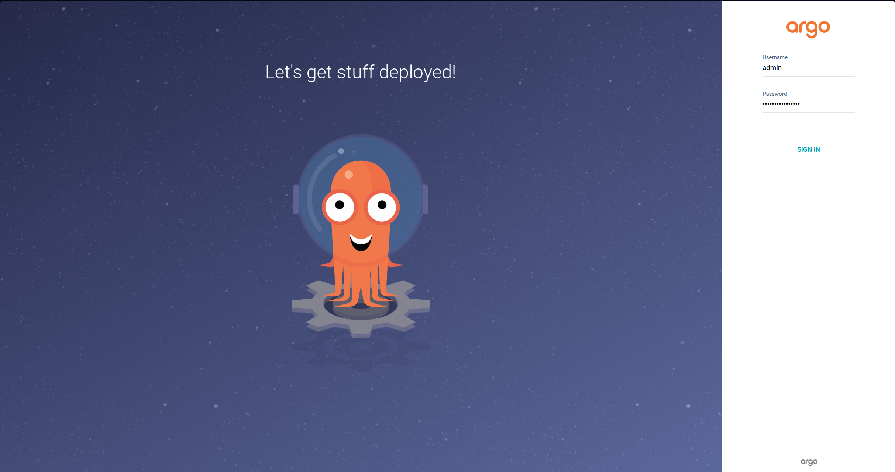
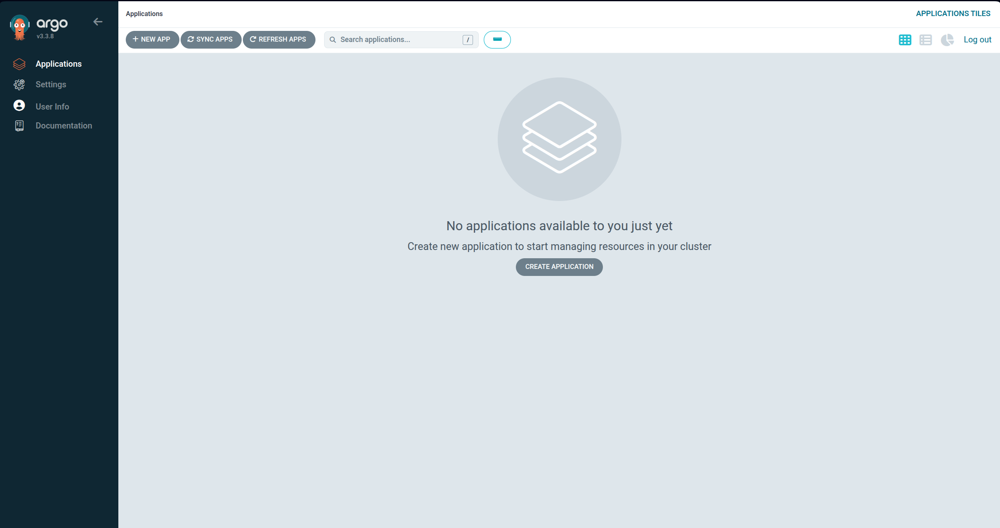
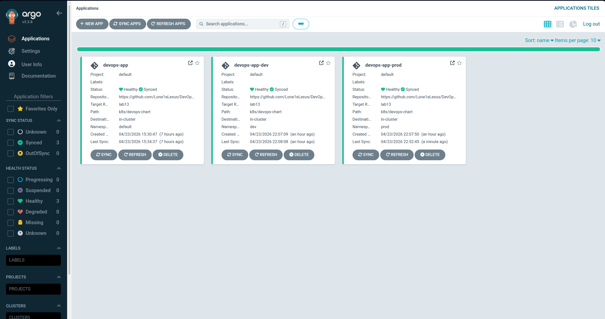

# Lab 13 — GitOps with ArgoCD

## Task 1 — ArgoCD Installation & Setup

```bash
$ helm repo add argo https://argoproj.github.io/argo-helm
"argo" has been added to your repositories
$ kubectl create namespace argocd
namespace/argocd created
$ helm install argocd argo/argo-cd --namespace argocd
NAME: argocd
LAST DEPLOYED: Thu Apr 23 15:03:24 2026
NAMESPACE: argocd
STATUS: deployed
REVISION: 1
DESCRIPTION: Install complete
TEST SUITE: None
NOTES:
In order to access the server UI you have the following options:

1. kubectl port-forward service/argocd-server -n argocd 8080:443

    and then open the browser on http://localhost:8080 and accept the certificate

2. enable ingress in the values file `server.ingress.enabled` and either
      - Add the annotation for ssl passthrough: https://argo-cd.readthedocs.io/en/stable/operator-manual/ingress/#option-1-ssl-passthrough
      - Set the `configs.params."server.insecure"` in the values file and terminate SSL at your ingress: https://argo-cd.readthedocs.io/en/stable/operator-manual/ingress/#option-2-multiple-ingress-objects-and-hosts


After reaching the UI the first time you can login with username: admin and the random password generated during the installation. You can find the password by running:

kubectl -n argocd get secret argocd-initial-admin-secret -o jsonpath="{.data.password}" | base64 -d

(You should delete the initial secret afterwards as suggested by the Getting Started Guide: https://argo-cd.readthedocs.io/en/stable/getting_started/#4-login-using-the-cli)
$ kubectl wait --for=condition=ready pod -l app.kubernetes.io/name=argocd-server -n argocd --timeout=120s
pod/argocd-server-7f857f54f-67ck9 condition met
$ kubectl -n argocd get secret argocd-initial-admin-secret -o jsonpath="{.data.password}" | base64 -d
...
```

```bash
$ kubectl port-forward svc/argocd-server -n argocd 8080:443
Forwarding from 127.0.0.1:8080 -> 8080
Forwarding from [::1]:8080 -> 8080
Handling connection for 8080
Handling connection for 8080
Handling connection for 8080
Handling connection for 8080
Handling connection for 8080
Handling connection for 8080
Handling connection for 8080
Handling connection for 8080
Handling connection for 8080
Handling connection for 8080
Handling connection for 8080
Handling connection for 8080
Handling connection for 8080
Handling connection for 8080
```





```bash
$ curl -sSL -o argocd https://github.com/argoproj/argo-cd/releases/latest/download/argocd-linux-amd64
$ sudo install -m 555 argocd /usr/local/bin/argocd
[sudo] password for lord: 
$ rm argocd
$ argocd version
argocd: v3.3.8+7ae7d2c
  BuildDate: 2026-04-21T17:45:55Z
  GitCommit: 7ae7d2cc723f5408b080a31263e705198af08613
  GitTreeState: clean
  GoVersion: go1.25.5
  Compiler: gc
  Platform: linux/amd64
{"level":"fatal","msg":"Argo CD server address unspecified","time":"2026-04-23T15:19:34+03:00"}
```

```
$ argocd login localhost:8080 --insecure
Username: admin
Password: 
'admin:login' logged in successfully
Context 'localhost:8080' updated
$ argocd account list
NAME   ENABLED  CAPABILITIES
admin  true     login
```

## Task 2 — Application Deployment

```bash
$ kubectl apply -f argocd/application.yaml
application.argoproj.io/devops-app configured
$ argocd app sync devops-app
TIMESTAMP                  GROUP        KIND              NAMESPACE                  NAME                          STATUS    HEALTH        HOOK  MESSAGE
2026-04-23T15:33:59+03:00         PersistentVolumeClaim     default  devops-app-devops-info-service-data         OutOfSync  Missing              
2026-04-23T15:33:59+03:00             Secret                default     devops-app-secret                        OutOfSync  Missing              
2026-04-23T15:33:59+03:00            Service                default  devops-app-devops-info-service              OutOfSync  Missing              
2026-04-23T15:33:59+03:00   apps  Deployment                default  devops-app-devops-info-service              OutOfSync  Missing              
2026-04-23T15:33:59+03:00          ConfigMap                default  devops-app-devops-info-service-config-file  OutOfSync  Missing              
2026-04-23T15:33:59+03:00          ConfigMap                default  devops-app-devops-info-service-env          OutOfSync  Missing              
2026-04-23T15:33:59+03:00  batch         Job     default  devops-app-devops-info-service-pre-install            Progressing              
2026-04-23T15:34:01+03:00  batch         Job     default  devops-app-devops-info-service-pre-install   Running   Synced     PreSync  job.batch/devops-app-devops-info-service-pre-install created
2026-04-23T15:34:07+03:00             Secret     default     devops-app-secret                          Synced  Missing              
2026-04-23T15:34:07+03:00          ConfigMap     default  devops-app-devops-info-service-config-file    Synced  Missing              
2026-04-23T15:34:07+03:00          ConfigMap     default  devops-app-devops-info-service-env            Synced  Missing              
2026-04-23T15:34:07+03:00         PersistentVolumeClaim     default  devops-app-devops-info-service-data    Synced  Healthy                  
2026-04-23T15:34:07+03:00            Service                default  devops-app-devops-info-service         Synced  Healthy                  
2026-04-23T15:34:07+03:00   apps  Deployment                default  devops-app-devops-info-service         Synced  Progressing              
2026-04-23T15:34:09+03:00  batch         Job                default  devops-app-devops-info-service-pre-install  Succeeded   Synced         PreSync  Reached expected number of succeeded pods
2026-04-23T15:34:09+03:00             Secret                default     devops-app-secret                          Synced   Missing                  secret/devops-app-secret created
2026-04-23T15:34:09+03:00          ConfigMap                default  devops-app-devops-info-service-config-file    Synced   Missing                  configmap/devops-app-devops-info-service-config-file created
2026-04-23T15:34:09+03:00          ConfigMap                default  devops-app-devops-info-service-env            Synced   Missing                  configmap/devops-app-devops-info-service-env created
2026-04-23T15:34:09+03:00         PersistentVolumeClaim     default  devops-app-devops-info-service-data           Synced   Healthy                  persistentvolumeclaim/devops-app-devops-info-service-data created
2026-04-23T15:34:09+03:00            Service                default  devops-app-devops-info-service                Synced   Healthy                  service/devops-app-devops-info-service created
2026-04-23T15:34:09+03:00   apps  Deployment                default  devops-app-devops-info-service                Synced   Progressing              deployment.apps/devops-app-devops-info-service created
2026-04-23T15:34:27+03:00   apps  Deployment     default  devops-app-devops-info-service    Synced  Healthy              deployment.apps/devops-app-devops-info-service created
2026-04-23T15:34:27+03:00  batch         Job     default  devops-app-devops-info-service-post-install   Running   Synced    PostSync  job.batch/devops-app-devops-info-service-post-install created
2026-04-23T15:34:37+03:00  batch         Job     default  devops-app-devops-info-service-post-install  Succeeded   Synced    PostSync  Reached expected number of succeeded pods

Name:               argocd/devops-app
Project:            default
Server:             https://kubernetes.default.svc
Namespace:          default
URL:                https://argocd.example.com/applications/devops-app
Source:
- Repo:             https://github.com/Lone1eLexus/DevOps-Core-Course.git
  Target:           lab13
  Path:             k8s/devops-chart
  Helm Values:      values.yaml
SyncWindow:         Sync Allowed
Sync Policy:        Manual
Sync Status:        Synced to lab13 (4401843)
Health Status:      Healthy

Operation:          Sync
Sync Revision:      4401843f6f25b457dba0c03c7421116a9c823d47
Phase:              Succeeded
Start:              2026-04-23 15:33:59 +0300 MSK
Finished:           2026-04-23 15:34:37 +0300 MSK
Duration:           38s
Message:            successfully synced (no more tasks)

GROUP  KIND                   NAMESPACE  NAME                                         STATUS     HEALTH   HOOK      MESSAGE
batch  Job                    default    devops-app-devops-info-service-pre-install   Succeeded           PreSync   Reached expected number of succeeded pods
       Secret                 default    devops-app-secret                            Synced                        secret/devops-app-secret created
       ConfigMap              default    devops-app-devops-info-service-config-file   Synced                        configmap/devops-app-devops-info-service-config-file created
       ConfigMap              default    devops-app-devops-info-service-env           Synced                        configmap/devops-app-devops-info-service-env created
       PersistentVolumeClaim  default    devops-app-devops-info-service-data          Synced     Healthy            persistentvolumeclaim/devops-app-devops-info-service-data created
       Service                default    devops-app-devops-info-service               Synced     Healthy            service/devops-app-devops-info-service created
apps   Deployment             default    devops-app-devops-info-service               Synced     Healthy            deployment.apps/devops-app-devops-info-service created
batch  Job                    default    devops-app-devops-info-service-post-install  Succeeded           PostSync  Reached expected number of succeeded pods
```

## Task 3 — Multi-Environment Deployment

```bash
$ kubectl create namespace dev
namespace/dev created
$ kubectl create namespace prod
namespace/prod created
$ kubectl apply -f argocd/application-dev.yaml
application.argoproj.io/devops-app-dev created
$ kubectl apply -f argocd/application-prod.yaml
application.argoproj.io/devops-app-prod created
$ argocd app sync devops-app-dev
TIMESTAMP                  GROUP        KIND              NAMESPACE                  NAME                              STATUS   HEALTH        HOOK  MESSAGE
2026-04-23T22:07:53+03:00            Service                    dev  devops-app-dev-devops-info-service                Synced  Healthy              
2026-04-23T22:07:53+03:00   apps  Deployment                    dev  devops-app-dev-devops-info-service                Synced  Healthy              
2026-04-23T22:07:53+03:00          ConfigMap                    dev  devops-app-dev-devops-info-service-config-file    Synced                       
2026-04-23T22:07:53+03:00          ConfigMap                    dev  devops-app-dev-devops-info-service-env            Synced                       
2026-04-23T22:07:53+03:00         PersistentVolumeClaim         dev  devops-app-dev-devops-info-service-data           Synced  Healthy              
2026-04-23T22:07:53+03:00             Secret                    dev  devops-app-dev-secret                             Synced                       
2026-04-23T22:07:54+03:00  batch         Job         dev  devops-app-dev-devops-info-service-pre-install            Progressing              
2026-04-23T22:07:56+03:00  batch         Job         dev  devops-app-dev-devops-info-service-pre-install   Running   Synced     PreSync  job.batch/devops-app-dev-devops-info-service-pre-install created
2026-04-23T22:08:04+03:00          ConfigMap                    dev  devops-app-dev-devops-info-service-env            Synced                        configmap/devops-app-dev-devops-info-service-env unchanged
2026-04-23T22:08:04+03:00         PersistentVolumeClaim         dev  devops-app-dev-devops-info-service-data           Synced   Healthy              persistentvolumeclaim/devops-app-dev-devops-info-service-data unchanged
2026-04-23T22:08:04+03:00            Service                    dev  devops-app-dev-devops-info-service                Synced   Healthy              service/devops-app-dev-devops-info-service unchanged
2026-04-23T22:08:04+03:00   apps  Deployment                    dev  devops-app-dev-devops-info-service                Synced   Healthy              deployment.apps/devops-app-dev-devops-info-service unchanged
2026-04-23T22:08:04+03:00  batch         Job                    dev  devops-app-dev-devops-info-service-pre-install  Succeeded   Synced     PreSync  Reached expected number of succeeded pods
2026-04-23T22:08:04+03:00             Secret                    dev  devops-app-dev-secret                             Synced                        secret/devops-app-dev-secret configured
2026-04-23T22:08:04+03:00          ConfigMap                    dev  devops-app-dev-devops-info-service-config-file    Synced                        configmap/devops-app-dev-devops-info-service-config-file unchanged
2026-04-23T22:08:04+03:00  batch         Job         dev  devops-app-dev-devops-info-service-post-install   Running   Synced    PostSync  job.batch/devops-app-dev-devops-info-service-post-install created
2026-04-23T22:08:08+03:00  batch         Job         dev  devops-app-dev-devops-info-service-post-install  Succeeded   Synced    PostSync  Reached expected number of succeeded pods

Name:               argocd/devops-app-dev
Project:            default
Server:             https://kubernetes.default.svc
Namespace:          dev
URL:                https://argocd.example.com/applications/devops-app-dev
Source:
- Repo:             https://github.com/Lone1eLexus/DevOps-Core-Course.git
  Target:           lab13
  Path:             k8s/devops-chart
  Helm Values:      values-dev.yaml
SyncWindow:         Sync Allowed
Sync Policy:        Automated (Prune)
Sync Status:        Synced to lab13 (4401843)
Health Status:      Healthy

Operation:          Sync
Sync Revision:      4401843f6f25b457dba0c03c7421116a9c823d47
Phase:              Succeeded
Start:              2026-04-23 22:07:53 +0300 MSK
Finished:           2026-04-23 22:08:08 +0300 MSK
Duration:           15s
Message:            successfully synced (no more tasks)

GROUP  KIND                   NAMESPACE  NAME                                             STATUS     HEALTH   HOOK      MESSAGE
batch  Job                    dev        devops-app-dev-devops-info-service-pre-install   Succeeded           PreSync   Reached expected number of succeeded pods
       Secret                 dev        devops-app-dev-secret                            Synced                        secret/devops-app-dev-secret configured
       ConfigMap              dev        devops-app-dev-devops-info-service-config-file   Synced                        configmap/devops-app-dev-devops-info-service-config-file unchanged
       ConfigMap              dev        devops-app-dev-devops-info-service-env           Synced                        configmap/devops-app-dev-devops-info-service-env unchanged
       PersistentVolumeClaim  dev        devops-app-dev-devops-info-service-data          Synced     Healthy            persistentvolumeclaim/devops-app-dev-devops-info-service-data unchanged
       Service                dev        devops-app-dev-devops-info-service               Synced     Healthy            service/devops-app-dev-devops-info-service unchanged
apps   Deployment             dev        devops-app-dev-devops-info-service               Synced     Healthy            deployment.apps/devops-app-dev-devops-info-service unchanged
batch  Job                    dev        devops-app-dev-devops-info-service-post-install  Succeeded           PostSync  Reached expected number of succeeded pods
$ kubectl get pods -n dev
NAME                                                 READY   STATUS    RESTARTS   AGE
devops-app-dev-devops-info-service-8c6bd47d6-pqs69   1/1     Running   0          57s
$ kubectl describe deployment -n dev
Name:                   devops-app-dev-devops-info-service
Namespace:              dev
CreationTimestamp:      Thu, 23 Apr 2026 22:07:18 +0300
Labels:                 app.kubernetes.io/instance=devops-app-dev
                        app.kubernetes.io/managed-by=Helm
                        app.kubernetes.io/name=devops-info-service
                        app.kubernetes.io/version=1.0.0
                        helm.sh/chart=devops-info-service-0.1.0
Annotations:            argocd.argoproj.io/tracking-id: devops-app-dev:apps/Deployment:dev/devops-app-dev-devops-info-service
                        deployment.kubernetes.io/revision: 1
Selector:               app.kubernetes.io/instance=devops-app-dev,app.kubernetes.io/name=devops-info-service
Replicas:               1 desired | 1 updated | 1 total | 1 available | 0 unavailable
StrategyType:           RollingUpdate
MinReadySeconds:        0
RollingUpdateStrategy:  25% max unavailable, 25% max surge
Pod Template:
  Labels:       app.kubernetes.io/instance=devops-app-dev
                app.kubernetes.io/name=devops-info-service
  Annotations:  checksum/config-env: 051e341d1ed533d48ffb16c1d95ec833c77560632bdbff692860b8ca032d289d
                checksum/config-file: 0f2c3ee97a71ce44c1c1a805217c3f64aec4dca9ad4793df088b5ff5a9dd1bc0
  Containers:
   devops-info-service:
    Image:      lehus1/devops-info-service:latest
    Port:       8000/TCP (http)
    Host Port:  0/TCP (http)
    Limits:
      cpu:     100m
      memory:  128Mi
    Requests:
      cpu:      50m
      memory:   64Mi
    Liveness:   http-get http://:8000/health delay=5s timeout=1s period=10s #success=1 #failure=3
    Readiness:  http-get http://:8000/health delay=3s timeout=1s period=5s #success=1 #failure=3
    Environment Variables from:
      devops-app-dev-devops-info-service-env  ConfigMap  Optional: false
    Environment:
      APP_ENV:    development
      LOG_LEVEL:  debug
    Mounts:
      /config from config-volume (ro)
      /data from data-volume (rw)
  Volumes:
   config-volume:
    Type:      ConfigMap (a volume populated by a ConfigMap)
    Name:      devops-app-dev-devops-info-service-config-file
    Optional:  false
   data-volume:
    Type:          PersistentVolumeClaim (a reference to a PersistentVolumeClaim in the same namespace)
    ClaimName:     devops-app-dev-devops-info-service-data
    ReadOnly:      false
  Node-Selectors:  <none>
  Tolerations:     <none>
Conditions:
  Type           Status  Reason
  ----           ------  ------
  Available      True    MinimumReplicasAvailable
  Progressing    True    NewReplicaSetAvailable
OldReplicaSets:  <none>
NewReplicaSet:   devops-app-dev-devops-info-service-8c6bd47d6 (1/1 replicas created)
Events:
  Type    Reason             Age   From                   Message
  ----    ------             ----  ----                   -------
  Normal  ScalingReplicaSet  23m   deployment-controller  Scaled up replica set devops-app-dev-devops-info-service-8c6bd47d6 from 0 to 1
```

```bash
$ argocd app sync devops-app-prod
TIMESTAMP                  GROUP        KIND              NAMESPACE                  NAME                               STATUS   HEALTH            HOOK  MESSAGE
2026-04-23T22:39:23+03:00             Secret                   prod  devops-app-prod-secret                             Synced                           
2026-04-23T22:39:23+03:00            Service                   prod  devops-app-prod-devops-info-service                Synced  Progressing              
2026-04-23T22:39:23+03:00   apps  Deployment                   prod  devops-app-prod-devops-info-service                Synced  Healthy                  
2026-04-23T22:39:23+03:00  batch         Job                   prod  devops-app-prod-devops-info-service-pre-install            Healthy                  
2026-04-23T22:39:23+03:00          ConfigMap                   prod  devops-app-prod-devops-info-service-config-file    Synced                           
2026-04-23T22:39:23+03:00          ConfigMap                   prod  devops-app-prod-devops-info-service-env            Synced                           
2026-04-23T22:39:23+03:00         PersistentVolumeClaim        prod  devops-app-prod-devops-info-service-data           Synced  Healthy                  
2026-04-23T22:39:25+03:00  batch         Job        prod  devops-app-prod-devops-info-service-pre-install   Running   Synced     PreSync  job.batch/devops-app-prod-devops-info-service-pre-install configured
2026-04-23T22:39:27+03:00  batch         Job                   prod  devops-app-prod-devops-info-service-pre-install  Succeeded   Synced         PreSync  Reached expected number of succeeded pods
2026-04-23T22:39:27+03:00             Secret                   prod  devops-app-prod-secret                             Synced                            secret/devops-app-prod-secret configured
2026-04-23T22:39:27+03:00          ConfigMap                   prod  devops-app-prod-devops-info-service-env            Synced                            configmap/devops-app-prod-devops-info-service-env unchanged
2026-04-23T22:39:27+03:00          ConfigMap                   prod  devops-app-prod-devops-info-service-config-file    Synced                            configmap/devops-app-prod-devops-info-service-config-file unchanged
2026-04-23T22:39:27+03:00         PersistentVolumeClaim        prod  devops-app-prod-devops-info-service-data           Synced   Healthy                  persistentvolumeclaim/devops-app-prod-devops-info-service-data unchanged
2026-04-23T22:39:27+03:00            Service                   prod  devops-app-prod-devops-info-service                Synced   Progressing              service/devops-app-prod-devops-info-service unchanged
2026-04-23T22:39:27+03:00   apps  Deployment                   prod  devops-app-prod-devops-info-service                Synced   Healthy                  deployment.apps/devops-app-prod-devops-info-service unchanged
$ argocd app get devops-app-prod
Name:               argocd/devops-app-prod
Project:            default
Server:             https://kubernetes.default.svc
Namespace:          prod
URL:                https://argocd.example.com/applications/devops-app-prod
Source:
- Repo:             https://github.com/Lone1eLexus/DevOps-Core-Course.git
  Target:           lab13
  Path:             k8s/devops-chart
  Helm Values:      values-prod.yaml
SyncWindow:         Sync Allowed
Sync Policy:        Manual
Sync Status:        Synced to lab13 (4401843)
Health Status:      Progressing

GROUP  KIND                   NAMESPACE  NAME                                             STATUS     HEALTH       HOOK     MESSAGE
batch  Job                    prod       devops-app-prod-devops-info-service-pre-install  Succeeded               PreSync  Reached expected number of succeeded pods
       Secret                 prod       devops-app-prod-secret                           Synced                           secret/devops-app-prod-secret configured
       ConfigMap              prod       devops-app-prod-devops-info-service-env          Synced                           configmap/devops-app-prod-devops-info-service-env unchanged
       ConfigMap              prod       devops-app-prod-devops-info-service-config-file  Synced                           configmap/devops-app-prod-devops-info-service-config-file unchanged
       PersistentVolumeClaim  prod       devops-app-prod-devops-info-service-data         Synced     Healthy               persistentvolumeclaim/devops-app-prod-devops-info-service-data unchanged
       Service                prod       devops-app-prod-devops-info-service              Synced     Progressing           service/devops-app-prod-devops-info-service unchanged
apps   Deployment             prod       devops-app-prod-devops-info-service              Synced     Healthy               deployment.apps/devops-app-prod-devops-info-service unchanged
$ kubectl get pods -n prod
NAME                                                    READY   STATUS      RESTARTS   AGE
devops-app-prod-devops-info-service-5bcb765d8b-4k8th    1/1     Running     0          40m
devops-app-prod-devops-info-service-5bcb765d8b-7cjpm    1/1     Running     0          40m
devops-app-prod-devops-info-service-5bcb765d8b-ss5n6    1/1     Running     0          40m
devops-app-prod-devops-info-service-pre-install-jm99d   0/1     Completed   0          40m
$ minikube tunnel
...
```

```bash
$ argocd app get devops-app-prod --refresh
Name:               argocd/devops-app-prod
Project:            default
Server:             https://kubernetes.default.svc
Namespace:          prod
URL:                https://argocd.example.com/applications/devops-app-prod
Source:
- Repo:             https://github.com/Lone1eLexus/DevOps-Core-Course.git
  Target:           lab13
  Path:             k8s/devops-chart
  Helm Values:      values-prod.yaml
SyncWindow:         Sync Allowed
Sync Policy:        Manual
Sync Status:        Synced to lab13 (4401843)
Health Status:      Healthy

GROUP  KIND                   NAMESPACE  NAME                                              STATUS     HEALTH   HOOK      MESSAGE
batch  Job                    prod       devops-app-prod-devops-info-service-pre-install   Succeeded           PreSync   Reached expected number of succeeded pods
       Secret                 prod       devops-app-prod-secret                            Synced                        secret/devops-app-prod-secret configured
       ConfigMap              prod       devops-app-prod-devops-info-service-env           Synced                        configmap/devops-app-prod-devops-info-service-env unchanged
       ConfigMap              prod       devops-app-prod-devops-info-service-config-file   Synced                        configmap/devops-app-prod-devops-info-service-config-file unchanged
       PersistentVolumeClaim  prod       devops-app-prod-devops-info-service-data          Synced     Healthy            persistentvolumeclaim/devops-app-prod-devops-info-service-data unchanged
       Service                prod       devops-app-prod-devops-info-service               Synced     Healthy            service/devops-app-prod-devops-info-service unchanged
apps   Deployment             prod       devops-app-prod-devops-info-service               Synced     Healthy            deployment.apps/devops-app-prod-devops-info-service unchanged
batch  Job                    prod       devops-app-prod-devops-info-service-post-install  Succeeded           PostSync  Reached expected number of succeeded pods
$ kubectl get pods -n prod
NAME                                                   READY   STATUS    RESTARTS   AGE
devops-app-prod-devops-info-service-5bcb765d8b-4k8th   1/1     Running   0          44m
devops-app-prod-devops-info-service-5bcb765d8b-7cjpm   1/1     Running   0          44m
devops-app-prod-devops-info-service-5bcb765d8b-ss5n6   1/1     Running   0          44m
```



## Task 4 — Self-Healing & Sync Policies

```bash
$ kubectl get deployment -n dev devops-app-dev-devops-info-service -o jsonpath="{.spec.replicas}"
1
$ kubectl scale deployment devops-app-dev-devops-info-service -n dev --replicas=55
$ kubectl get pods -n dev -w
deployment.apps/devops-app-dev-devops-info-service scaled
NAME                                                 READY   STATUS    RESTARTS   AGE
devops-app-dev-devops-info-service-8c6bd47d6-pqs69   1/1     Running   0          49m
devops-app-dev-devops-info-service-8c6bd47d6-ngdzd   0/1     Pending   0          0s
devops-app-dev-devops-info-service-8c6bd47d6-ngdzd   0/1     Pending   0          1s
devops-app-dev-devops-info-service-8c6bd47d6-s7wbw   0/1     Pending   0          1s
devops-app-dev-devops-info-service-8c6bd47d6-mcc6j   0/1     Pending   0          0s
devops-app-dev-devops-info-service-8c6bd47d6-s7wbw   0/1     Pending   0          1s
devops-app-dev-devops-info-service-8c6bd47d6-mcc6j   0/1     Pending   0          0s
devops-app-dev-devops-info-service-8c6bd47d6-x6hq8   0/1     Pending   0          0s
devops-app-dev-devops-info-service-8c6bd47d6-ngdzd   0/1     ContainerCreating   0          1s
devops-app-dev-devops-info-service-8c6bd47d6-x6hq8   0/1     Pending             0          0s
devops-app-dev-devops-info-service-8c6bd47d6-s7wbw   0/1     ContainerCreating   0          1s
devops-app-dev-devops-info-service-8c6bd47d6-mcc6j   0/1     ContainerCreating   0          0s
devops-app-dev-devops-info-service-8c6bd47d6-x6hq8   0/1     ContainerCreating   0          0s
devops-app-dev-devops-info-service-8c6bd47d6-s7wbw   0/1     Terminating         0          1s
devops-app-dev-devops-info-service-8c6bd47d6-ngdzd   0/1     Terminating         0          1s
devops-app-dev-devops-info-service-8c6bd47d6-mcc6j   0/1     Terminating         0          0s
devops-app-dev-devops-info-service-8c6bd47d6-x6hq8   0/1     Terminating         0          0s
devops-app-dev-devops-info-service-8c6bd47d6-s7wbw   0/1     Terminating         0          1s
devops-app-dev-devops-info-service-8c6bd47d6-ngdzd   0/1     Terminating         0          1s
devops-app-dev-devops-info-service-8c6bd47d6-mcc6j   0/1     Terminating         0          0s
devops-app-dev-devops-info-service-8c6bd47d6-ngdzd   0/1     ContainerStatusUnknown   0          2s
devops-app-dev-devops-info-service-8c6bd47d6-ngdzd   0/1     ContainerStatusUnknown   0          2s
devops-app-dev-devops-info-service-8c6bd47d6-ngdzd   0/1     ContainerStatusUnknown   0          2s
devops-app-dev-devops-info-service-8c6bd47d6-s7wbw   0/1     ContainerStatusUnknown   0          2s
devops-app-dev-devops-info-service-8c6bd47d6-s7wbw   0/1     ContainerStatusUnknown   0          2s
devops-app-dev-devops-info-service-8c6bd47d6-s7wbw   0/1     ContainerStatusUnknown   0          2s
devops-app-dev-devops-info-service-8c6bd47d6-mcc6j   0/1     ContainerStatusUnknown   0          1s
devops-app-dev-devops-info-service-8c6bd47d6-mcc6j   0/1     ContainerStatusUnknown   0          1s
devops-app-dev-devops-info-service-8c6bd47d6-mcc6j   0/1     ContainerStatusUnknown   0          1s
devops-app-dev-devops-info-service-8c6bd47d6-x6hq8   0/1     Terminating              0          3s
devops-app-dev-devops-info-service-8c6bd47d6-x6hq8   1/1     Terminating              0          8s
devops-app-dev-devops-info-service-8c6bd47d6-x6hq8   0/1     Error                    0          34s
devops-app-dev-devops-info-service-8c6bd47d6-x6hq8   0/1     Error                    0          34s
devops-app-dev-devops-info-service-8c6bd47d6-x6hq8   0/1     Error                    0          34s

$ kubectl get deployment -n dev devops-app-dev-devops-info-service -o jsonpath="{.spec.replicas}"
1

$ kubectl scale deployment devops-app-prod-devops-info-service -n prod --replicas=10
deployment.apps/devops-app-prod-devops-info-service scaled
$ kubectl get pods -n prod
NAME                                                   READY   STATUS    RESTARTS   AGE
devops-app-prod-devops-info-service-5bcb765d8b-4k8th   1/1     Running   0          51m
devops-app-prod-devops-info-service-5bcb765d8b-7cjpm   1/1     Running   0          51m
devops-app-prod-devops-info-service-5bcb765d8b-7lxpj   1/1     Running   0          67s
devops-app-prod-devops-info-service-5bcb765d8b-7vfhw   1/1     Running   0          67s
devops-app-prod-devops-info-service-5bcb765d8b-cg8q6   1/1     Running   0          67s
devops-app-prod-devops-info-service-5bcb765d8b-gbsv2   1/1     Running   0          67s
devops-app-prod-devops-info-service-5bcb765d8b-mvxhz   1/1     Running   0          67s
devops-app-prod-devops-info-service-5bcb765d8b-rq8rj   1/1     Running   0          67s
devops-app-prod-devops-info-service-5bcb765d8b-ss5n6   1/1     Running   0          51m
devops-app-prod-devops-info-service-5bcb765d8b-ww62z   1/1     Running   0          67s
```


```bash
$ argocd app sync devops-app-prod
TIMESTAMP                  GROUP        KIND              NAMESPACE                  NAME                               STATUS    HEALTH        HOOK  MESSAGE
2026-04-23T23:02:35+03:00          ConfigMap                   prod  devops-app-prod-devops-info-service-config-file    Synced                        
2026-04-23T23:02:35+03:00          ConfigMap                   prod  devops-app-prod-devops-info-service-env            Synced                        
2026-04-23T23:02:35+03:00         PersistentVolumeClaim        prod  devops-app-prod-devops-info-service-data           Synced   Healthy              
2026-04-23T23:02:35+03:00             Secret                   prod  devops-app-prod-secret                             Synced                        
2026-04-23T23:02:35+03:00            Service                   prod  devops-app-prod-devops-info-service                Synced   Healthy              
2026-04-23T23:02:35+03:00   apps  Deployment                   prod  devops-app-prod-devops-info-service              OutOfSync  Healthy              
2026-04-23T23:02:35+03:00  batch         Job        prod  devops-app-prod-devops-info-service-pre-install            Progressing              
2026-04-23T23:02:37+03:00  batch         Job        prod  devops-app-prod-devops-info-service-pre-install   Running   Synced     PreSync  job.batch/devops-app-prod-devops-info-service-pre-install created
2026-04-23T23:02:43+03:00   apps  Deployment        prod  devops-app-prod-devops-info-service    Synced  Healthy              
2026-04-23T23:02:45+03:00  batch         Job                   prod  devops-app-prod-devops-info-service-pre-install  Succeeded   Synced     PreSync  Reached expected number of succeeded pods
2026-04-23T23:02:45+03:00             Secret                   prod  devops-app-prod-secret                             Synced                        secret/devops-app-prod-secret configured
2026-04-23T23:02:45+03:00          ConfigMap                   prod  devops-app-prod-devops-info-service-env            Synced                        configmap/devops-app-prod-devops-info-service-env unchanged
2026-04-23T23:02:45+03:00          ConfigMap                   prod  devops-app-prod-devops-info-service-config-file    Synced                        configmap/devops-app-prod-devops-info-service-config-file unchanged
2026-04-23T23:02:45+03:00         PersistentVolumeClaim        prod  devops-app-prod-devops-info-service-data           Synced   Healthy              persistentvolumeclaim/devops-app-prod-devops-info-service-data unchanged
2026-04-23T23:02:45+03:00            Service                   prod  devops-app-prod-devops-info-service                Synced   Healthy              service/devops-app-prod-devops-info-service unchanged
2026-04-23T23:02:45+03:00   apps  Deployment                   prod  devops-app-prod-devops-info-service                Synced   Healthy              deployment.apps/devops-app-prod-devops-info-service configured
2026-04-23T23:02:45+03:00  batch         Job        prod  devops-app-prod-devops-info-service-post-install   Running   Synced    PostSync  job.batch/devops-app-prod-devops-info-service-post-install created
2026-04-23T23:02:50+03:00  batch         Job        prod  devops-app-prod-devops-info-service-post-install  Succeeded   Synced    PostSync  Reached expected number of succeeded pods

Name:               argocd/devops-app-prod
Project:            default
Server:             https://kubernetes.default.svc
Namespace:          prod
URL:                https://argocd.example.com/applications/devops-app-prod
Source:
- Repo:             https://github.com/Lone1eLexus/DevOps-Core-Course.git
  Target:           lab13
  Path:             k8s/devops-chart
  Helm Values:      values-prod.yaml
SyncWindow:         Sync Allowed
Sync Policy:        Manual
Sync Status:        Synced to lab13 (4401843)
Health Status:      Healthy

Operation:          Sync
Sync Revision:      4401843f6f25b457dba0c03c7421116a9c823d47
Phase:              Succeeded
Start:              2026-04-23 23:02:35 +0300 MSK
Finished:           2026-04-23 23:02:50 +0300 MSK
Duration:           15s
Message:            successfully synced (no more tasks)

GROUP  KIND                   NAMESPACE  NAME                                              STATUS     HEALTH   HOOK      MESSAGE
batch  Job                    prod       devops-app-prod-devops-info-service-pre-install   Succeeded           PreSync   Reached expected number of succeeded pods
       Secret                 prod       devops-app-prod-secret                            Synced                        secret/devops-app-prod-secret configured
       ConfigMap              prod       devops-app-prod-devops-info-service-env           Synced                        configmap/devops-app-prod-devops-info-service-env unchanged
       ConfigMap              prod       devops-app-prod-devops-info-service-config-file   Synced                        configmap/devops-app-prod-devops-info-service-config-file unchanged
       PersistentVolumeClaim  prod       devops-app-prod-devops-info-service-data          Synced     Healthy            persistentvolumeclaim/devops-app-prod-devops-info-service-data unchanged
       Service                prod       devops-app-prod-devops-info-service               Synced     Healthy            service/devops-app-prod-devops-info-service unchanged
apps   Deployment             prod       devops-app-prod-devops-info-service               Synced     Healthy            deployment.apps/devops-app-prod-devops-info-service configured
batch  Job                    prod       devops-app-prod-devops-info-service-post-install  Succeeded           PostSync  Reached expected number of succeeded pods
$ kubectl get pods -n prod
NAME                                                   READY   STATUS    RESTARTS   AGE
devops-app-prod-devops-info-service-5bcb765d8b-4k8th   1/1     Running   0          54m
devops-app-prod-devops-info-service-5bcb765d8b-7cjpm   1/1     Running   0          54m
devops-app-prod-devops-info-service-5bcb765d8b-ss5n6   1/1     Running   0          54m
```

```bash
$ kubectl delete pod -n dev -l app.kubernetes.io/instance=devops-app-dev --field-selector=status.phase=Running
pod "devops-app-dev-devops-info-service-8c6bd47d6-xfdsb" deleted from dev namespace
$ kubectl get pods -n dev -w
NAME                                                 READY   STATUS              RESTARTS   AGE
devops-app-dev-devops-info-service-8c6bd47d6-7sklk   0/1     ContainerCreating   0          2s
devops-app-dev-devops-info-service-8c6bd47d6-7sklk   0/1     Running             0          3s
devops-app-dev-devops-info-service-8c6bd47d6-7sklk   1/1     Running             0          9s
```

```bash
$ kubectl label deployment -n dev devops-app-dev-devops-info-service test=manual --overwritete
deployment.apps/devops-app-dev-devops-info-service labeled
$ kubectl get deployment -n dev devops-app-dev-devops-info-service -o jsonpath="{.metadata.labels}"
{"app.kubernetes.io/instance":"devops-app-dev","app.kubernetes.io/managed-by":"Helm","app.kubernetes.io/name":"devops-info-service","app.kubernetes.io/version":"1.0.0","helm.sh/chart":"devops-info-service-0.1.0","test":"manual"}
# After some time:
$ kubectl get deployment -n dev devops-app-dev-devops-info-service -o jsonpath="{.metadata.labels}"
{"app.kubernetes.io/instance":"devops-app-dev","app.kubernetes.io/managed-by":"Helm","app.kubernetes.io/name":"devops-info-service","app.kubernetes.io/version":"1.0.0","helm.sh/chart":"devops-info-service-0.1.0","test":"manual"}
# Drift is undetected :)
```

### Sync Behavior Summary

| Action | Dev (auto‑sync) | Prod (manual) |
|--------|----------------|---------------|
| Manual scale (replicas) | Auto‑reverted within 60s | Persists until manual sync |
| Label added | Auto‑removed | Persists until manual sync |
| Pod deletion | K8s ReplicaSet recreates immediately | Same |

## Bonus – ApplicationSet

An ApplicationSet was created to generate `dev` and `prod` applications from a single template:

This would eliminate duplicate Application manifests, but due to a variable substitution issue in the local cluster, the ApplicationSet could not create the child resources. The pattern is understood and would be applied in a production setting.

```bash
$ kubectl apply -f argocd/applicationset.yaml
applicationset.argoproj.io/devops-info-service-set created
$ argocd app list
NAME                             CLUSTER                         NAMESPACE  PROJECT  STATUS     HEALTH   SYNCPOLICY  CONDITIONS  REPO                                                   PATH              TARGET
argocd/devops-info-service-dev   https://kubernetes.default.svc  dev        default  OutOfSync  Missing  Manual      <none>      https://github.com/Lone1eLexus/DevOps-Core-Course.git  k8s/devops-chart  lab13
argocd/devops-info-service-prod  https://kubernetes.default.svc  prod       default  OutOfSync  Missing  Manual      <none>      https://github.com/Lone1eLexus/DevOps-Core-Course.git  k8s/devops-chart  lab13
```