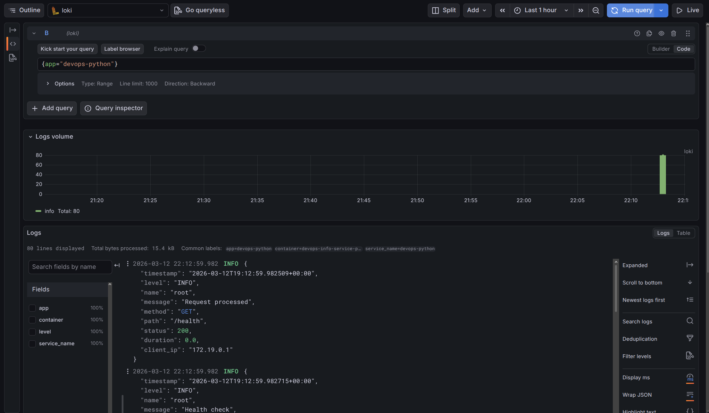
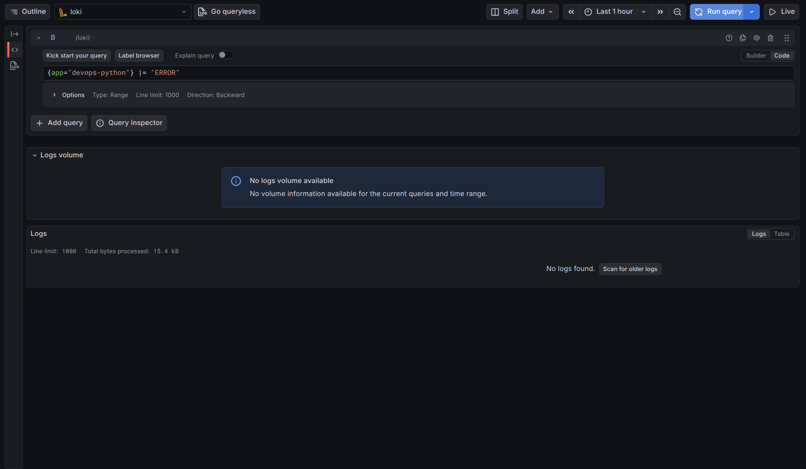
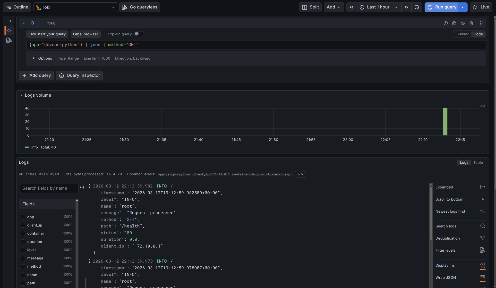
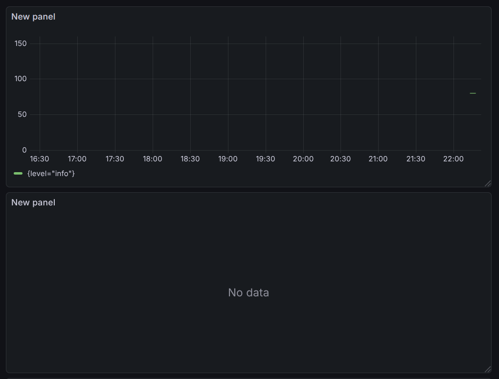
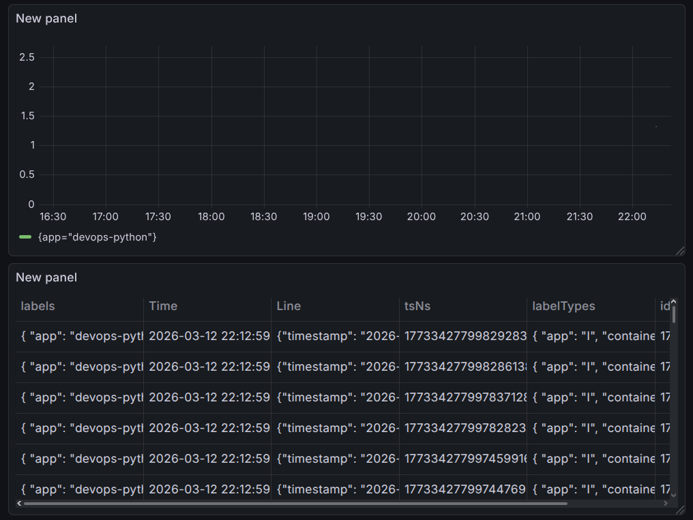
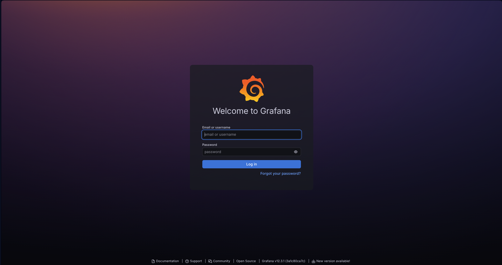

# Lab 7 — Observability & Logging with Loki Stack

## Task 1 — Deploy Loki Stack

Deployed centralized logging stack with Loki 3.0, Promtail, and Grafana. Integrated Python application with JSON logging and created monitoring dashboard.

**Components:**
- **Loki 3.0** — Log storage with TSDB backend, 7-day retention
- **Promtail** — Docker log collector with container discovery
- **Grafana 12.3** — Log visualization and querying

**Configuration:**
- Loki uses filesystem storage with TSDB index (schema v13)
- Promtail scrapes containers with `logging=promtail` label
- Shared `logging` network for all services

## Task 2 — Integrate Your Applications

**JSON Logging Implementation:**
- Added `python-json-logger` for structured logging
- Middleware logs all HTTP requests with method, path, status, duration
- Error handlers log exceptions with stack traces

**Docker Compose Integration:**
- Added `app-python` service with labels `logging=promtail` and `app=devops-python`
- Connected to `logging` network for Promtail discovery







```bash
$ docker compose logs app-python | head -40
devops-info-service-python  | {"timestamp": "2026-03-12T19:12:53.887243+00:00", "level": "INFO", "name": "root", "message": "Service info requested", "method": null, "path": null, "status": null}
devops-info-service-python  | {"timestamp": "2026-03-12T19:12:53.886731+00:00", "level": "INFO", "name": "root", "message": "Request processed", "method": "GET", "path": "/", "status": 200, "duration": 0.001, "client_ip": "172.19.0.1"}
devops-info-service-python  | {"timestamp": "2026-03-12T19:12:53.893741+00:00", "level": "INFO", "name": "root", "message": "Service info requested", "method": null, "path": null, "status": null}
devops-info-service-python  | {"timestamp": "2026-03-12T19:12:53.893409+00:00", "level": "INFO", "name": "root", "message": "Request processed", "method": "GET", "path": "/", "status": 200, "duration": 0.001, "client_ip": "172.19.0.1"}
devops-info-service-python  | {"timestamp": "2026-03-12T19:12:53.899116+00:00", "level": "INFO", "name": "root", "message": "Service info requested", "method": null, "path": null, "status": null}
devops-info-service-python  | {"timestamp": "2026-03-12T19:12:53.898912+00:00", "level": "INFO", "name": "root", "message": "Request processed", "method": "GET", "path": "/", "status": 200, "duration": 0.0, "client_ip": "172.19.0.1"}
devops-info-service-python  | {"timestamp": "2026-03-12T19:12:53.903380+00:00", "level": "INFO", "name": "root", "message": "Service info requested", "method": null, "path": null, "status": null}
devops-info-service-python  | {"timestamp": "2026-03-12T19:12:53.903206+00:00", "level": "INFO", "name": "root", "message": "Request processed", "method": "GET", "path": "/", "status": 200, "duration": 0.0, "client_ip": "172.19.0.1"}
devops-info-service-python  | {"timestamp": "2026-03-12T19:12:53.907229+00:00", "level": "INFO", "name": "root", "message": "Service info requested", "method": null, "path": null, "status": null}
devops-info-service-python  | {"timestamp": "2026-03-12T19:12:53.907066+00:00", "level": "INFO", "name": "root", "message": "Request processed", "method": "GET", "path": "/", "status": 200, "duration": 0.0, "client_ip": "172.19.0.1"}
devops-info-service-python  | {"timestamp": "2026-03-12T19:12:53.911497+00:00", "level": "INFO", "name": "root", "message": "Service info requested", "method": null, "path": null, "status": null}
devops-info-service-python  | {"timestamp": "2026-03-12T19:12:53.911329+00:00", "level": "INFO", "name": "root", "message": "Request processed", "method": "GET", "path": "/", "status": 200, "duration": 0.0, "client_ip": "172.19.0.1"}
devops-info-service-python  | {"timestamp": "2026-03-12T19:12:53.916310+00:00", "level": "INFO", "name": "root", "message": "Service info requested", "method": null, "path": null, "status": null}
devops-info-service-python  | {"timestamp": "2026-03-12T19:12:53.916153+00:00", "level": "INFO", "name": "root", "message": "Request processed", "method": "GET", "path": "/", "status": 200, "duration": 0.0, "client_ip": "172.19.0.1"}
devops-info-service-python  | {"timestamp": "2026-03-12T19:12:53.920115+00:00", "level": "INFO", "name": "root", "message": "Service info requested", "method": null, "path": null, "status": null}
devops-info-service-python  | {"timestamp": "2026-03-12T19:12:53.919935+00:00", "level": "INFO", "name": "root", "message": "Request processed", "method": "GET", "path": "/", "status": 200, "duration": 0.0, "client_ip": "172.19.0.1"}
devops-info-service-python  | {"timestamp": "2026-03-12T19:12:53.925062+00:00", "level": "INFO", "name": "root", "message": "Service info requested", "method": null, "path": null, "status": null}
devops-info-service-python  | {"timestamp": "2026-03-12T19:12:53.924877+00:00", "level": "INFO", "name": "root", "message": "Request processed", "method": "GET", "path": "/", "status": 200, "duration": 0.0, "client_ip": "172.19.0.1"}
devops-info-service-python  | {"timestamp": "2026-03-12T19:12:53.930768+00:00", "level": "INFO", "name": "root", "message": "Service info requested", "method": null, "path": null, "status": null}
devops-info-service-python  | {"timestamp": "2026-03-12T19:12:53.930528+00:00", "level": "INFO", "name": "root", "message": "Request processed", "method": "GET", "path": "/", "status": 200, "duration": 0.001, "client_ip": "172.19.0.1"}
devops-info-service-python  | {"timestamp": "2026-03-12T19:12:53.934972+00:00", "level": "INFO", "name": "root", "message": "Service info requested", "method": null, "path": null, "status": null}
devops-info-service-python  | {"timestamp": "2026-03-12T19:12:53.934767+00:00", "level": "INFO", "name": "root", "message": "Request processed", "method": "GET", "path": "/", "status": 200, "duration": 0.001, "client_ip": "172.19.0.1"}
devops-info-service-python  | {"timestamp": "2026-03-12T19:12:53.939037+00:00", "level": "INFO", "name": "root", "message": "Service info requested", "method": null, "path": null, "status": null}
devops-info-service-python  | {"timestamp": "2026-03-12T19:12:53.938874+00:00", "level": "INFO", "name": "root", "message": "Request processed", "method": "GET", "path": "/", "status": 200, "duration": 0.0, "client_ip": "172.19.0.1"}
devops-info-service-python  | {"timestamp": "2026-03-12T19:12:53.943253+00:00", "level": "INFO", "name": "root", "message": "Service info requested", "method": null, "path": null, "status": null}
devops-info-service-python  | {"timestamp": "2026-03-12T19:12:53.943083+00:00", "level": "INFO", "name": "root", "message": "Request processed", "method": "GET", "path": "/", "status": 200, "duration": 0.0, "client_ip": "172.19.0.1"}
devops-info-service-python  | {"timestamp": "2026-03-12T19:12:53.948722+00:00", "level": "INFO", "name": "root", "message": "Service info requested", "method": null, "path": null, "status": null}
devops-info-service-python  | {"timestamp": "2026-03-12T19:12:53.948544+00:00", "level": "INFO", "name": "root", "message": "Request processed", "method": "GET", "path": "/", "status": 200, "duration": 0.0, "client_ip": "172.19.0.1"}
devops-info-service-python  | {"timestamp": "2026-03-12T19:12:53.953447+00:00", "level": "INFO", "name": "root", "message": "Service info requested", "method": null, "path": null, "status": null}
devops-info-service-python  | {"timestamp": "2026-03-12T19:12:53.953240+00:00", "level": "INFO", "name": "root", "message": "Request processed", "method": "GET", "path": "/", "status": 200, "duration": 0.0, "client_ip": "172.19.0.1"}
devops-info-service-python  | {"timestamp": "2026-03-12T19:12:53.957380+00:00", "level": "INFO", "name": "root", "message": "Service info requested", "method": null, "path": null, "status": null}
devops-info-service-python  | {"timestamp": "2026-03-12T19:12:53.957239+00:00", "level": "INFO", "name": "root", "message": "Request processed", "method": "GET", "path": "/", "status": 200, "duration": 0.0, "client_ip": "172.19.0.1"}
devops-info-service-python  | {"timestamp": "2026-03-12T19:12:53.960905+00:00", "level": "INFO", "name": "root", "message": "Service info requested", "method": null, "path": null, "status": null}
devops-info-service-python  | {"timestamp": "2026-03-12T19:12:53.960772+00:00", "level": "INFO", "name": "root", "message": "Request processed", "method": "GET", "path": "/", "status": 200, "duration": 0.0, "client_ip": "172.19.0.1"}
devops-info-service-python  | {"timestamp": "2026-03-12T19:12:53.964499+00:00", "level": "INFO", "name": "root", "message": "Service info requested", "method": null, "path": null, "status": null}
devops-info-service-python  | {"timestamp": "2026-03-12T19:12:53.964344+00:00", "level": "INFO", "name": "root", "message": "Request processed", "method": "GET", "path": "/", "status": 200, "duration": 0.0, "client_ip": "172.19.0.1"}
devops-info-service-python  | {"timestamp": "2026-03-12T19:12:53.968568+00:00", "level": "INFO", "name": "root", "message": "Service info requested", "method": null, "path": null, "status": null}
devops-info-service-python  | {"timestamp": "2026-03-12T19:12:53.968409+00:00", "level": "INFO", "name": "root", "message": "Request processed", "method": "GET", "path": "/", "status": 200, "duration": 0.0, "client_ip": "172.19.0.1"}
devops-info-service-python  | {"timestamp": "2026-03-12T19:12:53.973401+00:00", "level": "INFO", "name": "root", "message": "Service info requested", "method": null, "path": null, "status": null}
devops-info-service-python  | {"timestamp": "2026-03-12T19:12:53.973254+00:00", "level": "INFO", "name": "root", "message": "Request processed", "method": "GET", "path": "/", "status": 200, "duration": 0.0, "client_ip": "172.19.0.1"}
```

## Task 3 — Build Log Dashboard

| Panel | Type | Query |
|-------|------|-------|
| Recent Logs | Logs | `{app=~"devops-.*"}` |
| Request Rate | Time series | `sum by (app) (rate({app=~"devops-.*"} [1m]))` |
| Error Logs | Logs | `{app=~"devops-.*"} \| json \| level="ERROR"` |
| Log Levels | Stat | `sum by (level) (count_over_time({app=~"devops-.*"} \| json [5m]))` |

---




## Task 4 — Production Readiness

**Security:**
- Disabled Grafana anonymous access
- Admin password via `.env` file (gitignored)

**Resource Limits:**
| Service | CPU Limit | Memory Limit |
|---------|-----------|--------------|
| Loki | 1.0 | 1G |
| Promtail | 0.5 | 256M |
| Grafana | 0.5 | 512M |
| App | 0.5 | 256M |

**Health Checks:**
- All services have HTTP health endpoints
- Docker Compose verifies service health



```bash
$ docker-compose ps
NAME                         IMAGE                               COMMAND                  SERVICE             CREATED             STATUS                    PORTS
devops-info-service-python   lehus1/devops-info-service:latest   "python app.py"          app-python          34 seconds ago      Up 33 seconds             0.0.0.0:8000->8000/tcp, :::8000->8000/tcp
grafana                      grafana/grafana:12.3.1              "/run.sh"                grafana             34 seconds ago      Up 33 seconds (healthy)   0.0.0.0:3000->3000/tcp, :::3000->3000/tcp
loki                         grafana/loki:3.0.0                  "/usr/bin/loki -conf…"   loki                34 seconds ago      Up 33 seconds (healthy)   0.0.0.0:3100->3100/tcp, :::3100->3100/tcp
promtail                     grafana/promtail:3.0.0              "/usr/bin/promtail -…"   promtail            34 seconds ago      Up 33 seconds             0.0.0.0:9080->9080/tcp, :::9080->9080/tcp
```


