# Lab 8 — Metrics & Monitoring with Prometheus

# Task 1 — Application Metrics

```bash
$ for i in {1..5}; do curl http://localhost:8000/health; done
{"status":"healthy","timestamp":"2026-03-19T14:30:20.214708+00:00","uptime_seconds":94}...
$ for i in {1..10}; do curl http://localhost:8000/; done
{"service":{"name":"devops-info-service","version":"1.0.0","description":"DevOps course info service","framework":"FastAPI"},"system":{"hostname":"EmptyThrone","platform":"Linux","platform_version":"#14~24.04.1-Ubuntu SMP PREEMPT_DYNAMIC Thu Jan 15 15:52:10 UTC 2","architecture":"x86_64","cpu_count":16,"python_version":"3.12.3"},"runtime":{"uptime_seconds":99,"uptime_human":"0 hours, 1 minutes","current_time":"2026-03-19T14:30:25.421895+00:00","timezone":"UTC"},"request":{"client_ip":"127.0.0.1","user_agent":"curl/8.5.0","method":"GET","path":"/"},"endpoints":[{"path":"/","method":"GET","description":"Service information"},{"path":"/health","method":"GET","description":"Health check"},{"path":"/docs","method":"GET","description":"Auto-generated API documentation"}]}...
```

```bash
$ curl http://localhost:8000/metrics
# HELP python_gc_objects_collected_total Objects collected during gc
# TYPE python_gc_objects_collected_total counter
python_gc_objects_collected_total{generation="0"} 628.0
python_gc_objects_collected_total{generation="1"} 37.0
python_gc_objects_collected_total{generation="2"} 0.0
# HELP python_gc_objects_uncollectable_total Uncollectable objects found during GC
# TYPE python_gc_objects_uncollectable_total counter
python_gc_objects_uncollectable_total{generation="0"} 0.0
python_gc_objects_uncollectable_total{generation="1"} 0.0
python_gc_objects_uncollectable_total{generation="2"} 0.0
# HELP python_gc_collections_total Number of times this generation was collected
# TYPE python_gc_collections_total counter
python_gc_collections_total{generation="0"} 104.0
python_gc_collections_total{generation="1"} 9.0
python_gc_collections_total{generation="2"} 0.0
# HELP python_info Python platform information
# TYPE python_info gauge
python_info{implementation="CPython",major="3",minor="12",patchlevel="3",version="3.12.3"} 1.0
# HELP process_virtual_memory_bytes Virtual memory size in bytes.
# TYPE process_virtual_memory_bytes gauge
process_virtual_memory_bytes 2.36711936e+08
# HELP process_resident_memory_bytes Resident memory size in bytes.
# TYPE process_resident_memory_bytes gauge
process_resident_memory_bytes 4.9897472e+07
# HELP process_start_time_seconds Start time of the process since unix epoch in seconds.
# TYPE process_start_time_seconds gauge
process_start_time_seconds 1.77393052507e+09
# HELP process_cpu_seconds_total Total user and system CPU time spent in seconds.
# TYPE process_cpu_seconds_total counter
process_cpu_seconds_total 0.32
# HELP process_open_fds Number of open file descriptors.
# TYPE process_open_fds gauge
process_open_fds 21.0
# HELP process_max_fds Maximum number of open file descriptors.
# TYPE process_max_fds gauge
process_max_fds 1.048576e+06
# HELP http_requests_total Total HTTP requests
# TYPE http_requests_total counter
http_requests_total{endpoint="/health",method="GET",status="200"} 5.0
http_requests_total{endpoint="/",method="GET",status="200"} 10.0
# HELP http_requests_created Total HTTP requests
# TYPE http_requests_created gauge
http_requests_created{endpoint="/health",method="GET",status="200"} 1.7739306202149212e+09
http_requests_created{endpoint="/",method="GET",status="200"} 1.7739306254222639e+09
# HELP http_request_duration_seconds HTTP request duration in seconds
# TYPE http_request_duration_seconds histogram
http_request_duration_seconds_bucket{endpoint="/health",le="0.005",method="GET"} 5.0
http_request_duration_seconds_bucket{endpoint="/health",le="0.01",method="GET"} 5.0
http_request_duration_seconds_bucket{endpoint="/health",le="0.025",method="GET"} 5.0
http_request_duration_seconds_bucket{endpoint="/health",le="0.05",method="GET"} 5.0
http_request_duration_seconds_bucket{endpoint="/health",le="0.075",method="GET"} 5.0
http_request_duration_seconds_bucket{endpoint="/health",le="0.1",method="GET"} 5.0
http_request_duration_seconds_bucket{endpoint="/health",le="0.25",method="GET"} 5.0
http_request_duration_seconds_bucket{endpoint="/health",le="0.5",method="GET"} 5.0
http_request_duration_seconds_bucket{endpoint="/health",le="0.75",method="GET"} 5.0
http_request_duration_seconds_bucket{endpoint="/health",le="1.0",method="GET"} 5.0
http_request_duration_seconds_bucket{endpoint="/health",le="2.5",method="GET"} 5.0
http_request_duration_seconds_bucket{endpoint="/health",le="5.0",method="GET"} 5.0
http_request_duration_seconds_bucket{endpoint="/health",le="7.5",method="GET"} 5.0
http_request_duration_seconds_bucket{endpoint="/health",le="10.0",method="GET"} 5.0
http_request_duration_seconds_bucket{endpoint="/health",le="+Inf",method="GET"} 5.0
http_request_duration_seconds_count{endpoint="/health",method="GET"} 5.0
http_request_duration_seconds_sum{endpoint="/health",method="GET"} 0.004373
http_request_duration_seconds_bucket{endpoint="/",le="0.005",method="GET"} 10.0
http_request_duration_seconds_bucket{endpoint="/",le="0.01",method="GET"} 10.0
http_request_duration_seconds_bucket{endpoint="/",le="0.025",method="GET"} 10.0
http_request_duration_seconds_bucket{endpoint="/",le="0.05",method="GET"} 10.0
http_request_duration_seconds_bucket{endpoint="/",le="0.075",method="GET"} 10.0
http_request_duration_seconds_bucket{endpoint="/",le="0.1",method="GET"} 10.0
http_request_duration_seconds_bucket{endpoint="/",le="0.25",method="GET"} 10.0
http_request_duration_seconds_bucket{endpoint="/",le="0.5",method="GET"} 10.0
http_request_duration_seconds_bucket{endpoint="/",le="0.75",method="GET"} 10.0
http_request_duration_seconds_bucket{endpoint="/",le="1.0",method="GET"} 10.0
http_request_duration_seconds_bucket{endpoint="/",le="2.5",method="GET"} 10.0
http_request_duration_seconds_bucket{endpoint="/",le="5.0",method="GET"} 10.0
http_request_duration_seconds_bucket{endpoint="/",le="7.5",method="GET"} 10.0
http_request_duration_seconds_bucket{endpoint="/",le="10.0",method="GET"} 10.0
http_request_duration_seconds_bucket{endpoint="/",le="+Inf",method="GET"} 10.0
http_request_duration_seconds_count{endpoint="/",method="GET"} 10.0
http_request_duration_seconds_sum{endpoint="/",method="GET"} 0.006179999999999999
# HELP http_request_duration_seconds_created HTTP request duration in seconds
# TYPE http_request_duration_seconds_created gauge
http_request_duration_seconds_created{endpoint="/health",method="GET"} 1.7739306202148821e+09
http_request_duration_seconds_created{endpoint="/",method="GET"} 1.7739306254222322e+09
# HELP http_requests_in_progress Number of HTTP requests currently in progress
# TYPE http_requests_in_progress gauge
http_requests_in_progress 1.0
# HELP devops_info_endpoint_calls_total Endpoint calls
# TYPE devops_info_endpoint_calls_total counter
devops_info_endpoint_calls_total{endpoint="/health"} 5.0
devops_info_endpoint_calls_total{endpoint="/"} 10.0
# HELP devops_info_endpoint_calls_created Endpoint calls
# TYPE devops_info_endpoint_calls_created gauge
devops_info_endpoint_calls_created{endpoint="/health"} 1.773930620214929e+09
devops_info_endpoint_calls_created{endpoint="/"} 1.7739306254222696e+09
```

```python
# Prometheus Metrics
http_requests_total = Counter(
    'http_requests_total',
    'Total HTTP requests',
    ['method', 'endpoint', 'status']
)

http_request_duration_seconds = Histogram(
    'http_request_duration_seconds',
    'HTTP request duration in seconds',
    ['method', 'endpoint']
)

http_requests_in_progress = Gauge(
    'http_requests_in_progress',
    'Number of HTTP requests currently in progress'
)

endpoint_calls = Counter('devops_info_endpoint_calls',
                         'Endpoint calls', ['endpoint'])
```

## Task 2 — Prometheus Setup

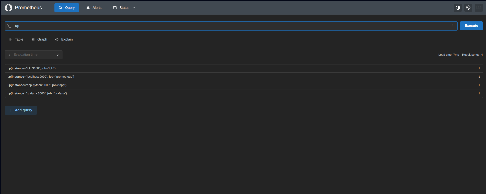
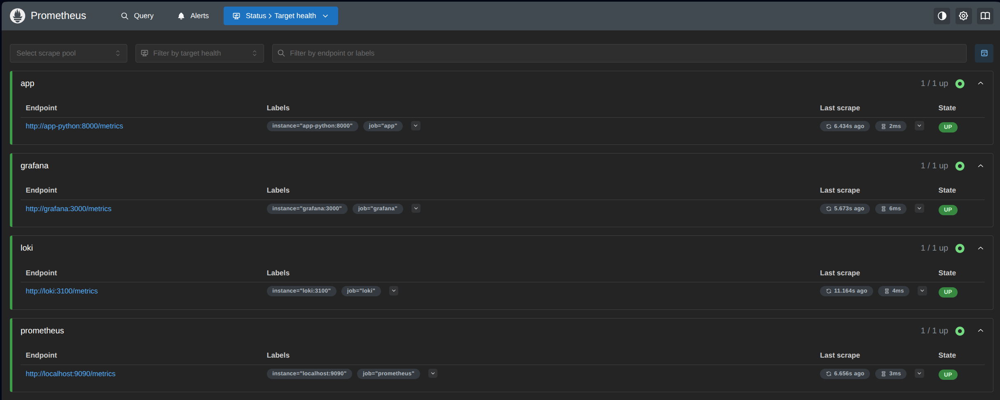

## Task 3 — Grafana Dashboards

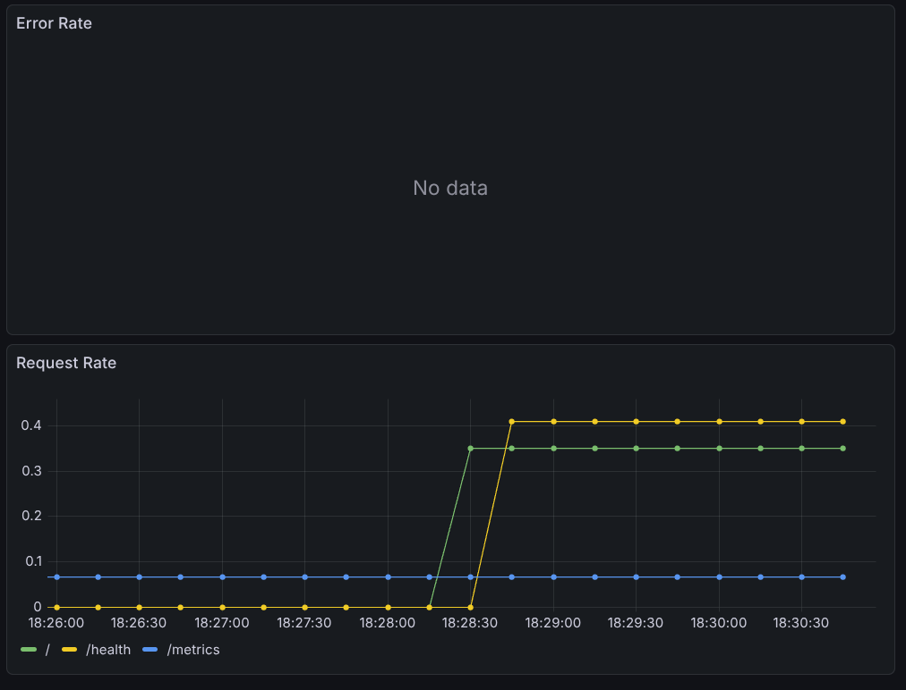
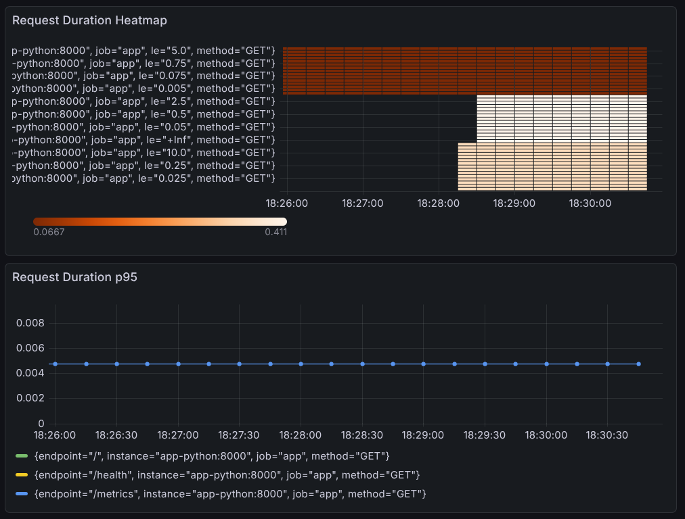
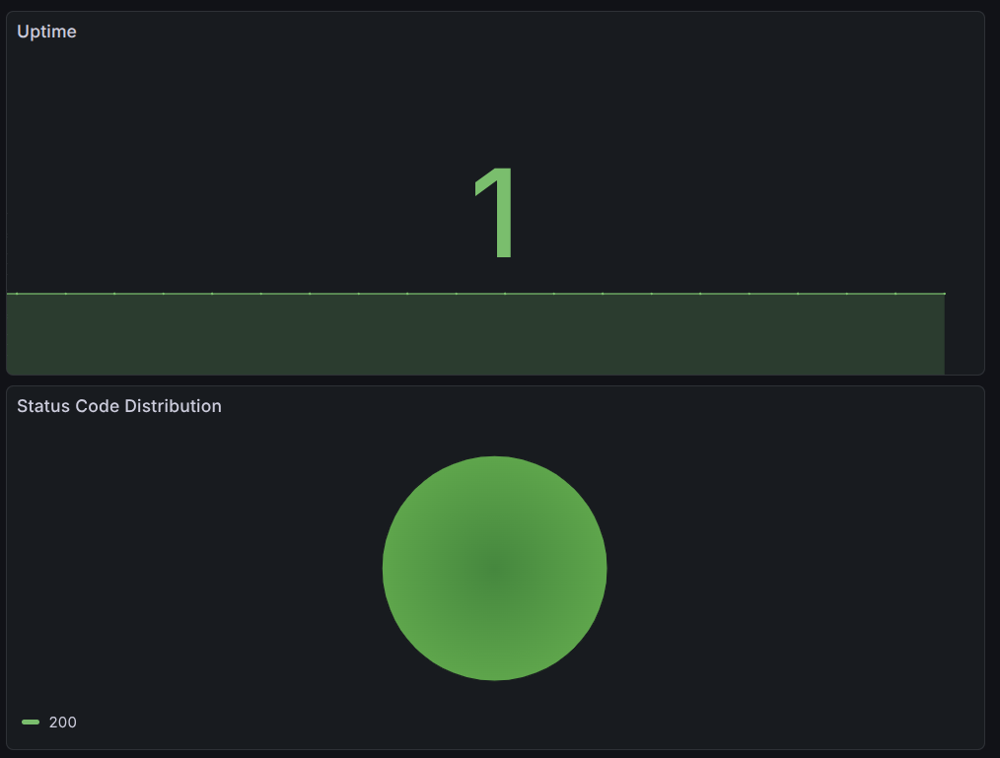


**Ready solution:**

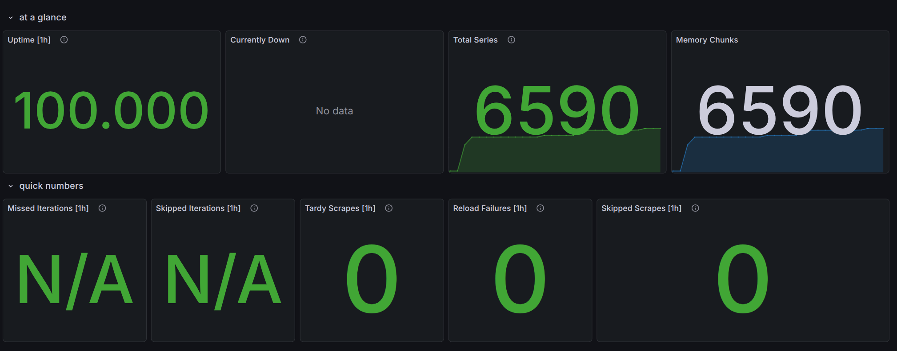
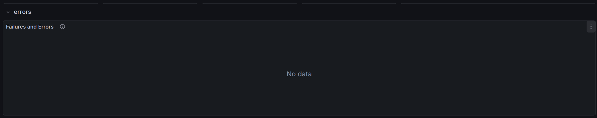
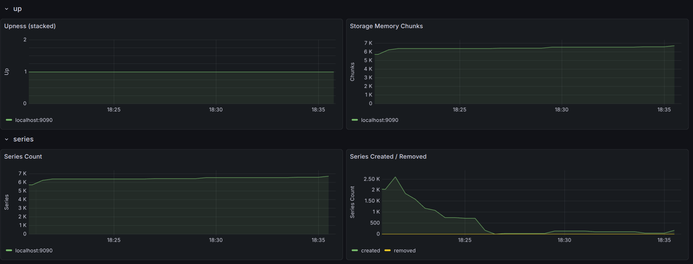
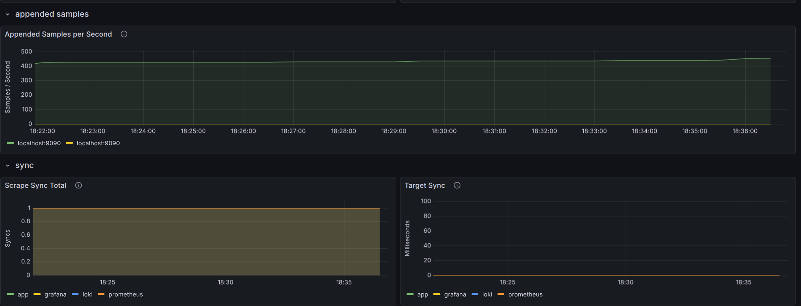
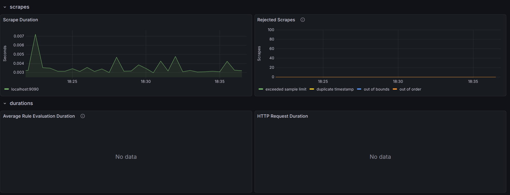
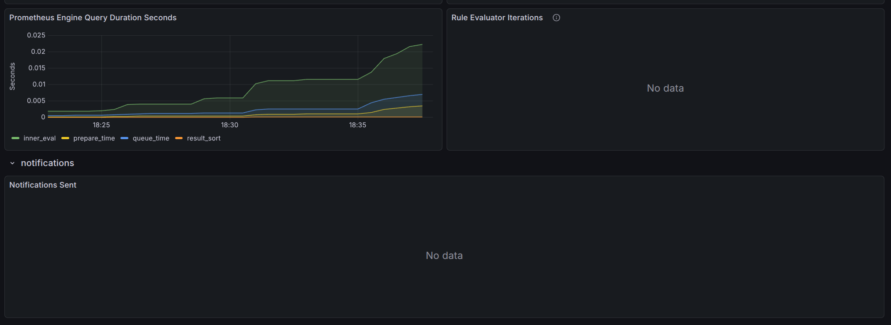
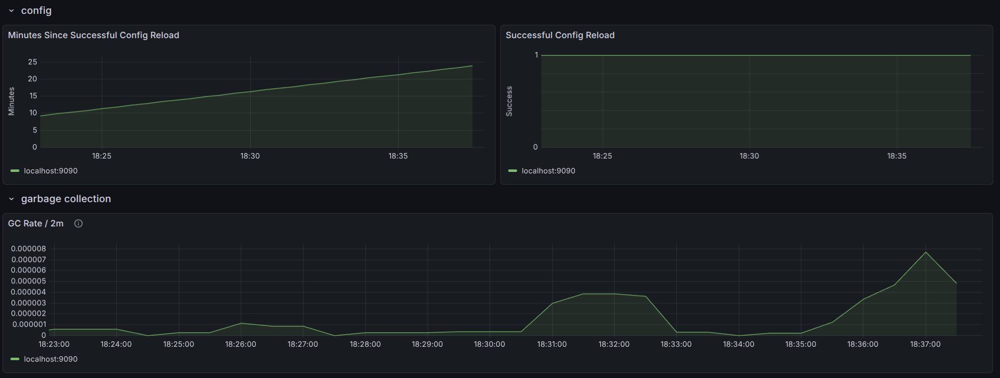

## Task 4 — Production Configuration

```bash
$ docker compose down && docker compose up -d
[+] down 6/6
 ✔ Container grafana                    Removed                                                                                                          0.3s
 ✔ Container promtail                   Removed                                                                                                          0.3s
 ✔ Container prometheus                 Removed                                                                                                          0.4s
 ✔ Container loki                       Removed                                                                                                          2.1s
 ✔ Container devops-info-service-python Removed                                                                                                          0.4s
 ✔ Network monitoring_logging           Removed                                                                                                          0.2s
[+] up 6/6
 ✔ Network monitoring_logging           Created                                                                                                          0.1s
 ✔ Container devops-info-service-python Created                                                                                                          0.1s
 ✔ Container loki                       Created                                                                                                          0.1s
 ✔ Container prometheus                 Created                                                                                                          0.1s
 ✔ Container grafana                    Created                                                                                                          0.2s
 ✔ Container promtail                   Created
 ```

 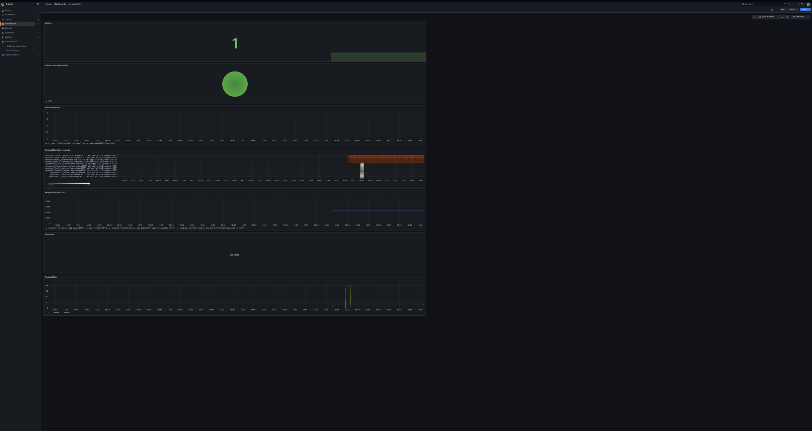

 ## Task 5 — Documentation

 ### Architecture

The diagram:
- **Python FastAPI app** exposes metrics at `/metrics`.
- **Prometheus** scrapes metrics from the app, Loki, Grafana, and itself.
- **Grafana** queries Prometheus and displays dashboards.
- All components run in Docker containers connected via the `logging` network.

 ### Metrics Added

I added the following Prometheus metrics to my FastAPI application:

| Metric Name | Type | Labels | Purpose |
|-------------|------|--------|---------|
| `http_requests_total` | Counter | `method`, `endpoint`, `status` | Count total requests for RED method (Rate) |
| `http_request_duration_seconds` | Histogram | `method`, `endpoint` | Measure request latency (Duration) |
| `http_requests_in_progress` | Gauge | (none) | Track concurrent requests |
| `devops_info_endpoint_calls` | Counter | `endpoint` | Business metric: count calls per endpoint |

**Why these metrics?**  
They follow the **RED method** (Rate, Errors, Duration) for request‑driven services. The gauge helps detect overload. The business metric is an example of application‑specific observability.

### Dashboard

- Request Rate (Graph)
    - Query: sum(rate(http_requests_total[5m])) by (endpoint)
    - Shows requests/sec per endpoint

- Error Rate (Graph)
    - Query: sum(rate(http_requests_total{status=~"5.."}[5m]))
    - Shows 5xx errors/sec

- Request Duration p95 (Graph)
    - Query: histogram_quantile(0.95, rate(http_request_duration_seconds_bucket[5m]))
    - Shows 95th percentile latency

- Request Duration Heatmap (Heatmap)
    - Query: rate(http_request_duration_seconds_bucket[5m])
    - Visualizes latency distribution

- Active Requests (Gauge/Graph)
    - Query: http_requests_in_progress
    - Shows concurrent requests

- Status Code Distribution (Pie Chart)
    - Query: sum by (status) (rate(http_requests_total[5m]))
    - Shows 2xx vs 4xx vs 5xx

- Uptime (Stat)
    - Query: up{job="app"}
    - Shows if service is up (1) or down (0)

### PromQL Examples

See prev

### Production Setup

Added Health Checks to ensure that every container up.
Added Resource Limits to control resourse usage. If some containers (services) go wrong, they will lie down without breaking the whole system.